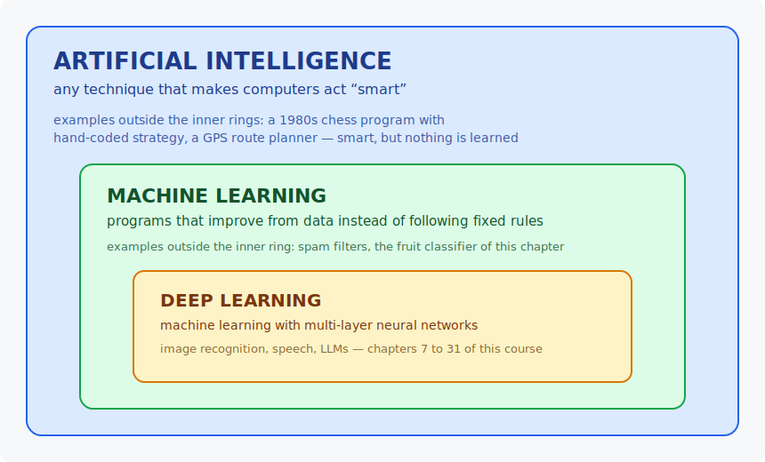
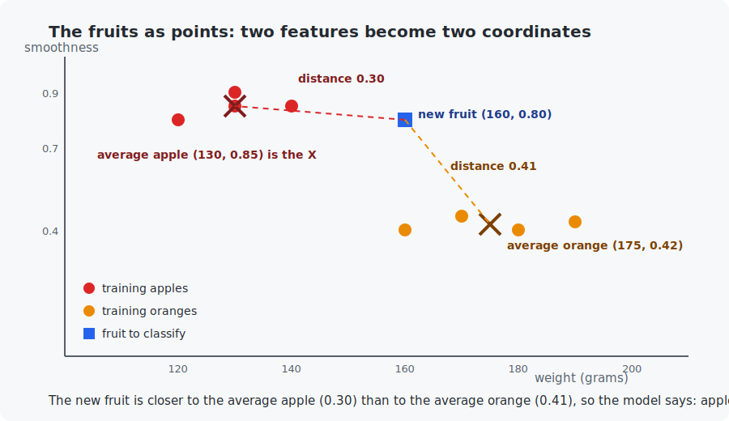

# Chapter 1 — What is AI?

In this chapter you will build two tiny programs that solve the same problem — one with hand-written rules, one that *learns* its rules from data — and see with your own eyes what "machine learning" actually means. No math yet; that starts in Chapter 2.

<!-- CONTENTS_START -->
## Contents

- [What you will learn](#what-you-will-learn)
- [Prerequisites](#prerequisites)
- [1. The map](#1-the-map)
- [2. The vocabulary](#2-the-vocabulary)
- [3. The three kinds of learning](#3-the-three-kinds-of-learning)
- [4. Rules vs learning — the demonstration](#4-rules-vs-learning-the-demonstration)
- [5. The learning algorithm, explained before the code](#5-the-learning-algorithm-explained-before-the-code)
- [Code walkthrough](#code-walkthrough)
- [Run it](#run-it)
- [What the C version covers](#what-the-c-version-covers)
- [Exercises](#exercises)
- [Next](#next)

<!-- CONTENTS_END -->

## What you will learn

- The map: how AI, machine learning, and deep learning relate.
- The vocabulary the whole course uses: model, parameters, features, labels, training, inference.
- The three kinds of learning: supervised, unsupervised, reinforcement.
- The one honest definition of machine learning, demonstrated in code.

## Prerequisites

- [Chapter 0](../00-setup/README.md) — your tools work.

## 1. The map



- **Artificial intelligence** is the umbrella term. A chess program from 1980 with hand-coded strategy is AI, but it learns nothing.
- **Machine learning (ML)** is the part of AI where the program gets better by looking at data instead of being told every rule.
- **Deep learning** is machine learning done with neural networks that have many layers. It is behind image recognition, speech, and LLMs — and it is most of this course from Chapter 7 onward.

## 2. The vocabulary

Imagine sorting fruit on a conveyor belt: apples to the left, oranges to the right. You measure each fruit.

| Term | Meaning | In the fruit example |
|------|---------|----------------------|
| **example** | one item of data | one fruit |
| **feature** | one measured property of an example | weight in grams; surface smoothness |
| **label** | the correct answer for an example | "apple" or "orange" |
| **model** | a function with adjustable numbers inside that maps features → prediction | our classifier |
| **parameters** | the adjustable numbers inside the model | (you will see them in a minute) |
| **training** | adjusting the parameters using labeled examples | showing the model 8 known fruits |
| **inference** | using the trained model on new, unseen examples | classifying tomorrow's fruit |

Keep this table handy; every chapter uses these words. (They are all in the [glossary](../../appendices/D-glossary/README.md) too.)

## 3. The three kinds of learning

1. **Supervised learning** — you have examples *with* labels (fruit + "apple"). The model learns to predict the label. Most of this course (chapters 5–25) is supervised.
2. **Unsupervised learning** — you have examples *without* labels, and the model finds structure by itself (grouping similar customers, compressing images). Chapters 26–29 (generative AI) grow out of this idea.
3. **Reinforcement learning** — no dataset at all: an *agent* acts in an environment and learns from rewards, like a dog learning tricks for treats. Chapter 30.

## 4. Rules vs learning — the demonstration

Here is the honest definition this chapter exists to plant in your head:

> **Classic programming:** you write the rules. `rules + data → answers`
> **Machine learning:** the computer finds the rules. `data + answers → rules`

The example programs classify fruit from two features:

- `weight_in_grams` — oranges tend to be heavier,
- `surface_smoothness` — a number from 0 (very rough) to 1 (very smooth); apples are smoother.

**Version 1 — hand-written rules.** A programmer stares at some fruit and writes:

```python
if weight_in_grams > 150:
    return "orange"
else:
    return "apple"
```

Where did `150` come from? The programmer guessed it. And why only weight? Because writing rules that combine several features by hand gets hard fast — which is precisely why this approach does not scale.

**Version 2 — learned rules.** We give the program 8 fruits *with labels* and let it compute its own numbers. The algorithm we use is called the **nearest-centroid classifier**, and the next section explains it completely before you run anything.

## 5. The learning algorithm, explained before the code

### Why this algorithm?

There are many learning algorithms; this course will teach the famous ones. For this very first chapter we need the *simplest algorithm that genuinely learns* — one whose entire "training" you can check with school arithmetic. The nearest-centroid classifier is exactly that: its learning step is just **computing averages**, and its prediction step is just **measuring distances**. No loops that gradually improve, no calculus (that machinery starts in Chapter 5). Its weakness — it only draws simple boundaries — does not matter for fruit.

### Step 1 — Learning: compute the average fruit of each class

Each fruit is a pair of numbers `(weight, smoothness)`, so we can treat it as a **point**: weight is the horizontal coordinate, smoothness the vertical one. Learning is one arithmetic step — average the apples' coordinates, then the oranges':

```
average apple:   weight     = (120 + 130 + 140 + 130) / 4 = 130.0
                 smoothness = (0.80 + 0.90 + 0.85 + 0.85) / 4 = 0.85

average orange:  weight     = (160 + 170 + 180 + 190) / 4 = 175.0
                 smoothness = (0.40 + 0.45 + 0.40 + 0.43) / 4 = 0.42
```

These two points — the "centroids" (centers) of each class — are the model's **parameters**. Nobody typed 130 or 0.42 into the program; they came out of the data. Feed the program different fruits and it computes different centroids: it adapts itself. That is the learning.

### Step 2 — Predicting: which average is the new fruit closer to?

To classify a new fruit, measure the straight-line distance from its point to each centroid and pick the closer one. Distance between two points is the school Pythagoras formula: square the horizontal difference, square the vertical difference, add, take the square root.

One adjustment first: weight is measured in grams (numbers around 100–200) while smoothness lives between 0 and 1. Raw differences in grams would drown the smoothness differences completely — the distance would ignore one of our two features. So the code divides the weight difference by 100 to bring both features to a similar size:

$$\text{distance} = \sqrt{\left(\frac{\text{weight difference}}{100}\right)^2 + (\text{smoothness difference})^2}$$

(This trick — putting features on comparable scales before combining them — appears throughout the course; Chapter 5 shows it speeding up training 200×, and Chapter 12 gives it its proper name, *normalization*.)

### The worked example

Take the new fruit `(160 g, 0.80)` — a heavy, smooth apple the programs never saw during training:

```
distance to average apple (130, 0.85):
    sqrt( ((160-130)/100)^2 + (0.80-0.85)^2 )  =  sqrt(0.0900 + 0.0025)  =  0.30

distance to average orange (175, 0.42):
    sqrt( ((160-175)/100)^2 + (0.80-0.42)^2 )  =  sqrt(0.0225 + 0.1444)  =  0.41

0.30 < 0.41  ->  closer to the apple average  ->  "apple"   (correct!)
```



Notice *why* the learned model beats the hand-written rule on this fruit: the rule `weight > 150 → orange` sees only the weight, 160, and answers orange. The distance calculation sees both features at once — this fruit is unusually heavy for an apple, but its smoothness (0.80 vs the orange average of 0.42) screams apple, and the combined distance reflects that.

### Reading the code

Both programs are the two steps above plus bookkeeping, with matching names:

| In the program | What it is |
|----------------|-----------|
| `TRAINING_FRUITS` / `training_fruits` | the 8 labeled fruits (data + answers) |
| `learn_class_averages(...)` | **Step 1**: computes the two centroids |
| `classify_with_learned_model(...)` | **Step 2**: two distances, picks the smaller |
| `classify_with_hand_written_rules(...)` | version 1, the guessed `weight > 150` rule |
| `TEST_FRUITS` / `test_fruits` | 6 held-back fruits used to judge both versions (**inference**) |

The test uses fruits the programs never trained on because that is the only honest test — any model looks good on questions it has already seen the answers to. (This train/test separation gets a full treatment in Chapter 12.)

## Code walkthrough

The example is `python/rules_vs_learning.py`. It holds the two classifiers side by side, so you can compare hand-written rules against learning in one file. Read it in this order:

| Function | What it does | What to notice |
|----------|--------------|----------------|
| `TRAINING_FRUITS`, `TEST_FRUITS` (module top) | The 8 labeled fruits to learn from, and 6 held-back fruits to judge on. | Each fruit is a tuple `(weight, smoothness, label)`. The test fruits are separate on purpose — Section 5 explains why. |
| `classify_with_hand_written_rules(weight, smoothness)` | Version 1: the guessed rule `weight > 150 → orange`. | It ignores smoothness entirely (`del surface_smoothness`) — that is the point of the comparison, not an oversight. |
| `learn_class_averages(training_fruits)` | **The learning step.** Computes the average weight and smoothness of each class. | Returns the two centroids `{"apple": (130, 0.85), "orange": (175, 0.42)}` — these are the model's *parameters*, and nobody typed them in. |
| `classify_with_learned_model(weight, smoothness, class_averages)` | Version 2: picks the class whose average is nearest. | The nested `distance_to_average` divides the weight difference by 100 — the feature-scaling trick from Section 5. Watch for it; it returns throughout the course. |
| `main()` | Learns the averages, then judges all 6 test fruits with both classifiers and tallies the score. | The printed table is where the learned model wins on the 160 g smooth apple. |

**The takeaway to carry forward:** "learning" here is just `learn_class_averages` computing means. Every later chapter makes that step more powerful, but the shape — data in, parameters out — never changes.

## Run it

```bash
.venv/bin/python chapters/01-what-is-ai/python/rules_vs_learning.py
make -C chapters/01-what-is-ai/c && ./chapters/01-what-is-ai/c/build/rules_vs_learning
```

Expected output (both languages print the same story):

```
Training data: 8 fruits with known labels.

LEARNING STEP (computing the parameters from data):
  average apple  -> weight 130.0 g, smoothness 0.85
  average orange -> weight 175.0 g, smoothness 0.42

Judging 6 new fruits both programs have never seen:

  fruit (g, smooth)   true      rules say   learned model says
  (118, 0.90)         apple     apple       apple
  (160, 0.80)         apple     orange      apple
  ...

Hand-written rules:  5/6 correct
Learned model:       6/6 correct
```

The one disagreement is exactly the fruit from the worked example in Section 5: the 160-gram smooth apple. You already know why each program answers what it answers — if not, reread Section 5 with the output in front of you.

## What the C version covers

A full port of the Python program: same dataset, same learning step, same test — in about 120 lines of plain C. Read it to see that "learning" here is just arithmetic: sums, divisions, and comparisons. No magic.

## Exercises

1. Add a 7th test fruit that fools the *learned* model too (hint: make an unusually heavy, rough apple). What does that tell you about models and unusual data?
2. Add a third feature, `color_redness` (0 to 1), to the Python version. You need to extend the averages and the distance. Does accuracy change?
3. Change the training data so it contains only 1 apple and 7 oranges, retrain, and test. This is called **class imbalance** — describe in one sentence what went wrong.
4. (Thought experiment) The learned model computes distance with weight in *grams* (numbers near 150) and smoothness in *0–1* (numbers near 0.5). Which feature dominates the distance? Chapter 2 gives you the tools to fix this; Chapter 12 names the fix (normalization).

## Next

[Chapter 2 — Vectors and matrices](../02-vectors-and-matrices/README.md)

<!-- NAV_START -->
---

[← Chapter 0: Setup](../00-setup/README.md) · [↑ Course index](../../README.md) · [Chapter 2: Vectors and matrices →](../02-vectors-and-matrices/README.md)

<!-- NAV_END -->
