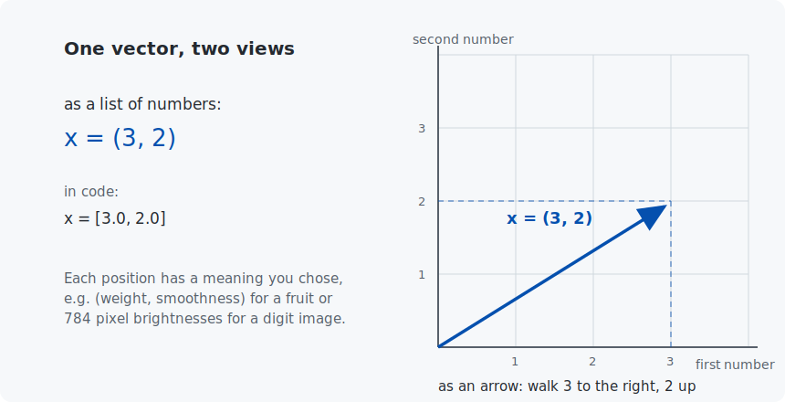
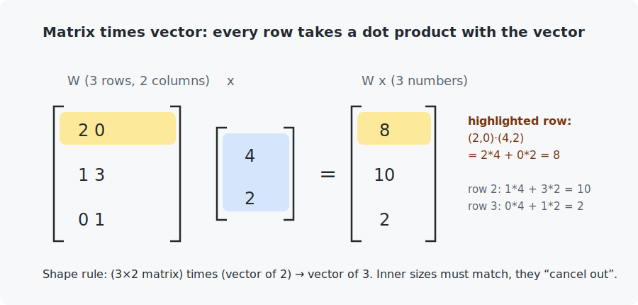

# Chapter 2 — Vectors and matrices

In this chapter you will learn the small amount of linear algebra that powers *all* of AI. This is not an exaggeration: a neural network spends almost 100% of its time doing exactly the two operations you will build here by hand — the dot product and matrix multiplication.

<!-- CONTENTS_START -->
## Contents

- [What you will learn](#what-you-will-learn)
- [Prerequisites](#prerequisites)
- [1. Vectors: a list of numbers with a meaning](#1-vectors-a-list-of-numbers-with-a-meaning)
- [2. The dot product — the most important operation in this course](#2-the-dot-product-the-most-important-operation-in-this-course)
- [3. Matrices: many dot products at once](#3-matrices-many-dot-products-at-once)
- [4. Why NumPy](#4-why-numpy)
- [Code walkthrough](#code-walkthrough)
- [Run it](#run-it)
- [What the C version covers](#what-the-c-version-covers)
- [Exercises](#exercises)
- [Next](#next)

<!-- CONTENTS_END -->

## What you will learn

- What a vector is (two views: list of numbers, arrow in space).
- The dot product — the "how similar are these two things?" operation.
- What a matrix is and how matrix–vector and matrix–matrix multiplication work.
- The shape rule that lets you predict whether any multiplication is legal.
- Why NumPy exists: the same math, a thousand times faster.

## Prerequisites

- [Chapter 1](../01-what-is-ai/README.md) — the vocabulary (features, model, parameters).
- Notation used here is collected in [Appendix A](../../appendices/A-math-notation/README.md).

## 1. Vectors: a list of numbers with a meaning

A **vector** is simply an ordered list of numbers. That is all. We write vectors in bold, like $\mathbf{x}$, and in code they are arrays:



The fruit from Chapter 1 was already a vector: `(150.0, 0.45)` — weight and smoothness. A 28×28 pixel image of a digit is a vector of 784 brightness values. **Turning a real-world thing into a vector of features is always step one of machine learning.**

The number of elements is the vector's **dimension**. You will sometimes see the notation $\mathbf{x} \in \mathbb{R}^n$, which looks scarier than it is — let us take it apart: $\mathbb{R}$ is the mathematician's symbol for "all real numbers" (any decimal you like), the little $\in$ means "belongs to", and the raised $n$ means "a list of $n$ of them". So $\mathbf{x} \in \mathbb{R}^n$ reads simply "**x is a list of $n$ real numbers**" — exactly the plain-English sentence you started with. (Every symbol in this course is collected in [Appendix A](../../appendices/A-math-notation/README.md) if one ever throws you.)

### Operations you can do with vectors

Say $\mathbf{a} = (1, 2)$ and $\mathbf{b} = (3, 1)$.

| Operation | Definition | Example | Meaning as arrows |
|-----------|-----------|---------|-------------------|
| addition | add element by element | $\mathbf{a}+\mathbf{b} = (4, 3)$ | put the arrows head to tail |
| scaling | multiply every element by one number | $2\mathbf{a} = (2, 4)$ | stretch the arrow |
| **dot product** | multiply element by element, **then add it all up** | $\mathbf{a}\cdot\mathbf{b} = 1{\cdot}3 + 2{\cdot}1 = 5$ | see below |

## 2. The dot product — the most important operation in this course

$$\mathbf{a} \cdot \mathbf{b} = \sum_{i=1}^{n} a_i \, b_i$$

That $\sum$ symbol (a Greek capital "sigma") is the mathematician's shorthand for "add all of these up". The $i=1$ underneath and the $n$ on top say "let the counter $i$ run from 1 up to $n$", and the term being added, $a_i\,b_i$, means "the $i$-th element of $\mathbf{a}$ times the $i$-th element of $\mathbf{b}$" (so $a_i$ is just `a[i]` in code). Put together, the whole line reads aloud as: "multiply the first elements together, the second elements together, and so on, then add everything up." The result is **one single number**. In code it is a plain loop:

```python
dot_product = 0.0
for element_index in range(vector_length):
    dot_product += first_vector[element_index] * second_vector[element_index]
```

Why does AI care so much? Two reasons:

1. **A dot product is a weighted sum.** Chapter 0's C program combined values and importance weights: `0.5·0.8 + 0.3·(−0.2)`. Written with vectors, that is exactly `values · weights` — the dot product *is* the weighted sum from Chapter 0, in compact notation. Since weighted sums are the operation AI is built from, the dot product is the operation AI is built from. (In Chapter 7 this same computation, plus an offset, becomes the building block of neural networks.)
2. **It measures agreement.** When the vectors point the same way the dot product is large and positive; perpendicular gives zero; opposite gives negative. So `features · weights` asks: *how much does this input look like the pattern stored in the weights?* That single idea scales from spam filters up to the attention mechanism inside LLMs (Chapter 22 is one big dot product festival).

A vector's **length** (norm) is $\|\mathbf{x}\| = \sqrt{\mathbf{x} \cdot \mathbf{x}}$ — the dot product of a vector with itself, square-rooted. For $(3,2)$: $\sqrt{9+4} = \sqrt{13} \approx 3.61$. The distance you computed in Chapter 1's fruit classifier was the length of the difference between two vectors.

> **Want a deeper, visual feel for vectors and matrices?** Everything this course needs is on this page — but if the geometry clicks better in motion, [3Blue1Brown — *Essence of Linear Algebra*](https://www.youtube.com/playlist?list=PLZHQObOWTQDPD3MizzM2xVFitgF8hE_ab) is the gold standard (short, beautiful, intuitive), and [Khan Academy — Vectors and spaces](https://www.khanacademy.org/math/linear-algebra/vectors-and-spaces) covers the same ground with practice problems.

## 3. Matrices: many dot products at once

A **matrix** is a grid of numbers with $m$ rows and $n$ columns, written $W \in \mathbb{R}^{m \times n}$. The element in row $i$, column $j$ is $W_{ij}$ — in code, `W[i][j]`.

**Matrix × vector**: each row of the matrix takes a dot product with the vector.



Why this matters: a **layer** of a neural network is $m$ neurons all looking at the same $n$ inputs. Stack each neuron's weights as one row of a matrix and the whole layer becomes a single matrix–vector product $W\mathbf{x}$ — one line of math, one line of code, and (Chapter 10 onward) one GPU operation.

**Matrix × matrix**: the same idea repeated. $C = AB$ means every element $C_{ij}$ is the dot product of **row $i$ of $A$** with **column $j$ of $B$**:

$$C_{ij} = \sum_{k} A_{ik} \, B_{kj}$$

That triple loop over $i$, $j$, $k$ is what you will write in both languages today, and it is what GPUs were built to do billions of times per second.

### The shape rule

$$(m \times n) \cdot (n \times p) \rightarrow (m \times p)$$

The inner sizes must match, and they disappear. A $(3\times2)$ matrix times a $(2\times4)$ matrix gives $(3\times4)$. A $(3\times2)$ times a $(3\times2)$ is **illegal** — the inner sizes are 2 and 3. When your PyTorch code crashes with a "shape mismatch" error in Chapter 10 (it will), this rule is how you debug it.

## 4. Why NumPy

Python loops are slow: each pass through a loop pays Python's bookkeeping costs. NumPy stores numbers in one solid block of memory (exactly like a C array — see the C notes below) and runs loops in compiled C internally:

```python
import numpy

matrix_product = first_matrix @ second_matrix    # "@" is matrix multiplication
```

The Python example times your hand-written matmul against NumPy's `@` on 200×200 matrices. Expect NumPy to win by a factor of several hundred. That gap is why all "from scratch" chapters still use NumPy for storage and speed — we implement the *ideas* ourselves, but let NumPy run the arithmetic.

## Code walkthrough

The example is `python/vector_and_matrix_operations.py`. It builds the two operations by hand, checks them against NumPy, then times both. The functions are the section headings of this chapter, in code:

| Function | What it does | What to notice |
|----------|--------------|----------------|
| `compute_dot_product(a, b)` | Multiplies two vectors element by element and sums — the loop from Section 2. | Raises if the lengths differ. This single number is the neuron, the layer, the attention score — everything downstream. |
| `multiply_matrix_by_vector(rows, vector)` | Each matrix row dots the vector. | It is literally `[compute_dot_product(row, vector) for row in rows]` — matrix×vector *is* many dot products. |
| `multiply_matrices(first, second)` | The classic triple loop (`i`, `j`, `k`) for matrix×matrix. | Checks the shape rule and raises on mismatch — the same "shape mismatch" error PyTorch will throw at you in Chapter 10, here in plain sight. |
| `run_worked_examples()` | Reproduces the chapter's numbers (dot = 5, `Wx = (8,10,2)`, a 2×2 matmul) and **asserts they match NumPy**. | The `assert numpy.allclose(...)` lines are the real test: if our loops disagree with NumPy, our understanding is wrong. |
| `compare_speed_against_numpy(size)` | Times the hand-written matmul vs NumPy's `@` on 200×200 matrices. | Expect NumPy ~hundreds of times faster — the reason "from scratch" chapters still let NumPy do the arithmetic. |

The C file `c/vector_and_matrix_operations.c` mirrors these, and shows the one thing NumPy hides: a matrix is a **flat 1-D array**, indexed `values[row * column_count + column]`. That formula returns in every later C example.

## Run it

```bash
.venv/bin/python chapters/02-vectors-and-matrices/python/vector_and_matrix_operations.py
make -C chapters/02-vectors-and-matrices/c && ./chapters/02-vectors-and-matrices/c/build/vector_and_matrix_operations
```

Both print the same worked examples (dot product = 5, the matrix–vector product `(8, 10, 2)` from the figure, a 2×2 matmul), and each ends with a speed comparison: Python-loops vs NumPy, and in C, the same multiplication so you can compare machines.

## What the C version covers

A full port. It also shows the one C idea NumPy hides: a matrix is stored as a **flat 1D block** in row-major order, and `matrix[row][column]` becomes `matrix_values[row_index * column_count + column_index]`. NumPy stores its arrays exactly this way internally — C just refuses to hide it. This formula returns in every later C example.

## Exercises

1. By hand (paper!): compute $(2, -1, 3) \cdot (1, 4, 2)$ and check yourself with either program. *(Answer below the last exercise.)*
2. By hand: what is the shape of $(4\times3)(3\times2)$? And $(3\times2)(4\times3)$? One of them is illegal — which, and why?
3. In the Python file, make the matrices 400×400 instead of 200×200. Loops get ~8× slower, NumPy barely moves. Why 8×? (Hint: the triple loop runs $n^3$ times.)
4. Write (in either language) `compute_vector_length(vector)` using the dot product, and verify $\|(3,4)\| = 5$.
5. Challenge: using the shape rule, explain why the *order* of multiplication matters: $AB \neq BA$ in general, even when both are legal.

*Answer to 1: $2·1 + (-1)·4 + 3·2 = 4$.*

## Next

[Chapter 3 — Derivatives and gradients](../03-derivatives-and-gradients/README.md)

<!-- NAV_START -->
---

[← Chapter 1: What is AI?](../01-what-is-ai/README.md) · [↑ Course index](../../README.md) · [Chapter 3: Derivatives and gradients →](../03-derivatives-and-gradients/README.md)

<!-- NAV_END -->
