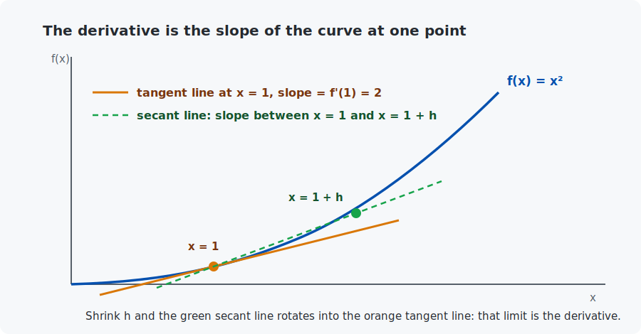
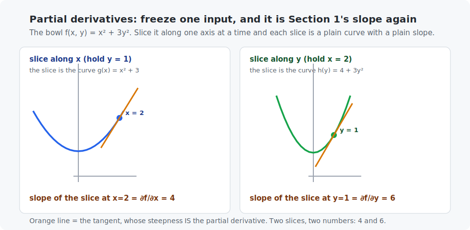
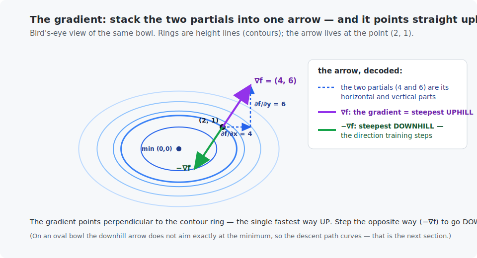
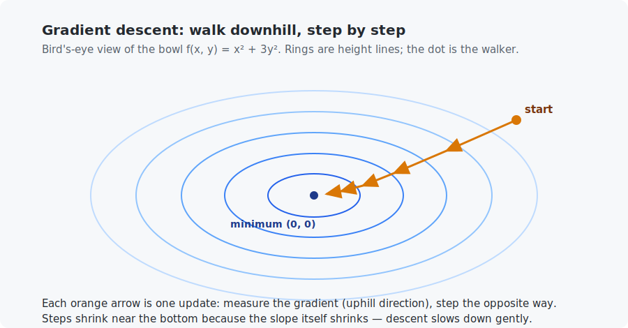

# Chapter 3 — Derivatives and gradients

In this chapter you will learn the second (and last) piece of math that powers all of AI: the derivative. Chapter 2 gave models a way to *compute* (dot products); this chapter gives them a way to *improve* (follow slopes). By the end you will write a program that finds the bottom of a valley by feeling the ground — which is literally how neural networks learn.

<!-- CONTENTS_START -->
## Contents

- [What you will learn](#what-you-will-learn)
- [Prerequisites](#prerequisites)
- [1. Slope: how fast something changes](#1-slope-how-fast-something-changes)
- [2. Many inputs: partial derivatives and the gradient](#2-many-inputs-partial-derivatives-and-the-gradient)
- [3. Gradient descent: learning is walking downhill](#3-gradient-descent-learning-is-walking-downhill)
- [Code walkthrough](#code-walkthrough)
- [Run it](#run-it)
- [What the C version covers](#what-the-c-version-covers)
- [Exercises](#exercises)
- [Next](#next)

<!-- CONTENTS_END -->

## What you will learn

- What a slope is, and what a derivative is (the slope of a curve at one point).
- How to compute any derivative **numerically**, with three lines of code and no formulas.
- Partial derivatives and the gradient — slopes for functions with many inputs.
- Gradient descent: the walk-downhill algorithm behind every model in this course.

## Prerequisites

- [Chapter 2](../02-vectors-and-matrices/README.md) — vectors.
- Notation reference: [Appendix A](../../appendices/A-math-notation/README.md).

## 1. Slope: how fast something changes

A straight line's slope is rise over run: climb 2 meters for every 1 meter forward → slope 2. Walk in the other direction (descending) → slope −2. Flat ground → slope 0. That is all "slope" means: **how much the output changes per unit of input change.**

Curves are trickier — their steepness changes from place to place. So we ask for the slope **at one point**:



Pick a point $x$ and a nearby point $x + h$ (where $h$ is a small step). The slope of the straight line between them (the *secant*) is:

$$\text{slope between the two points} = \frac{f(x+h) - f(x)}{h}$$

Read it: "how much did $f$ rise, divided by how far we stepped." Now shrink $h$ toward zero. The two points merge, the secant becomes the *tangent*, and the slope settles on one number. That number is the **derivative** of $f$ at $x$, written $f'(x)$ or $\frac{df}{dx}$:

$$f'(x) = \lim_{h \to 0} \frac{f(x+h) - f(x)}{h}$$

Let us decode that symbol by symbol, because it is the densest one in the chapter:

- $f'(x)$ (read "f prime of x") is the name for the answer: the slope of $f$ at the point $x$. The other spelling, $\frac{df}{dx}$ (read "d f d x"), means the same thing — "how $f$ changes as $x$ changes".
- $\lim_{h \to 0}$ (read "the limit as h goes to zero") is not a new operation — it is just the "shrink $h$" instruction from the paragraph above, written in symbols. It says: *do the fraction for smaller and smaller $h$, and report the number it settles on.*
- The fraction itself is the secant slope you already understand.

So the whole line reads: "the derivative is the secant slope as the second point slides infinitely close to the first." Nothing more.

### You never need the formulas — you can always compute it numerically

Here is the honest situation, and it is good news. Calculus has a toolbox of **rules** that turn a function into an *exact formula* for its derivative — for instance, those rules say the derivative of $x^2$ is exactly $2x$, and the derivative of $\sin(x)$ is $\cos(x)$. Learning and practicing those rules is what a calculus course spends months on, and **this course deliberately does not teach them.** You will see me write a few results like "the derivative of $x^2$ is $2x$" — each time, know that I am quoting one of those rules, not deriving it here.

Why can we skip them? Because the definition above is already a recipe you can *run*. Just plug in a small $h$:

```python
derivative_estimate = (f(x + small_step) - f(x - small_step)) / (2 * small_step)
```

Stepping both ways (the **central difference**) is more accurate than stepping only forward. With `small_step = 1e-5`, the estimate for $f(x)=x^2$ at $x=3$ comes out 6.000000000 — and the calculus rule says $2x = 2 \times 3 = 6$, so they agree. **That is the pattern for the whole course: you never have to trust a formula on faith — you can always check it numerically, and the example programs do exactly that.**

This numerical trick matters for two reasons: it is how you **check** any hand-derived gradient (we will lean on it as a safety net in Chapter 8), and it proves derivatives are nothing mystical — just $(f(x+h)-f(x-h))/2h$ with a small $h$.

> **Curious where the exact rules come from?** You can read the entire rest of this course without them — but if you *want* to understand why "the derivative of $x^2$ is $2x$", these are the friendliest free resources, in order of gentleness:
> - [3Blue1Brown — *Essence of Calculus*](https://www.youtube.com/playlist?list=PLZHQObOWTQDMsr9K-rj53DwVRMYO3t5Yr) (a beautiful visual series; the first three videos cover everything this course touches)
> - [Khan Academy — Derivative rules](https://www.khanacademy.org/math/differential-calculus/dc-diff-intro) (free, step by step, with practice)
> - [Wikipedia — Derivative](https://en.wikipedia.org/wiki/Derivative) (for reference, denser)

## 2. Many inputs: partial derivatives and the gradient

Real models have many knobs, not one, so we need slopes for functions of several inputs. Take $f(x, y) = x^2 + 3y^2$ — a function with two inputs, shaped like an oval bowl. With more than one input, "the slope" is ambiguous: slope *in which direction*? The answer is to measure one direction at a time.

A **partial derivative** does exactly that. The symbol $\frac{\partial f}{\partial x}$ (read "partial f by x"; the rounded $\partial$ is just a "d" that signals "one variable at a time") means: *the slope if you move only along $x$, holding $y$ completely still — as if $y$ were a fixed constant.* Likewise $\frac{\partial f}{\partial y}$ is the slope moving only along $y$, holding $x$ still. That is the only new idea here — a partial derivative is an ordinary derivative where every input except one is frozen.

For our bowl, applying the standard calculus rules (the ones from the box above — we quote them, we do not derive them here):

- freeze $y$, and $f$ looks like $x^2 + \text{constant}$, whose derivative is $2x$. So $\frac{\partial f}{\partial x} = 2x$.
- freeze $x$, and $f$ looks like $\text{constant} + 3y^2$, whose derivative is $6y$. So $\frac{\partial f}{\partial y} = 6y$.

Here is that idea as a picture. Freeze the inputs at our example point $(2, 1)$: each frozen slice of the bowl becomes an ordinary curve, and its slope at the point is exactly the partial derivative — the very same "slope of a curve" from Section 1, nothing new:



The left slice slopes upward at rate $\frac{\partial f}{\partial x} = 2x = 4$; the right one at $\frac{\partial f}{\partial y} = 6y = 6$.

And — this is the reassuring part — **you do not have to believe those two results.** The `estimate_gradient_of_two_variable_function` in the example computes both by the numerical central difference from Section 1, freezing one input at a time, and confirms they come out $2x$ and $6y$. If the hand rules and the numbers ever disagreed, the numbers would win.

The **gradient** simply collects every partial derivative into one vector (a list of the slopes, one per input), written $\nabla f$ — the upside-down triangle is called "nabla", and you can read $\nabla f$ as "the gradient of $f$":

$$\nabla f(x, y) = \left( \frac{\partial f}{\partial x}, \frac{\partial f}{\partial y} \right) = (2x, 6y)$$

So the gradient is not a new kind of object — it is a *vector of the partial derivatives you just computed*, packed together so we can talk about "all the slopes at once". Draw it as an arrow at the point $(2, 1)$ and its two parts are exactly those partials, 4 across and 6 up:



The gradient has a superpower, and it is the single most important fact in this course:

> **The gradient points in the direction of steepest ascent. So its opposite, $-\nabla f$, points steepest downhill.**

(Why it points uphill is itself a lovely piece of calculus we will not prove — the [Wikipedia article on the gradient](https://en.wikipedia.org/wiki/Gradient) has the full derivation for the curious — but you can simply take it as the one fact to memorize, and the descent experiments in the next section will make you *believe* it by watching it work.)

Plug in the point $(2, 1)$: $\nabla f = (2\times 2, 6\times 1) = (4, 6)$. The bowl climbs fastest in the direction $(4,6)$; to descend fastest, step toward $(-4, -6)$. That single sentence — *step against the gradient* — is the seed of every training algorithm in the course.

## 3. Gradient descent: learning is walking downhill

Here is the plan that trains every model from Chapter 5 to Chapter 31:

1. Stand somewhere (start with random parameter values).
2. Feel the slope under your feet (compute the gradient).
3. Take a small step downhill (subtract a fraction of the gradient).
4. Repeat.

As one formula, applied to every parameter:

$$x_{\text{new}} = x_{\text{old}} - \eta \nabla f(x_{\text{old}})$$

$\eta$ ("eta") is the **learning rate** — the step size. It is the first *hyperparameter* you meet (a knob *you* choose rather than the model learning it). Too small: you crawl. Too large: you overshoot the valley and bounce out. The example programs let you feel both failure modes.



Running descent on the bowl from $(2, 1)$ with $\eta = 0.1$:

| step | position $(x, y)$ | height $f(x,y)$ |
|------|-------------------|------------------|
| 0 | (2.000, 1.000) | 7.000 |
| 1 | (1.600, 0.400) | 3.040 |
| 2 | (1.280, 0.160) | 1.715 |
| 5 | (0.655, 0.010) | 0.430 |
| 20 | (0.023, 0.000) | 0.001 |

It slides to the bottom $(0,0)$, fast at first and gently at the end (small slope → small steps). No formula told it where the minimum was — it *found* it by feel. **Replace "bowl" with "how wrong my model is" and this is machine learning.** That replacement is exactly Chapter 5.

## Code walkthrough

The example is `python/numerical_gradients.py`. Everything is built from one idea — the central difference — so the file is short and each function adds one layer:

| Function | What it does | What to notice |
|----------|--------------|----------------|
| `estimate_derivative(function, point, step)` | The central difference `(f(x+h) − f(x−h)) / 2h` — Section 1, in three lines. | It takes a *function* as an argument. This numeric trick works on anything, with no formula needed. |
| `estimate_gradient_of_two_variable_function(f, x, y, step)` | Two partial derivatives, each freezing one input. | A gradient is just "the derivative in each direction, collected" — that is all this does. |
| `oval_bowl_function(x, y)` | The example landscape `x² + 3y²`, minimum at (0,0). | The "3" is what makes it an *oval* bowl (steeper in y) — the source of the trouble in demo 4 and, later, Chapter 5. |
| `run_gradient_descent_on_bowl(rate, x0, y0, steps, steps_to_print)` | The walk-downhill loop: measure the gradient, step against it, repeat. | The two lines `current_x -= rate * gradient_x` are *the entire learning algorithm* — the minus sign is "go downhill". |
| `main()` | Runs four demos: numeric-vs-formula check, the gradient at (2,1), convergence at rate 0.1, and divergence at rate 0.4. | Demo 4 exploding is not a bug — it is the learning rate being too big, the lesson of the chapter. |

**Carry forward:** `run_gradient_descent_on_bowl` is the skeleton every training loop in the course fleshes out. Replace "bowl" with "how wrong the model is" and you have Chapter 5.

## Run it

```bash
.venv/bin/python chapters/03-derivatives-and-gradients/python/numerical_gradients.py
make -C chapters/03-derivatives-and-gradients/c && ./chapters/03-derivatives-and-gradients/c/build/numerical_gradients
```

Both programs (same output):

1. estimate derivatives numerically and compare them with the exact formulas (they agree to ~10 decimal places),
2. compute the gradient of the bowl at $(2,1)$ and check it equals $(4, 6)$,
3. run gradient descent and print the table above,
4. demonstrate a too-large learning rate exploding.

## What the C version covers

A full port. Note how a "function of two variables" is passed around in C: as a function pointer `double (*function)(double, double)` — the C refresher ([Appendix C](../../appendices/C-c-refresher/README.md)) mentions this as the one advanced C feature the course uses.

## Exercises

1. By hand: the derivative of $f(x) = x^2$ at $x = 5$ is 10. Verify with the central difference and $h = 0.01$ on paper: compute $(5.01^2 - 4.99^2)/0.02$.
2. Change the learning rate in either program to `0.4`. Describe what the table does now, and why (the bowl's $3y^2$ direction has slope $6y$ — steeper than the step size can handle).
3. Add the function $f(x) = e^x$ to the numerical check. Its exact derivative is famously $e^x$ itself — confirm numerically at $x = 1$.
4. Modify the descent to start at $(-3, -2)$. Does it still find $(0,0)$? Why does the starting point not matter *for this bowl*? (In Chapter 11 you will meet landscapes where it very much matters.)
5. Challenge: minimize $f(x, y) = (x-3)^2 + (y+1)^2$ with descent. Where should it converge? Confirm.

## Next

[Chapter 4 — Probability basics](../04-probability-basics/README.md)

<!-- NAV_START -->
---

[← Chapter 2: Vectors and matrices](../02-vectors-and-matrices/README.md) · [↑ Course index](../../README.md) · [Chapter 4: Probability basics →](../04-probability-basics/README.md)

<!-- NAV_END -->
