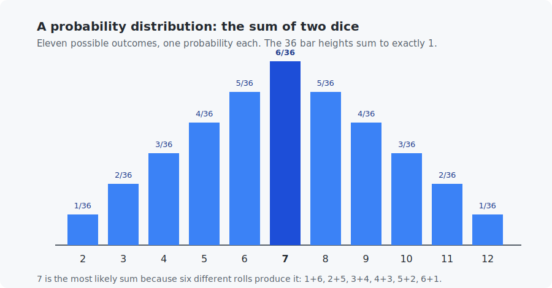
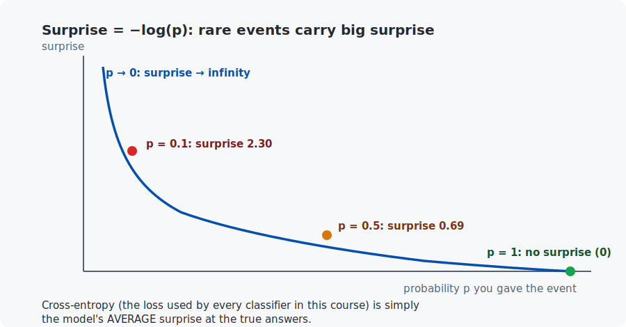

# Chapter 4 — Probability basics

In this chapter you will learn the last piece of foundation math: probability. Modern AI models do not output answers — they output *probabilities of answers* ("87% cat, 13% dog"), and they are trained by a probability-based score called cross-entropy. By the end you will understand that score well enough to compute it by hand, and you will have simulated thousands of dice rolls in both languages to check the theory.

## What you will learn

- What a probability and a probability distribution are.
- Sampling, and why averages of many random draws become predictable (the law of large numbers).
- Expected value — the "long-run average" of a random quantity.
- Surprise ($-\log p$) and **cross-entropy**, the loss function used by every classifier from Chapter 6 to Chapter 24.

## Prerequisites

- [Chapter 3](../03-derivatives-and-gradients/README.md).
- The $\sum$ (sum) notation and $\log$ from [Appendix A](../../appendices/A-math-notation/README.md).

## 1. Probability and distributions

A **probability** is a number between 0 (impossible) and 1 (certain) measuring how likely an event is. Write $P(A)$ for "the probability of event $A$". A fair die gives $P(\text{rolling a 4}) = 1/6 \approx 0.167$.

A **probability distribution** lists *every* possible outcome with its probability. The probabilities must add up to exactly 1 — something must happen. For one fair die the distribution is boring: six outcomes, each $1/6$ ("uniform"). Roll **two** dice and sum them, and structure appears:



Nobody decided 7 should be special. The shape emerges from counting: 36 equally likely pairs of dice, six of which sum to 7. Distribution shapes always come from counting or measuring — that is the whole game.

## 2. Sampling and the law of large numbers

**Sampling** means drawing an actual outcome from a distribution — rolling the die for real. One sample tells you almost nothing. Many samples reveal the distribution:

| rolls of two dice | fraction that summed to 7 | exact answer 6/36 |
|-------------------|---------------------------|-------------------|
| 100 | 0.130 | 0.1667 |
| 10,000 | 0.1653 | 0.1667 |
| 1,000,000 | 0.16669 | 0.1667 |

This is the **law of large numbers**: averages over many samples converge to the true probabilities. It is why "train on more data" is almost always good advice, and why the example programs can *verify* every claim in this chapter by brute force — simulate a million times and compare.

## 3. Expected value: the long-run average

The **expected value** of a random quantity $X$, written $\mathbb{E}[X]$ (read: "the expectation of X"), is each possible value weighted by its probability:

$$\mathbb{E}[X] = \sum_{\text{outcomes } i} P(x_i) \cdot x_i$$

For one die: $\frac{1}{6}(1+2+3+4+5+6) = 3.5$. You never roll 3.5 — expectation is not a prediction of one roll, it is the average of many. Casinos, insurers, and loss functions all live on this idea; in fact **every loss you will minimize in this course is an expectation: the average wrongness over the training examples.**

## 4. Surprise and cross-entropy — how classifiers are graded

Here is the payoff of the chapter. We need a fair score for a model that outputs probabilities. The key ingredient is **surprise**:

$$\text{surprise of an event you gave probability } p = -\log(p)$$

Why $-\log$? It behaves exactly like surprise should:

- You said $p = 1$ (certain) and it happened: $-\log(1) = 0$. No surprise.
- You said $p = 0.5$: $-\log(0.5) \approx 0.69$. Mild surprise.
- You said $p = 0.1$ and it happened anyway: $-\log(0.1) \approx 2.30$. Very surprised.
- You said $p = 0$ (impossible) and it happened: infinite surprise — the score never forgives absolute certainty that was wrong.



**Cross-entropy** is simply the model's **average surprise at the true answers**:

$$\text{cross-entropy} = \frac{1}{n} \sum_{i=1}^{n} -\log\big(p_{\text{model gave to the true answer of example } i}\big)$$

A worked example, done by hand and verified by both programs. Two weather forecasters predict "rain probability" for 5 days; it actually rained on days 1, 2, and 5:

| day | rained? | forecaster A said | A's surprise | forecaster B said | B's surprise |
|-----|---------|-------------------|--------------|-------------------|--------------|
| 1 | yes | 0.8 | 0.22 | 0.5 | 0.69 |
| 2 | yes | 0.9 | 0.11 | 0.5 | 0.69 |
| 3 | no | 0.2 → gave "no" 0.8 | 0.22 | 0.5 | 0.69 |
| 4 | no | 0.1 → gave "no" 0.9 | 0.11 | 0.5 | 0.69 |
| 5 | yes | 0.6 | 0.51 | 0.5 | 0.69 |
| | | **cross-entropy (average)** | **0.23** | | **0.69** |

Forecaster A — confident *and right* — scores 0.23. Forecaster B, who shrugs "50/50" every day, scores 0.69. Lower is better, and cross-entropy rewards exactly what we want: **confident correctness**, punishing both wishy-washiness and confident wrongness.

From Chapter 6 onward, "training a classifier" means: compute cross-entropy, take its gradient (Chapter 3), step downhill. You now hold all three pieces.

## Code walkthrough

The example is `python/dice_and_distributions.py`. Its theme is *verify theory by brute force* — every claim in the chapter is checked by simulating it thousands of times:

| Function | What it does | What to notice |
|----------|--------------|----------------|
| `simulate_two_dice_distribution(rolls, rng)` | Rolls two dice `rolls` times, returns the fraction landing on each sum. | Takes an explicit `rng` (a `random.Random`) so runs are reproducible from one seed — a habit kept all course long. |
| `exact_two_dice_probability(sum)` | The exact answer by counting: `6 − |7 − sum|` pairs out of 36. | Comparing this against the simulation is the whole point — the law of large numbers, made concrete. |
| `estimate_expected_value_by_sampling(n, rng)` | Averages many rolls to estimate the expected values (3.5 and 7.0). | Watch the estimate tighten as `n` grows from 100 to a million. |
| `compute_cross_entropy_for_rain_forecasts(probs, rained)` | **The chapter's payoff:** average surprise `−log(p)` at what actually happened. | The `if rained else 1 − p` branch is subtle: on a dry day, the probability of the *actual* outcome is `1 − p_rain`. This exact function reappears as the classifier loss from Chapter 6 on. |
| `main()` | Runs the three demos and reproduces the weather-forecaster table. | Forecaster A (confident, right) scores 0.23; B ("50/50" always) scores 0.69. Lower is better. |

**Carry forward:** `compute_cross_entropy_for_rain_forecasts` is cross-entropy. Chapters 6, 9, 20–24 all minimize a version of it — you have already written the loss that trains an LLM.

## Run it

```bash
.venv/bin/python chapters/04-probability-basics/python/dice_and_distributions.py
make -C chapters/04-probability-basics/c && ./chapters/04-probability-basics/c/build/dice_and_distributions
```

Both programs: (1) simulate a million two-dice rolls and print the empirical distribution next to the exact one, (2) verify $\mathbb{E} = 3.5$ and 7.0 by sampling, (3) score the two forecasters and reproduce the table above.

## What the C version covers

A full port. Worth reading for one detail: how a random integer 1–6 is made from `rand()`, and why the code uses a fixed seed (`srand(42)`) — so every reader's output matches the chapter exactly. Reproducible randomness (seeding) is a habit you will keep for the whole course: it is how you debug models.

## Exercises

1. By hand: what is the probability the sum of two dice is at least 10? (Count the pairs.) Verify by adding a counter to either program.
2. Compute (by hand) the cross-entropy of a forecaster C who said rain 0.99, 0.99, 0.01, 0.01, 0.01 for the five days. Day 5 rained and C gave it 0.01 — watch what one confident mistake does to the average.
3. Change the simulation to 100 rolls and run it five times (vary the seed). How much do the empirical probabilities wobble? Reconcile this with the law of large numbers.
4. The expected value of one die is 3.5. What is the expected value of "the larger of two dice"? Estimate it by simulation first; then, if you enjoy counting, verify exactly ($\approx 4.47$).

## Next

[Chapter 5 — Linear regression](../05-linear-regression/README.md)
