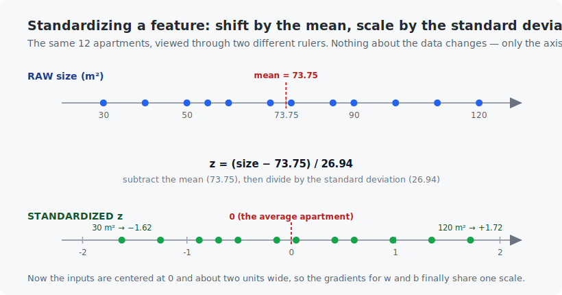

# Chapter 5 — Linear regression

This is the chapter where the pieces snap together. You have vectors (Chapter 2), gradients (Chapter 3), and the idea of a loss (Chapter 4). Now you will train your first real model — from scratch, in both languages — and watch it learn the price of apartments. Every model you build for the rest of the course, up to and including the mini-LLM, trains with **exactly** the loop you write today. Only the model gets bigger.

<!-- CONTENTS_START -->
## Contents

- [What you will learn](#what-you-will-learn)
- [Prerequisites](#prerequisites)
- [1. The problem](#1-the-problem)
- [2. The loss: measuring how wrong a line is](#2-the-loss-measuring-how-wrong-a-line-is)
- [3. The gradients, derived slowly](#3-the-gradients-derived-slowly)
- [4. The training loop](#4-the-training-loop)
- [5. Feature scaling: the same algorithm, 200× faster](#5-feature-scaling-the-same-algorithm-200-faster)
- [6. Inference](#6-inference)
- [Code walkthrough](#code-walkthrough)
- [Run it](#run-it)
- [What the C version covers](#what-the-c-version-covers)
- [Exercises](#exercises)
- [Next](#next)

<!-- CONTENTS_END -->

## What you will learn

- The three-part recipe of supervised learning: **model, loss, optimizer**.
- Mean squared error (MSE) and how to derive its gradients by hand — slowly, symbol by symbol.
- The training loop: forward pass, loss, gradients, update.
- Why feature scaling can make the *same* algorithm converge 200× faster.

## Prerequisites

- [Chapter 3](../03-derivatives-and-gradients/README.md) — gradient descent.
- [Chapter 4](../04-probability-basics/README.md) — the idea of a loss as average wrongness.

## 1. The problem

We have data on 12 apartments — size in square meters, price in thousands of dollars:

| size (m²) | 30 | 40 | 50 | 55 | 60 | 70 | 75 | 85 | 90 | 100 | 110 | 120 |
|---|---|---|---|---|---|---|---|---|---|---|---|---|
| price (1000s of dollars) | 105 | 144 | 168 | 191 | 192 | 233 | 250 | 271 | 297 | 314 | 352 | 377 |

Task: predict the price of an apartment we have never seen, say 80 m². The data looks roughly like a line, so we choose the simplest possible model:

$$\hat{y} = w \cdot x + b$$

Read it: the predicted price $\hat{y}$ ("y hat" — the hat always means *prediction*) is the size $x$ times a **weight** $w$, plus a **bias** $b$. The pair $(w, b)$ are the model's only parameters. Training means: find the $w$ and $b$ that make the line fit.


## 2. The loss: measuring how wrong a line is

Take any candidate line. For each apartment $i$, the model predicts $\hat{y}_i = w x_i + b$ while the truth is $y_i$. The **error** on that apartment is $\hat{y}_i - y_i$. The **mean squared error** averages the squares of all errors:

$$L(w, b) = \frac{1}{n} \sum_{i=1}^{n} (w x_i + b - y_i)^2$$

Why squared? Two reasons. Squaring makes every error positive (an overshoot of +10 is as bad as an undershoot of −10, and they must not cancel out). And squaring punishes big misses much more than small ones — missing by 20 costs 400, missing by 2 costs 4.

$L$ is a landscape exactly like Chapter 3's bowl: two knobs $(w, b)$ instead of $(x, y)$, one height (the loss). It is even bowl-shaped. Find the bottom and you have the best line.

## 3. The gradients, derived slowly

We need $\frac{\partial L}{\partial w}$ and $\frac{\partial L}{\partial b}$. Take one apartment's squared error, $(w x_i + b - y_i)^2$, and let us call the inner part $e_i = w x_i + b - y_i$ (the error). The chain rule from Chapter 3 says: derivative of *(something)²* is *2·(something)* times the derivative of the something.

- How does $e_i$ change when $w$ moves? $e_i = w x_i + \dots$, so $\frac{\partial e_i}{\partial w} = x_i$.
- How does $e_i$ change when $b$ moves? $b$ is added on, so $\frac{\partial e_i}{\partial b} = 1$.

Therefore, averaging over the dataset:

$$\frac{\partial L}{\partial w} = \frac{2}{n} \sum_{i=1}^{n} e_i x_i \qquad\qquad \frac{\partial L}{\partial b} = \frac{2}{n} \sum_{i=1}^{n} e_i$$

Read them aloud, they are friendlier than they look: *the weight's gradient is the average of (error × input); the bias's gradient is the average error.* If predictions run too high, the average error is positive and both parameters get pushed down. The formulas do the sensible thing.

(Not sure a derivation is right? Chapter 3 gave you the tool: check it numerically. Both example programs do exactly that before training starts.)

## 4. The training loop

```
repeat many times:
    1. forward pass: predict y_hat_i = w * x_i + b for every apartment
    2. loss:         L = average of (y_hat_i - y_i)^2
    3. gradients:    the two formulas above
    4. update:       w = w - learning_rate * dL/dw
                     b = b - learning_rate * dL/db
```

Memorize the shape of this loop — *forward, loss, gradients, update* — because it never changes again in this course. Running it with learning rate $\eta = 10^{-4}$:

| epoch | loss | $w$ | $b$ |
|-------|------|-----|-----|
| 0 | 64699.8 | 0.000 | 0.000 |
| 1 | 3583.5 | 3.992 | 0.048 |
| 10 | 72.1 | 3.237 | 0.044 |
| 10,000 | 54.2 | 3.187 | 4.263 |
| 100,000 | 24.8 | 3.019 | 18.267 |
| 200,000 | 24.4 | 2.999 | 19.999 |

(An **epoch** is one pass over the whole dataset.) It works — the model lands on `price = 3.0·size + 20`.

One thing surprises people here: the loss settles at about **24.4, not 0**. That is not a failure to converge — it is the *right* answer. The 12 real apartments do not sit exactly on any straight line (real prices wobble), so no line can drive every error to zero; 24.4 is simply the smallest average squared error a straight line can achieve on this data. "Converged" means **the loss stopped improving**, not that it reached zero. (Exercise 1 has you confirm this by hand.)

With that settled, look at the *path* the parameters took: the slope $w$ was nearly right after just 10 epochs, while the bias $b$ crawled for 200,000. Why the lopsided speed?

## 5. Feature scaling: the same algorithm, 200× faster

### Why the raw run was so lopsided

The gradient of $w$ contains a factor $x_i$ (sizes: 30–120); the gradient of $b$ contains a factor 1. So $w$ receives updates roughly 75× larger than $b$. One learning rate cannot fit both: small enough to keep $w$ stable is far too small for $b$, which is why the bias crawled. This is Chapter 3's oval bowl, stretched extremely.

### Step 1 — standardize the sizes (shift and scale)

The fix is to **standardize** the feature: put it on a ruler centered at 0 and about one unit wide, so the two gradients share a scale. Compute two numbers from the 12 sizes — their **mean** (the average) and their **standard deviation** (a measure of spread):

$$\text{mean} = \frac{30 + 40 + \dots + 120}{12} = 73.75 \text{ m}^2, \qquad \text{std} \approx 26.94 \text{ m}^2$$

Then replace each size $x$ with its **standardized** value $z$:

$$z = \frac{x - \text{mean}}{\text{std}} = \frac{x - 73.75}{26.94}$$

Subtracting the mean slides the average apartment to $z = 0$; dividing by the spread makes one standard deviation one unit. The smallest apartment, 30 m², becomes $z = (30 - 73.75)/26.94 \approx -1.62$; the average one becomes exactly 0; the largest, 120 m², becomes $\approx +1.72$. Same apartments, new ruler:



Now both gradients live at the same scale, the learning rate can jump all the way to 0.1, and the **same loop** converges in about 300 epochs instead of 200,000.

### Step 2 — read the learned line back in real square meters

Training on $z$ produces a line in the *standardized* world, and that is the source of the scary-looking numbers in the output: the program reports $w_z \approx 80.7$ and $b_z \approx 241.2$, nothing like the 3 and 20 we expected. They are not wrong — they are simply measured on the standardized ruler (where "1" means one standard deviation, not one square meter). To use the line on a real size, undo the standardization: take the standardized line $\text{price} = w_z \cdot z + b_z$, substitute $z = (x - \text{mean})/\text{std}$, and expand:

$$\text{price} = w_z \cdot \frac{x - \text{mean}}{\text{std}} + b_z = \underbrace{\frac{w_z}{\text{std}}}_{\text{raw slope } w} \cdot x + \underbrace{\left(b_z - \frac{w_z \cdot \text{mean}}{\text{std}}\right)}_{\text{raw bias } b}$$

Reading the two underbraced pieces straight off:

$$w = \frac{w_z}{\text{std}} = \frac{80.7}{26.94} \approx 3.0, \qquad b = b_z - \frac{w_z \cdot \text{mean}}{\text{std}} = 241.2 - \frac{80.7 \times 73.75}{26.94} \approx 20.2$$

There it is — the very same `price ≈ 3.0·size + 20` that the slow raw run crawled to over 200,000 epochs, recovered from the fast run with one line of algebra. The program prints the raw-unit line from *both* runs side by side so you can confirm they match.

The habit — **always put your inputs on a similar scale** — carries through the entire course (for images we divide pixels by 255; Chapter 11's batch norm automates the idea inside deep networks).

## 6. Inference

After training: predict the 80 m² apartment. $\hat{y} = 3.0 \cdot 80 + 20 = 260$ — about 260,000 dollars. The model never saw an 80 m² apartment; the *pattern* generalizes. That is the entire promise of machine learning, delivered by two numbers and a loop.

## Code walkthrough

The example is `python/train_linear_regression.py` — the first real *training loop* in the course. We will read it slowly, assuming **no prior programming** (Chapter 3's walkthrough introduced `def`, `return`, and `for`; the same primer applies).

### Step 1 — the loss: one number for "how wrong is this line"

```python
def compute_mean_squared_error(weight, bias, input_values, true_values):
    total_squared_error = 0.0
    for input_value, true_value in zip(input_values, true_values):
        prediction_error = weight * input_value + bias - true_value
        total_squared_error += prediction_error ** 2
    return total_squared_error / len(input_values)
```

`zip(input_values, true_values)` walks the sizes and prices together, one apartment per turn. For each, `weight * input_value + bias` is the model's prediction, minus the true price is the `prediction_error`, and `** 2` squares it (Section 2's reason: errors must not cancel, and big misses should hurt more). We sum all the squares and divide by the count — the mean squared error. **This single number is what training drives down.**

### Step 2 — the gradients: which way is downhill

```python
for input_value, true_value in zip(input_values, true_values):
    prediction_error = weight * input_value + bias - true_value
    gradient_weight += prediction_error * input_value
    gradient_bias += prediction_error
return 2.0 * gradient_weight / number_of_examples, 2.0 * gradient_bias / number_of_examples
```

This is Section 3's two formulas, line for line: the weight's gradient accumulates `error * input`, the bias's gradient accumulates just `error`, and both get averaged and doubled. The code *is* the math, with long names standing in for the symbols.

### Step 3 — never trust a hand-derived gradient: check it

`verify_gradients_numerically` computes the same two slopes a second way — Chapter 3's central difference, nudging each parameter a hair and measuring how the loss moves — and prints both side by side. They match to four decimals. **This runs before any training.** Re-deriving a gradient by hand and confirming it numerically is a habit that becomes essential once the models are too big to check by eye (Chapter 8).

### Step 4 — the training loop (memorize this shape)

```python
weight = 0.0
bias = 0.0
for epoch_number in range(number_of_epochs + 1):
    gradient_weight, gradient_bias = compute_loss_gradients(weight, bias, input_values, true_values)
    weight = weight - learning_rate * gradient_weight
    bias = bias - learning_rate * gradient_bias
return weight, bias
```

Start both parameters at 0. Each pass (`epoch`) over the data: measure the gradient, then step each parameter a little *against* it (the minus sign = downhill, exactly Chapter 3). Repeat. **Memorize this shape — forward, loss, gradient, update — because it never changes again in this course.** Chapter 24's LLM trains with this exact skeleton; only the model in the middle grows.

### Step 5 — standardizing, and converting the answer back

This is the part that produced the confusing output, so here is the code behind Section 5's math. First, standardizing the sizes:

```python
def standardize_values(values):
    mean_value = sum(values) / len(values)
    variance = sum((value - mean_value) ** 2 for value in values) / len(values)
    standard_deviation = variance ** 0.5
    standardized = [(value - mean_value) / standard_deviation for value in values]
    return standardized, mean_value, standard_deviation
```

It computes the `mean_value` (73.75) and the `standard_deviation` (≈26.94), builds the new list where every size becomes `(value - mean) / std`, and — crucially — **returns the mean and std alongside**, because we cannot convert the answer back without them.

Then, after training on the standardized sizes gives `weight_standardized` (≈80.7) and `bias_standardized` (≈241.2), `main()` converts them to real square meters with the exact two formulas derived in Section 5:

```python
weight_raw_units = weight_standardized / size_standard_deviation
bias_raw_units = bias_standardized - weight_standardized * size_mean / size_standard_deviation
```

The first line is $w = w_z / \text{std}$; the second is $b = b_z - w_z \cdot \text{mean} / \text{std}$ — the two underbraced pieces from Section 5, typed out. Run it and both training runs report the same `price ≈ 3.0·size + 20`.

### Quick reference

| Function | What it does | What to notice |
|----------|--------------|----------------|
| `compute_mean_squared_error(w, b, x, y)` | The loss: average of `(w·x + b − y)²` over the apartments. | This one number is what training drives down. |
| `compute_loss_gradients(w, b, x, y)` | The hand-derived gradients: average of `error·x`, and average of `error`. | Read them next to the formulas in Section 3 — the code *is* the math. |
| `verify_gradients_numerically(w, b)` | Checks those gradients against Chapter 3's central difference. | **Runs before training** — never trust a hand-derived gradient until a numeric check agrees. |
| `train_with_gradient_descent(x, y, rate, epochs, epochs_to_print)` | The four-step loop: forward, loss, gradients, update. | Memorize its shape. Chapter 24's LLM trains with this exact skeleton. |
| `standardize_values(values)` | Shifts and scales the feature to mean 0, spread 1; returns the mean/std to convert back. | The 200×-speedup fix. The returned stats are what convert the line to real units. |
| `main()` | Verifies gradients, trains raw (slow), trains standardized (fast), converts back, predicts an 80 m² flat. | The two runs reaching the same line at wildly different speeds is the chapter's core lesson. |

## Run it

```bash
.venv/bin/python chapters/05-linear-regression/python/train_linear_regression.py
make -C chapters/05-linear-regression/c && ./chapters/05-linear-regression/c/build/train_linear_regression
```

Both programs print: the numerical gradient check, the raw-feature training table above, the standardized training (300 epochs), the recovered line, and the 80 m² prediction. The Python version takes a few seconds (200,000 epochs in pure Python); the C version does the same work in a blink — a preview of why frameworks push math into compiled code.

## What the C version covers

A full port, identical output. Notice it is barely longer than the Python: at this scale, "machine learning" is 60 lines of arithmetic in any language.

## Exercises

1. By hand: with $w=3, b=20$, compute the prediction and squared error for the 60 m² apartment (true price 192). Check against either program's final loss — why is the loss not zero even after perfect convergence?
2. Set the learning rate to $10^{-3}$ in the raw-feature version. Explain what you see using Section 5's argument.
3. Add a 13th apartment: 200 m², price 1000 (a luxury outlier). Retrain. How much does the line move? Squared error's harsh punishment of big misses makes regression sensitive to outliers — connect this to Section 2.
4. Predict the price of a 500 m² apartment. The number comes out confidently absurd. What does this teach about using models outside the range of their training data (*extrapolation*)?
5. Challenge: add a second feature (e.g., distance to the city center) with made-up values, so the model becomes $\hat{y} = w_1 x_1 + w_2 x_2 + b$. Extend the gradient formulas and verify them with the numerical checker.

## Next

[Chapter 6 — Logistic regression](../06-logistic-regression/README.md)

<!-- NAV_START -->
---

[← Chapter 4: Probability basics](../04-probability-basics/README.md) · [↑ Course index](../../README.md) · [Chapter 6: Logistic regression →](../06-logistic-regression/README.md)

<!-- NAV_END -->
