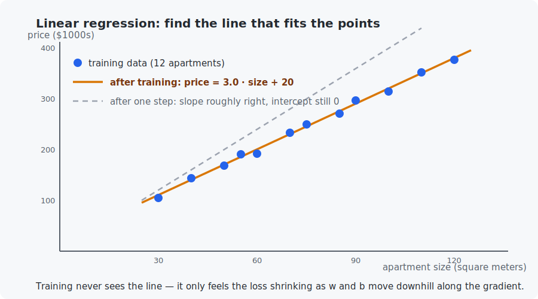

# Chapter 5 — Linear regression

This is the chapter where the pieces snap together. You have vectors (Chapter 2), gradients (Chapter 3), and the idea of a loss (Chapter 4). Now you will train your first real model — from scratch, in both languages — and watch it learn the price of apartments. Every model you build for the rest of the course, up to and including the mini-LLM, trains with **exactly** the loop you write today. Only the model gets bigger.

## What you will learn

- The three-part recipe of supervised learning: **model, loss, optimizer**.
- Mean squared error (MSE) and how to derive its gradients by hand — slowly, symbol by symbol.
- The training loop: forward pass, loss, gradients, update.
- Why feature scaling can make the *same* algorithm converge 200× faster.

## Prerequisites

- [Chapter 3](../03-derivatives-and-gradients/README.md) — gradient descent.
- [Chapter 4](../04-probability-basics/README.md) — the idea of a loss as average wrongness.

## 1. The problem

We have data on 12 apartments — size in square meters, price in thousands of dollars:

| size (m²) | 30 | 40 | 50 | 55 | 60 | 70 | 75 | 85 | 90 | 100 | 110 | 120 |
|---|---|---|---|---|---|---|---|---|---|---|---|---|
| price ($1000s) | 105 | 144 | 168 | 191 | 192 | 233 | 250 | 271 | 297 | 314 | 352 | 377 |

Task: predict the price of an apartment we have never seen, say 80 m². The data looks roughly like a line, so we choose the simplest possible model:

$$\hat{y} = w \cdot x + b$$

Read it: the predicted price $\hat{y}$ ("y hat" — the hat always means *prediction*) is the size $x$ times a **weight** $w$, plus a **bias** $b$. The pair $(w, b)$ are the model's only parameters. Training means: find the $w$ and $b$ that make the line fit.



## 2. The loss: measuring how wrong a line is

Take any candidate line. For each apartment $i$, the model predicts $\hat{y}_i = w x_i + b$ while the truth is $y_i$. The **error** on that apartment is $\hat{y}_i - y_i$. The **mean squared error** averages the squares of all errors:

$$L(w, b) = \frac{1}{n} \sum_{i=1}^{n} (w x_i + b - y_i)^2$$

Why squared? Two reasons. Squaring makes every error positive (an overshoot of +10 is as bad as an undershoot of −10, and they must not cancel out). And squaring punishes big misses much more than small ones — missing by 20 costs 400, missing by 2 costs 4.

$L$ is a landscape exactly like Chapter 3's bowl: two knobs $(w, b)$ instead of $(x, y)$, one height (the loss). It is even bowl-shaped. Find the bottom and you have the best line.

## 3. The gradients, derived slowly

We need $\frac{\partial L}{\partial w}$ and $\frac{\partial L}{\partial b}$. Take one apartment's squared error, $(w x_i + b - y_i)^2$, and let us call the inner part $e_i = w x_i + b - y_i$ (the error). The chain rule from Chapter 3 says: derivative of *(something)²* is *2·(something)* times the derivative of the something.

- How does $e_i$ change when $w$ moves? $e_i = w x_i + \dots$, so $\frac{\partial e_i}{\partial w} = x_i$.
- How does $e_i$ change when $b$ moves? $b$ is added on, so $\frac{\partial e_i}{\partial b} = 1$.

Therefore, averaging over the dataset:

$$\frac{\partial L}{\partial w} = \frac{2}{n} \sum_{i=1}^{n} e_i \, x_i \qquad\qquad \frac{\partial L}{\partial b} = \frac{2}{n} \sum_{i=1}^{n} e_i$$

Read them aloud, they are friendlier than they look: *the weight's gradient is the average of (error × input); the bias's gradient is the average error.* If predictions run too high, the average error is positive and both parameters get pushed down. The formulas do the sensible thing.

(Not sure a derivation is right? Chapter 3 gave you the tool: check it numerically. Both example programs do exactly that before training starts.)

## 4. The training loop

```
repeat many times:
    1. forward pass: predict y_hat_i = w * x_i + b for every apartment
    2. loss:         L = average of (y_hat_i - y_i)^2
    3. gradients:    the two formulas above
    4. update:       w = w - learning_rate * dL/dw
                     b = b - learning_rate * dL/db
```

Memorize the shape of this loop — *forward, loss, gradients, update* — because it never changes again in this course. Running it with learning rate $\eta = 10^{-4}$:

| epoch | loss | $w$ | $b$ |
|-------|------|-----|-----|
| 0 | 64699.8 | 0.000 | 0.000 |
| 1 | 3583.5 | 3.992 | 0.048 |
| 10 | 72.1 | 3.237 | 0.044 |
| 10,000 | 54.2 | 3.187 | 4.263 |
| 100,000 | 24.8 | 3.019 | 18.267 |
| 200,000 | 24.4 | 2.999 | 20.000 |

(An **epoch** is one pass over the whole dataset.) It works — the model lands on `price = 3.0·size + 20` — but look closer: the slope $w$ was nearly right after 10 epochs, while the bias $b$ crawled for 200,000. Why?

## 5. Feature scaling: the same algorithm, 200× faster

The gradient of $w$ contains a factor $x_i$ (sizes: 30–120); the gradient of $b$ contains a factor 1. So $w$ receives updates ~75× larger than $b$. One learning rate cannot fit both: small enough to keep $w$ stable is far too small for $b$. This is Chapter 3's oval bowl, stretched extremely.

The fix is to **standardize** the feature — replace $x$ with $z = (x - \text{mean}) / \text{standard deviation}$, so the input has mean 0 and spread 1. Both gradients now live at the same scale, the learning rate can jump to 0.1, and the same loop converges in about 300 epochs instead of 200,000. Afterward the learned line converts back to raw units, giving the same `3.0·size + 20`.

Both example programs run *both* versions so you can watch the difference. The habit — **always put your inputs on a similar scale** — carries through the entire course (for images we divide pixels by 255; Chapter 11's batch norm automates the idea inside deep networks).

## 6. Inference

After training: predict the 80 m² apartment. $\hat{y} = 3.0 \cdot 80 + 20 = 260$ — about $260{,}000. The model never saw an 80 m² apartment; the *pattern* generalizes. That is the entire promise of machine learning, delivered by two numbers and a loop.

## Code walkthrough

The example is `python/train_linear_regression.py`. This is the first *training loop* in the course, and its five functions map exactly onto the recipe — model, loss, gradients, update, plus the scaling fix:

| Function | What it does | What to notice |
|----------|--------------|----------------|
| `compute_mean_squared_error(w, b, x, y)` | The loss: average of `(w·x + b − y)²` over the apartments. | This one number is what training drives down. |
| `compute_loss_gradients(w, b, x, y)` | The hand-derived gradients: average of `error·x`, and average of `error`. | Read them next to the formulas in Section 3 — the code *is* the math, with long names for the symbols. |
| `verify_gradients_numerically(w, b)` | Checks those gradients against Chapter 3's central difference. | **This runs before training** — never trust a hand-derived gradient until a numeric check agrees. A habit that becomes essential in Chapter 8. |
| `train_with_gradient_descent(x, y, rate, epochs, epochs_to_print)` | The four-step loop: forward, loss, gradients, update. | Memorize its shape. It never changes again — Chapter 24's LLM trains with this exact skeleton. |
| `standardize_values(values)` | Shifts and scales the feature to mean 0, spread 1; returns the mean/std to convert back. | This is the 200×-speedup fix. The returned stats are used at the end to report the line in real apartment units. |
| `main()` | Verifies gradients, trains on raw sizes (slow), trains on standardized sizes (fast), recovers the line, predicts an 80 m² flat. | The two training runs reaching the same answer at wildly different speeds is the chapter's core lesson. |

## Run it

```bash
.venv/bin/python chapters/05-linear-regression/python/train_linear_regression.py
make -C chapters/05-linear-regression/c && ./chapters/05-linear-regression/c/build/train_linear_regression
```

Both programs print: the numerical gradient check, the raw-feature training table above, the standardized training (300 epochs), the recovered line, and the 80 m² prediction. The Python version takes a few seconds (200,000 epochs in pure Python); the C version does the same work in a blink — a preview of why frameworks push math into compiled code.

## What the C version covers

A full port, identical output. Notice it is barely longer than the Python: at this scale, "machine learning" is 60 lines of arithmetic in any language.

## Exercises

1. By hand: with $w=3, b=20$, compute the prediction and squared error for the 60 m² apartment (true price 192). Check against either program's final loss — why is the loss not zero even after perfect convergence?
2. Set the learning rate to $10^{-3}$ in the raw-feature version. Explain what you see using Section 5's argument.
3. Add a 13th apartment: 200 m², price 1000 (a luxury outlier). Retrain. How much does the line move? Squared error's harsh punishment of big misses makes regression sensitive to outliers — connect this to Section 2.
4. Predict the price of a 500 m² apartment. The number comes out confidently absurd. What does this teach about using models outside the range of their training data (*extrapolation*)?
5. Challenge: add a second feature (e.g., distance to the city center) with made-up values, so the model becomes $\hat{y} = w_1 x_1 + w_2 x_2 + b$. Extend the gradient formulas and verify them with the numerical checker.

## Next

[Chapter 6 — Logistic regression](../06-logistic-regression/README.md)
