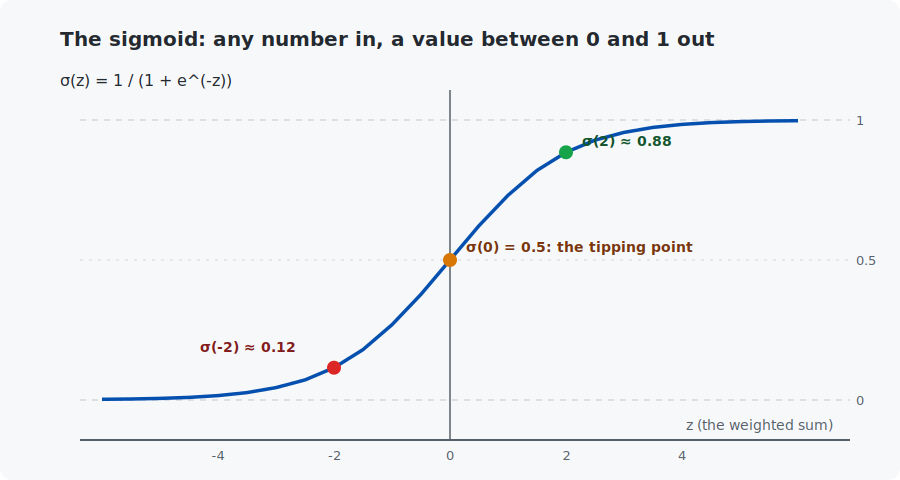
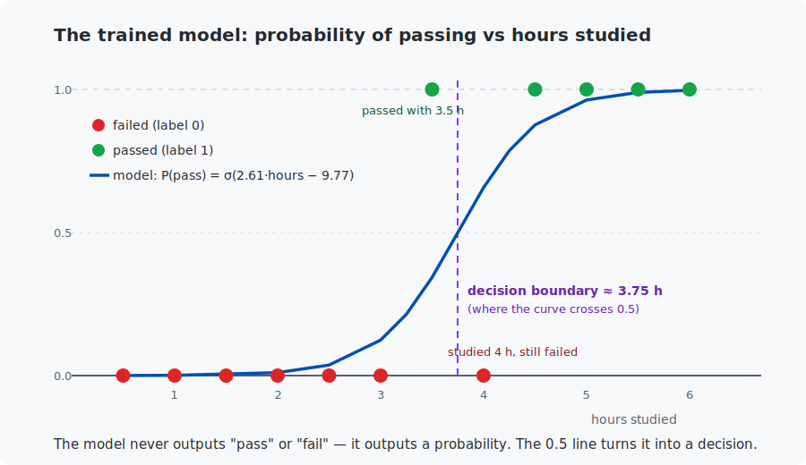

# Chapter 6 — Logistic regression

Chapter 5 predicted a *number* (a price). But most AI questions want a *category*: spam or not, cat or dog, pass or fail. In this chapter you will build your first trained classifier — and meet the exact loss (cross-entropy) and output layer (sigmoid) that every classifier in this course uses, up to and including the mini-LLM.

## What you will learn

- Why predicting a category needs a different model than predicting a number.
- The sigmoid function — how a weighted sum becomes a probability.
- Training with cross-entropy (Chapter 4's "average surprise") and gradient descent.
- Decision boundaries: turning probabilities into decisions.

## Prerequisites

- [Chapter 4](../04-probability-basics/README.md) — cross-entropy.
- [Chapter 5](../05-linear-regression/README.md) — the training loop (forward, loss, gradients, update).

## 1. The problem, and why a line is not enough

Twelve students studied for an exam; here is how long each studied and whether they passed (1) or failed (0):

| hours | 0.5 | 1 | 1.5 | 2 | 2.5 | 3 | 3.5 | 4 | 4.5 | 5 | 5.5 | 6 |
|---|---|---|---|---|---|---|---|---|---|---|---|---|
| passed | 0 | 0 | 0 | 0 | 0 | 0 | 1 | 0 | 1 | 1 | 1 | 1 |

Notice the messy middle: one student passed with 3.5 hours, another failed with 4. Real data always has this — identical effort, different outcomes. That is precisely why the model should output a **probability** ("with 4 hours you pass with probability 0.66"), not a hard yes/no.

Could we just reuse Chapter 5, fitting `passed = w·hours + b`? Two things break:

1. The line's output is unbounded — it happily predicts "1.4" or "−0.2 chance of passing", which is nonsense for a probability.
2. Squared error is the wrong penalty for probabilities. Chapter 4 built the right one: **cross-entropy**, which fines confident wrongness brutally and never forgives a "0% chance" that happens. Squared error would fine a 0.99-confident mistake at most $(1-0)^2 = 1$ — barely more than a shrug.

We keep the weighted sum (it is our only tool for combining features, and a good one) but fix the output range with one extra step.

## 2. The sigmoid: from weighted sum to probability

The **sigmoid function** squashes any number into the range (0, 1):

$$\sigma(z) = \frac{1}{1 + e^{-z}}$$

Read it piece by piece: $z$ is any number (for us: the weighted sum $w \cdot x + b$). $e^{-z}$ is the exponential from [Appendix A](../../appendices/A-math-notation/README.md) — always positive, huge when $z$ is very negative, near zero when $z$ is very positive. So the denominator ranges from "huge" (output near 0) down to "barely above 1" (output near 1):



Check the three marked points by hand: $\sigma(0) = 1/(1+1) = 0.5$; $\sigma(2) = 1/(1+0.135) \approx 0.88$; $\sigma(-2) \approx 0.12$. Big positive weighted sum → probability near 1; big negative → near 0; zero → the 50/50 tipping point.

Our whole model is therefore:

$$P(\text{pass}) = \sigma(w \cdot \text{hours} + b)$$

Two parameters, exactly like Chapter 5 — one weight, one bias. This model is called **logistic regression** (a historical name: it is a classifier, despite the "regression").

## 3. The loss and its gradient

Chapter 4 already built our loss. The model gives each training student a probability; cross-entropy is the **average surprise at what actually happened**:

$$L(w, b) = \frac{1}{n} \sum_{i=1}^{n} -\log\big(p_i \text{ if student } i \text{ passed, else } 1 - p_i\big) \quad\text{where } p_i = \sigma(w x_i + b)$$

To train, we need the gradients. The derivation (chain rule through the log and the sigmoid) has a famous punchline — nearly everything cancels, leaving:

$$\frac{\partial L}{\partial w} = \frac{1}{n} \sum_{i=1}^{n} (p_i - y_i) \, x_i \qquad\qquad \frac{\partial L}{\partial b} = \frac{1}{n} \sum_{i=1}^{n} (p_i - y_i)$$

Stop and compare with Chapter 5's gradients: **identical shape** — average of (error × input), average of (error) — except the "error" is now `probability − label` instead of `prediction − truth`, and the factor 2 is gone. This is not a coincidence; sigmoid + cross-entropy were made for each other, and the same clean pattern will reappear with softmax in Chapter 9. We do not reproduce the full cancellation here (it is a satisfying exercise once you have Chapter 8's chain-rule practice), but we do not ask for faith either: **both programs verify these formulas numerically before training**, exactly like Chapter 5.

## 4. Training, step by step

The loop is unchanged — *forward, loss, gradients, update* — with learning rate 0.5 (hours are small numbers, so no scaling needed; check: feature values 0.5–6, all within one order of magnitude):

| epoch | loss | $w$ | $b$ | boundary (h) |
|-------|------|-----|-----|--------------|
| 0 | 0.6931 | 0.000 | 0.000 | — |
| 10 | 0.5438 | 0.300 | −0.755 | 2.52 |
| 100 | 0.2880 | 1.082 | −3.838 | 3.55 |
| 1000 | 0.2115 | 2.253 | −8.405 | 3.73 |
| 5000 | 0.2092 | 2.605 | −9.769 | 3.75 |

Two details worth noticing:

- The starting loss is 0.6931 — that is $-\log(0.5)$, the "always say 50/50" score of Chapter 4's forecaster B. With $w = b = 0$ the sigmoid outputs 0.5 for everyone; training begins from pure ignorance.
- The final loss is not zero and never will be: the two noisy students (passed at 3.5 h, failed at 4 h) make perfect prediction impossible. The model settles on honest probabilities instead.

## 5. The decision boundary

The model outputs probabilities; decisions come from a threshold. The natural one is 0.5, and the sigmoid crosses 0.5 exactly where the weighted sum is zero:

$$w \cdot x + b = 0 \quad\Rightarrow\quad x = -\frac{b}{w} = \frac{9.769}{2.605} \approx 3.75 \text{ hours}$$



Below ~3.75 study hours the model bets "fail", above it "pass" — but unlike Chapter 1's hand-guessed `weight > 150`, this threshold was *learned*, and the model also tells you how confident it is near the line: $P(\text{pass} \mid 3.7\text{h}) = 0.47$ — a coin flip, as the messy data deserves.

With one feature the boundary is a point on the hours axis. With two features it becomes a line in the plane; with hundreds, an invisible flat surface. What it can never be, for logistic regression, is *curved* — remember this, because it is exactly the wall Chapter 7 runs into.

## Code walkthrough

The example is `python/train_logistic_regression.py`. It is Chapter 5's training loop with two changes — a sigmoid on the output and cross-entropy for the loss. Notice how little else moves:

| Function | What it does | What to notice |
|----------|--------------|----------------|
| `sigmoid(z)` | `1 / (1 + e^(−z))` — squashes the weighted sum into a probability. | Three characters of math; the whole reason this is a classifier. |
| `compute_cross_entropy_loss(w, b, x, y)` | Average surprise at the true labels (Chapter 4's loss, applied here). | The `PROBABILITY_CLAMP` (1e-12) keeps `log(0)` from becoming infinity — a numerical safety rail every real framework has. |
| `compute_loss_gradients(w, b, x, y)` | The gradients — which cancel down to `(probability − label)`. | Compare with Chapter 5: **same shape**, `error·x` and `error`, but "error" is now `probability − label`. Sigmoid and cross-entropy were made for each other. |
| `verify_gradients_numerically(w, b)` | Numeric check of those gradients before training. | Same discipline as Chapter 5 — the formula is confirmed, not assumed. |
| `main()` | Trains 5000 epochs, prints the loss and the **decision boundary** each step, then predicts for 2 h / 3.7 h / 5 h students. | The boundary converges to 3.75 h; the 3.7 h student sits at P = 0.47, a coin flip — exactly what the messy data deserves. |

**Carry forward:** `sigmoid` + `compute_cross_entropy_loss` are the classifier core. Chapter 9 scales the same pair to ten classes (softmax); the pattern is identical.

## Run it

```bash
.venv/bin/python chapters/06-logistic-regression/python/train_logistic_regression.py
make -C chapters/06-logistic-regression/c && ./chapters/06-logistic-regression/c/build/train_logistic_regression
```

Both programs print, in order: the numerical gradient check, the training table above, the learned boundary, and predictions for three new students (2 h, 3.7 h, 5 h of study). Identical output in both languages.

## What the C version covers

A full port. One numeric subtlety appears in the code of both languages: computing $-\log(1-p)$ when $p$ is extremely close to 1 would overflow to infinity, so the loss code clamps probabilities away from exact 0 and 1. Numerical safety rails like this are routine in real ML code — you will meet the same trick inside every framework.

## Exercises

1. By hand: with the trained model ($w=2.605$, $b=-9.769$), compute $P(\text{pass})$ for a student who studies 3 hours. (Compute the weighted sum, then the sigmoid — a calculator helps for $e$.) Check against the programs.
2. Remove the two noisy students from the dataset and retrain. What happens to the final loss, and to $w$? (When classes separate perfectly, $w$ keeps growing — the model becomes ever more confident. Watch it happen.)
3. Change the decision threshold from 0.5 to 0.9 in your head: which students get classified differently? When would a real system want a 0.9 threshold instead of 0.5? (Think of a spam filter deleting mail, or a medical screen.)
4. The gradient formulas contain `(probability − label)`. Explain in one sentence why the gradient is exactly zero for a student the model predicts perfectly.
5. Challenge: add a second feature, "hours slept the night before", inventing plausible values. Extend the model to $\sigma(w_1 x_1 + w_2 x_2 + b)$, verify your gradients numerically, and find where its decision *line* sits.

## Next

[Chapter 7 — Perceptrons and neurons](../07-perceptron-and-neurons/README.md)
