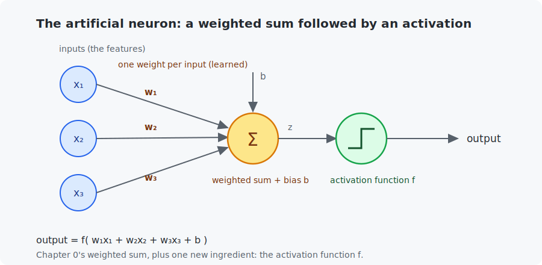
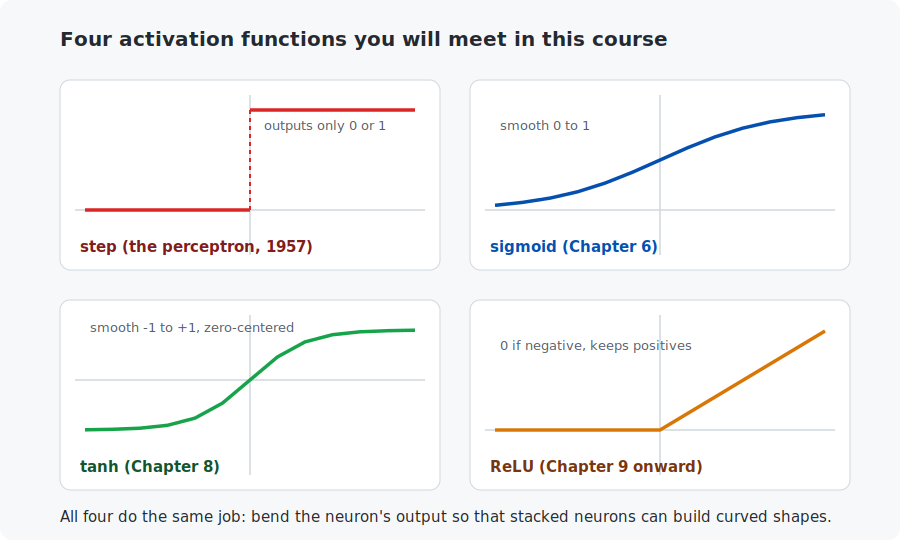
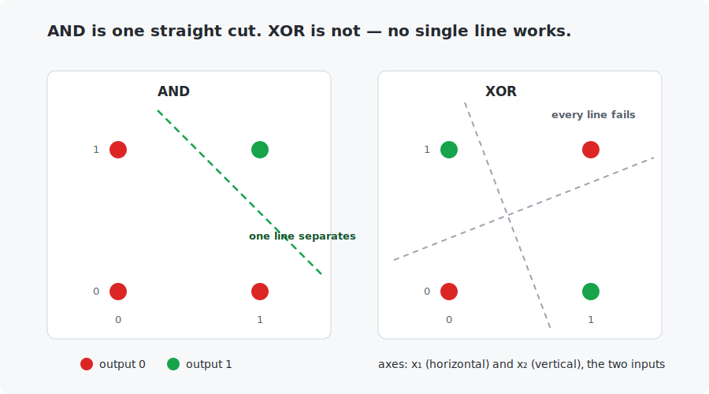

# Chapter 7 — Perceptrons and neurons

This is the chapter where the course has finally earned the word **neuron**. You have used every ingredient already — weighted sums since Chapter 0, the sigmoid since Chapter 6 — and now they get their proper name and their history. You will train the very first learning machine ever built (the 1957 perceptron), watch it hit the famous wall that froze AI research for a decade (XOR), and then break through that wall with the idea that defines deep learning: **layers**.

<!-- CONTENTS_START -->
## Contents

- [What you will learn](#what-you-will-learn)
- [Prerequisites](#prerequisites)
- [1. The artificial neuron](#1-the-artificial-neuron)
- [2. Activation functions, and why they must exist](#2-activation-functions-and-why-they-must-exist)
- [3. The perceptron and its learning rule](#3-the-perceptron-and-its-learning-rule)
- [4. The wall: XOR](#4-the-wall-xor)
- [5. Breaking the wall with layers](#5-breaking-the-wall-with-layers)
- [Code walkthrough](#code-walkthrough)
- [Run it](#run-it)
- [What the C version covers](#what-the-c-version-covers)
- [Exercises](#exercises)
- [Next](#next)

<!-- CONTENTS_END -->

## What you will learn

- What an artificial neuron is (you already know the parts).
- Activation functions — step, sigmoid, tanh, ReLU — and why networks *need* them.
- The perceptron and its learning rule, worked by hand.
- Linear separability: what one neuron can and cannot learn (the XOR problem).
- How stacking neurons into layers solves XOR — and what question that raises for Chapter 8.

## Prerequisites

- [Chapter 6](../06-logistic-regression/README.md) — the sigmoid and the weighted-sum classifier.
- [Chapter 2](../02-vectors-and-matrices/README.md) — dot products.

## 1. The artificial neuron

An **artificial neuron** is a weighted sum followed by a squashing function:



$$\text{output} = f(w_1 x_1 + w_2 x_2 + \dots + w_n x_n + b) = f(\mathbf{w} \cdot \mathbf{x} + b)$$

Every symbol here is an old friend: the inputs $\mathbf{x}$ are features (Chapter 1), the weighted sum is Chapter 0's, written as a dot product (Chapter 2), $b$ is the bias, and $f$ — the **activation function** — is the only new part, and even it is half-familiar: Chapter 6's sigmoid is one.

In fact, look back at Chapter 6: logistic regression, $\sigma(w \cdot x + b)$, **is exactly one neuron** with a sigmoid activation. You have already trained a neuron. This chapter is about what one neuron *cannot* do, and why we will need many.

The name comes from a loose analogy with brain cells, which receive signals through connections of different strengths and "fire" when stimulation crosses a threshold. The analogy inspired the math but should not be taken far — real neurons are enormously more complicated. "Neural networks" are neither brains nor models of brains; they are stacks of weighted sums.

## 2. Activation functions, and why they must exist



Four activations cover this whole course. **Step** (0 below the threshold, 1 above — today's chapter, and history's first). **Sigmoid** (Chapter 6: smooth 0-to-1, gives probabilities). **Tanh** (like sigmoid but from −1 to +1, zero-centered — Chapter 8 uses it). **ReLU** ("rectified linear unit": outputs 0 for negative inputs, passes positives through — the workhorse from Chapter 9 to the end, chosen mostly because it is fast and trains well).

Why insist on an activation at all? Here is the one-paragraph argument, and it matters enough to read twice. Suppose we stack two activation-free neurons: the first computes $z = w_1 x + b_1$, the second takes that as input and computes $w_2 z + b_2$. Substitute:

$$w_2 (w_1 x + b_1) + b_2 = (w_2 w_1) x + (w_2 b_1 + b_2)$$

— which is just *one* weighted sum with weight $w_2 w_1$ and bias $w_2 b_1 + b_2$. Stack a hundred linear neurons and the whole tower still collapses into a single straight line. **Without a nonlinear function between layers, depth buys nothing.** The activation is the bend that stops the collapse — it is what lets networks build curves out of straight pieces, as Section 5 will show concretely.

## 3. The perceptron and its learning rule

In 1957, Frank Rosenblatt built the **perceptron**: one neuron with the step activation,

$$\text{prediction} = \text{step}(\mathbf{w} \cdot \mathbf{x} + b), \qquad \text{step}(z) = \begin{cases} 1 & \text{if } z > 0 \\ 0 & \text{otherwise} \end{cases}$$

plus a training rule so simple it needs no calculus. Look at one example at a time; if the prediction is wrong, nudge the weights toward the correct answer:

$$\text{error} = y - \text{prediction} \qquad w_i \mathrel{+}= \eta \cdot \text{error} \cdot x_i \qquad b \mathrel{+}= \eta \cdot \text{error}$$

The error can only be $+1$ (said 0, should be 1: push weights *up* on active inputs), $-1$ (said 1, should be 0: push them *down*), or $0$ (correct: touch nothing). $\eta$ is our familiar learning rate.

**One update worked by hand.** Train AND (output 1 only if both inputs are 1), learning rate 0.2, everything starting at zero. First look at the example $x = (1, 1)$, label $y = 1$:

```
weighted sum = 0*1 + 0*1 + 0 = 0     step(0) = 0     prediction: 0, but y = 1
error = 1 - 0 = +1
w1 += 0.2 * (+1) * 1  ->  0.2        (input was active, so its weight grows)
w2 += 0.2 * (+1) * 1  ->  0.2
b  += 0.2 * (+1)      ->  0.2
```

Repeat over all four truth-table rows, again and again, until a full pass makes zero mistakes. For AND this takes a handful of passes — the programs print every step so you can follow the weights settle. A perceptron is guaranteed to converge like this **whenever a straight line can separate the two classes** (that is a real theorem, the *perceptron convergence theorem*).

Why teach a 70-year-old algorithm? Because it is honest history — this rule, running on room-sized hardware, is where "machine learning" stopped being philosophy — and because its failure introduces the most important structural idea in the field.

## 4. The wall: XOR

Two tiny logic problems, same four inputs, different labels:

| $x_1$ | $x_2$ | AND | OR | XOR |
|-------|-------|-----|----|----|
| 0 | 0 | 0 | 0 | 0 |
| 0 | 1 | 0 | 1 | 1 |
| 1 | 0 | 0 | 1 | 1 |
| 1 | 1 | 1 | 1 | 0 |

XOR ("exclusive or") outputs 1 when the inputs *differ*. Chapter 6 ended with a warning: a single weighted sum can only draw a **straight** decision boundary. Now plot the four points:



For AND, one straight cut separates the single 1 from the three 0s. For XOR the 1s sit on one diagonal and the 0s on the other — **no straight line can ever split them**. The perceptron does not just struggle with XOR; it provably cannot represent it, and the training rule cycles forever (the programs show the mistake count refusing to reach zero).

This observation, published by Minsky and Papert in 1969, helped freeze neural-network research for over a decade — the first "AI winter". The thaw came from taking layers seriously.

## 5. Breaking the wall with layers

XOR is not separable by one line — but it *is* buildable from things that are. Notice:

$$\text{XOR}(x_1, x_2) = \text{OR}(x_1, x_2) \text{ AND NOT } \text{AND}(x_1, x_2)$$

("at least one is on, but not both.") OR and AND are each one perceptron. So wire **three neurons in two layers** — no training, weights chosen by hand:

```
hidden neuron 1 (an OR gate):    h1 = step( x1 + x2 - 0.5 )
hidden neuron 2 (an AND gate):   h2 = step( x1 + x2 - 1.5 )
output neuron (h1 and not h2):   out = step( h1 - h2 - 0.5 )
```

Trace the hardest row, $x = (1,1)$: $h_1 = \text{step}(1.5) = 1$, $h_2 = \text{step}(0.5) = 1$, $\text{out} = \text{step}(1 - 1 - 0.5) = 0$. Correct — and the programs verify all four rows.

Read what happened geometrically: each hidden neuron draws one straight line; the output neuron combines their verdicts, producing a decision region that is **no longer a single straight cut**. Stack enough neurons and you can approximate any shape — that is (informally) the *universal approximation* property, and it is why the rest of this course is about networks, not single neurons.

One thing should bother you, though. We *hand-picked* those six weights and three biases by staring at a truth table. For real problems — 784 pixels, thousands of neurons — nobody can stare that hard. The perceptron rule cannot help either: it has no idea how to assign blame to a *hidden* neuron two steps away from the output. **How do we compute gradients through layers?** That question has a beautiful answer, and it is the entire subject of [Chapter 8](../08-backpropagation/README.md).

## Code walkthrough

The example is `python/perceptron_and_xor.py`. There is **no calculus and no gradient** here — the perceptron learns by a plain mistake rule — so this is the simplest training code in the course. We will read it assuming no prior programming.

### Step 1 — one neuron: weighted sum, then a hard yes/no

```python
def step_activation(weighted_sum):
    return 1 if weighted_sum > 0 else 0

def perceptron_predict(first_input, second_input, weights_and_bias):
    first_weight, second_weight, bias = weights_and_bias
    return step_activation(first_weight * first_input + second_weight * second_input + bias)
```

`step_activation` is history's first activation function: output 1 if the weighted sum is positive, else 0 — a hard switch with nothing in between. `perceptron_predict` is one whole neuron: it unpacks its three parameters from the list `[w1, w2, b]`, forms the weighted sum `w1·x1 + w2·x2 + b`, and passes it through the step. Notice what this neuron *cannot* do: it can only ever say 0 or 1, never "0.7" — that inability to express confidence is the price of the step, and exactly what Chapter 6's sigmoid fixed.

### Step 2 — Rosenblatt's 1957 learning rule

```python
for pass_number in range(1, maximum_passes + 1):
    mistakes_this_pass = 0
    for (first_input, second_input), true_label in zip(TRUTH_TABLE_INPUTS, true_labels):
        prediction = perceptron_predict(first_input, second_input, weights_and_bias)
        prediction_error = true_label - prediction
        if prediction_error != 0:
            mistakes_this_pass += 1
            weights_and_bias[0] += learning_rate * prediction_error * first_input
            weights_and_bias[1] += learning_rate * prediction_error * second_input
            weights_and_bias[2] += learning_rate * prediction_error
    if mistakes_this_pass == 0:
        return True
```

This is the entire learning algorithm, and it needs no derivatives. Each **pass** runs through all four truth-table rows. For each row it predicts, then computes `prediction_error = true_label - prediction`, which can only be `+1` (should have said 1, said 0), `-1` (should have said 0, said 1), or `0` (correct). When the error is non-zero it counts a mistake and nudges each parameter by `learning_rate * error * input` — pushing the weights toward the right answer, but only on inputs that were active (an input of 0 changes nothing). The `if mistakes_this_pass == 0` check is the convergence test: **a full pass with zero mistakes means the perceptron has learned the gate.** For AND and OR that happens within a few passes; for XOR it never does, so the outer loop is capped at 20 passes to stop the otherwise-endless cycle.

### Step 3 — breaking the wall by hand: a two-layer network

```python
def two_layer_network_predict(first_input, second_input):
    hidden_or_gate = step_activation(first_input + second_input - 0.5)
    hidden_and_gate = step_activation(first_input + second_input - 1.5)
    return step_activation(hidden_or_gate - hidden_and_gate - 0.5)
```

Three neurons wired in two layers, solving the XOR that one neuron provably cannot. The first hidden neuron is an OR gate, the second an AND gate (each just a step over a weighted sum with a hand-picked bias), and the output neuron computes "OR **but not** AND" — which is exactly XOR. Trace the hardest row `(1, 1)`: `hidden_or_gate = step(1.5) = 1`, `hidden_and_gate = step(0.5) = 1`, output `= step(1 - 1 - 0.5) = 0`. Correct. The catch, and the whole reason Chapter 8 exists: **these six weights were chosen by staring at the truth table, not learned.** For a real problem nobody can stare that hard, and the perceptron rule cannot train hidden neurons — that is the open problem the chapter ends on.

### Quick reference

| Function | What it does | What to notice |
|----------|--------------|----------------|
| `step_activation(z)` | Returns 1 if `z > 0`, else 0 — history's first activation. | The hard yes/no is exactly what makes the perceptron unable to express *confidence* (contrast Chapter 6's sigmoid). |
| `perceptron_predict(x1, x2, weights_and_bias)` | One neuron: weighted sum, then the step. | `weights_and_bias` is a plain 3-element list `[w1, w2, b]` — no framework, nothing hidden. |
| `train_perceptron(true_labels, gate_name, max_passes, rate)` | Rosenblatt's 1957 rule: on a wrong prediction, nudge each weight toward the right answer. | Returns whether it *converged*. For AND/OR it does; **for XOR it never can**, and the mistake count refuses to reach zero. |
| `two_layer_network_predict(x1, x2)` | The hand-wired 3-neuron network that solves XOR (an OR gate, an AND gate, combined). | The weights are **chosen by hand, not learned** — the open problem Chapter 8 solves. |
| `main()` | Trains the perceptron on AND, OR, XOR, then runs the two-layer network on all four XOR rows. | Watch AND converge in ~6 passes, XOR loop forever, then the layered network get all four right. |

## Run it

```bash
.venv/bin/python chapters/07-perceptron-and-neurons/python/perceptron_and_xor.py
make -C chapters/07-perceptron-and-neurons/c && ./chapters/07-perceptron-and-neurons/c/build/perceptron_and_xor
```

Both programs (identical output): train a perceptron on AND (converges, weights printed per pass), on OR (converges), then on XOR (20 passes, the mistake count cycles and never reaches zero), and finally run the hand-wired two-layer network on all four XOR rows.

## What the C version covers

A full port. Notice that the perceptron's learning rule in C is four lines of integer-friendly arithmetic — 1957 hardware could do it, and so can any microcontroller today. Simplicity is the perceptron's enduring charm.

## Exercises

1. By hand: continue the AND training from Section 3 — process the remaining rows (0,0), (0,1), (1,0) with the updated weights and say which of them trigger further updates.
2. Design a perceptron (choose $w_1, w_2, b$ yourself) that computes NOR (output 1 only when both inputs are 0). Check it against all four rows, then verify with either program by editing the labels.
3. NAND (NOT AND) is famous because every digital circuit can be built from it alone. Hand-wire NAND as one perceptron. Could a network of your NAND perceptrons compute XOR? (It can — sketch it.)
4. In the two-layer XOR network, change the output neuron's bias from −0.5 to −1.5 and retrace the truth table. What logical function does the network compute now?
5. Challenge: the perceptron rule never uses a learning-rate *schedule* or a loss function — yet Chapter 6 trained the same architecture (one neuron) with gradients on cross-entropy. Write two sentences on what the gradient approach buys that the perceptron rule does not. (Hint: what does the perceptron output between its two extremes? What can it not express about *confidence*?)

## Next

[Chapter 8 — Backpropagation](../08-backpropagation/README.md)

<!-- NAV_START -->
---

[← Chapter 6: Logistic regression](../06-logistic-regression/README.md) · [↑ Course index](../../README.md) · [Chapter 8: Backpropagation →](../08-backpropagation/README.md)

<!-- NAV_END -->
