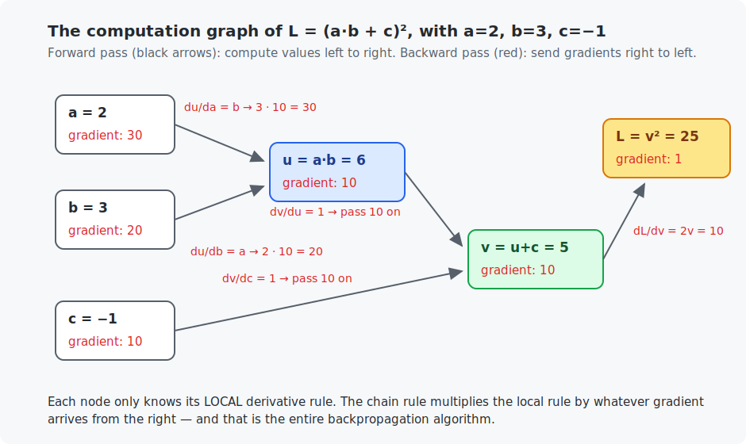
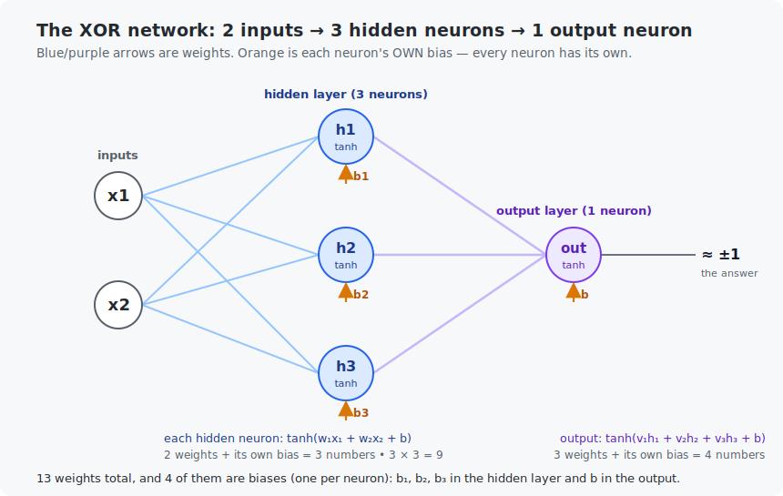

# Chapter 8 — Backpropagation

Chapter 7 ended with the field's defining question: layers solve XOR, but the weights were wired by hand — *how do we compute gradients through layers automatically?* This chapter answers it. You will learn the chain rule, see that every formula is secretly a graph of tiny operations, and then build a real **automatic differentiation engine** — the same machinery inside PyTorch — in about 100 lines of Python and, yes, in C. As the payoff, your engine will *learn* the XOR weights that Chapter 7 had to guess.

This is the most important chapter of the course. Everything after it is scale.

<!-- CONTENTS_START -->
## Contents

- [What you will learn](#what-you-will-learn)
- [Prerequisites](#prerequisites)
- [1. The chain rule](#1-the-chain-rule)
- [2. Every formula is a graph](#2-every-formula-is-a-graph)
- [3. Backpropagation, by hand](#3-backpropagation-by-hand)
- [4. Building the engine](#4-building-the-engine)
- [5. The payoff: XOR, learned this time](#5-the-payoff-xor-learned-this-time)
- [Code walkthrough](#code-walkthrough)
- [Run it](#run-it)
- [What the C version covers](#what-the-c-version-covers)
- [Exercises](#exercises)
- [Next](#next)

<!-- CONTENTS_END -->

## What you will learn

- The chain rule: how derivatives pass through composed functions.
- Computation graphs: any formula as a network of tiny operations.
- The backpropagation algorithm, worked completely by hand on a small graph.
- How to build an autograd engine (a `Value` that remembers its own history).
- Training a neural network on XOR with *learned* weights — closing Chapter 7's loop.

## Prerequisites

- [Chapter 3](../03-derivatives-and-gradients/README.md) — derivatives and the numerical checker.
- [Chapter 7](../07-perceptron-and-neurons/README.md) — neurons, tanh, the XOR problem.

## 1. The chain rule

Chapter 3 taught derivatives of single functions. Real models are functions *inside* functions: a neuron's output feeds the next neuron, whose output feeds the loss. We need the derivative of a **composition**, and the rule could not be friendlier:

> If $y$ depends on $u$, and $u$ depends on $x$, then
> $$\frac{dy}{dx} = \frac{dy}{du} \cdot \frac{du}{dx}$$

Read it as gears: if $y$ turns 3× as fast as $u$, and $u$ turns 2× as fast as $x$, then $y$ turns 6× as fast as $x$. Rates through a chain **multiply**.

**Worked example.** $y = (2x + 1)^2$ at $x = 1$. Name the inner part $u = 2x + 1$ (so $y = u^2$):

```
du/dx = 2                (the inner function has slope 2 everywhere)
dy/du = 2u = 2*3 = 6     (at x=1, u=3; the square's slope there is 2u)
dy/dx = 6 * 2 = 12
```

Check it the Chapter 3 way: $\frac{(2 \cdot 1.001 + 1)^2 - (2 \cdot 0.999 + 1)^2}{0.002} = 12.000$. Both programs run this exact check.

Chains longer than two links work the same — multiply all the rates. That is the whole rule, and it is the *only* calculus fact backpropagation needs.

## 2. Every formula is a graph

Take $L = (a \cdot b + c)^2$. A computer never evaluates that "all at once" — it does one tiny operation at a time. To keep the inputs ($a, b, c$) clearly separate from the intermediate results, we name those results $u$ and $v$: first $u = a \cdot b$, then $v = u + c$, then $L = v^2$. Drawing the steps gives a **computation graph**, and each tiny operation has a one-line local derivative:

| operation | local derivative rule |
|-----------|----------------------|
| $v = u + c$ | $\frac{\partial v}{\partial u} = 1$ and $\frac{\partial v}{\partial c} = 1$ — addition passes gradients through unchanged |
| $u = a \cdot b$ | $\frac{\partial u}{\partial a} = b$ and $\frac{\partial u}{\partial b} = a$ — each input's slope is *the other* input |
| $L = v^2$ | $\frac{dL}{dv} = 2v$ |
| $t = \tanh(z)$ | $\frac{dt}{dz} = 1 - t^2$ (a gift: the slope is computable from the *output* $t$) |

The first three rules are all the worked example above needs. The fourth one, **tanh**, is included for later: the neural network we train in Section 5 is built from tanh neurons — the S-shaped activation from [Chapter 7](../07-perceptron-and-neurons/README.md) — so our engine has to know its rule too. (Like "the derivative of $x^2$ is $2x$" back in Chapter 3, each of these four rules is a standard calculus result we simply quote, not something you need to derive.)

## 3. Backpropagation, by hand

**Backpropagation** is the chain rule organized as a two-pass walk over the graph:

1. **Forward pass**: compute every node's value, left to right, and remember them.
2. **Backward pass**: start at the end with $\frac{dL}{dL} = 1$, then walk right to left. Each node multiplies the gradient arriving from its right by its own local rule, and hands the result to its parents.

Here is the whole thing on our example with $a=2, b=3, c=-1$:



Follow the red numbers right to left. Every node does the same tiny job: take the gradient handed to it from the right, multiply by its **own local rule** (from Section 2's table, in this chapter), and pass the result to each parent.

- $L = v^2$: the loss's gradient with respect to itself is 1 (that is where we start). Its local rule is $\frac{dL}{dv} = 2v = 2 \times 5 = 10$, so $v$ receives **10**.
- $v = u + c$: addition's rule is "pass through unchanged" (slope 1 to each parent), so both $u$ and $c$ receive that **10** untouched.
- $u = a \cdot b$: multiplication's rule is "each input's slope is the *other* input". The incoming gradient is 10, so $a$ receives $b \times 10 = 3 \times 10 = 30$ and $b$ receives $a \times 10 = 2 \times 10 = 20$.

Done — the gradient of *every* input, in one right-to-left sweep, using nothing but Section 2's four rules and multiplication.

**What each node actually needs (this answers the common questions).** No node ever sees the whole formula — it works **purely locally**, from just two ingredients: the gradient arriving from its right, and its own local rule. But look closely at that multiplication step: to send gradient to $a$, the rule multiplies the incoming gradient by $b$ — so it needs $b$'s **forward value** (3); to send gradient to $b$, it multiplies by $a$ instead (so it needs the value 2). So a node with two parents *reuses the forward values of its parents* — each parent's gradient is built from the **other** parent's stored value. **That is exactly why the forward pass saves every value**: the backward pass reads them back. (Addition needs no saved values; multiplication and tanh do.)

**Why this gives all the gradients in one pass.** Because we walk right to left, each node's own gradient $\frac{dL}{d(\text{node})}$ is computed **once** and then reused to feed all of its parents — nothing is ever recomputed. Contrast Chapter 3's numerical method, which needs two whole extra evaluations of the formula *per parameter*: for a million-parameter network, that is two million forward passes versus backprop's single backward sweep.

**One last rule, for a value that feeds two places at once** (two arrows leaving it, a *fan-out*). Each place it feeds sends back its own gradient contribution, and the node's total gradient is their **sum** — you add them up. That is the only reason the code writes gradients with `+=` (accumulate onto what is there) instead of `=` (overwrite): a value used in several places must collect gradient from every one of them.

## 4. Building the engine

Now we automate Section 3. The design, in plain words, before any code:

> Wrap every number in a small object — call it a `TrackedValue` — that stores four things: its **data**, a slot for its **gradient**, which values it was **made from** (its parents), and a tiny function that knows the **local derivative rule** of the operation that made it.
>
> Every arithmetic operation (`+`, `*`, `tanh`) does double duty: it computes the result *and* records the wiring. Run any formula on `TrackedValue`s and the computation graph of Section 2 builds itself as a side effect.
>
> Then `backward()` is Section 3, mechanized: visit the nodes in reverse construction order (parents always exist before children, so construction order is already a valid ordering of the graph), seed the final node's gradient with 1, and let each node run its local rule.

That is the entire architecture of PyTorch's autograd. Ours differs in scale (one number per node instead of a whole tensor) and speed, not in concept.

The Python version (`python/tiny_autograd.py`) spells this out in ~100 heavily documented lines. The engine checks itself: after backpropagating the Section 3 example, it reproduces the figure's gradients, then re-verifies *every* gradient with Chapter 3's numerical checker.

## 5. The payoff: XOR, learned this time

With the engine, Chapter 7's embarrassment disappears. We build a tiny network — 2 inputs → 3 tanh neurons → 1 tanh output — as ordinary arithmetic on `TrackedValue`s, and train it on XOR.



**Why is there a separate output neuron — couldn't the network just be the 3?** No, and the reason is worth pinning down. The three hidden neurons each produce *one number* (their tanh activation), so together they hand you **three numbers**. But the task needs **one** answer: the single XOR value. Something has to reduce three numbers to one — and "take a weighted sum and squash it" is precisely a neuron. So the output neuron is not decoration; it is the piece that *combines* the hidden layer's three findings into the final answer. A network of "just the 3" would be three separate detectors with no one deciding the verdict.

**Why does the output neuron look at all three hidden neurons?** Because combining them **is** its job — and looking at all three is exactly what "combine the middle layer" means. Recall Chapter 7's geometry: each hidden neuron draws one straight dividing line, and XOR needs at least two lines working together. The output neuron takes a weighted sum of *all three* hidden outputs (`v₁·h₁ + v₂·h₂ + v₃·h₃ + b`), learning how much each line's verdict should count, and bends the result through tanh into the final decision. If it saw only one hidden neuron, it would have only one line's worth of information — not enough for XOR. So "seeing all three" is not extra; it is the combination itself. (This full connectivity — every neuron in a layer feeding every neuron in the next — is the default, and the shape 2→3→1 is a deliberate hand-picked choice, as the walkthrough explains.)

**Why tanh here, and not Chapter 7's step function?** This is not a detail — it is the whole reason backpropagation needs a new activation. The perceptron's **step** has a slope of exactly zero everywhere (it is flat, then it jumps, then flat again). But backprop trains by *multiplying* gradients as they flow backward, so a zero slope multiplies everything to zero: no gradient survives, and the network can never learn. To send gradient back through a layer you need a **smooth** activation — one with a real, nonzero slope. `tanh` is exactly that: the S-shaped squashing function from Chapter 7, smooth and bounded, with the clean derivative $1 - t^2$ already sitting in our Section 2 table. (Chapter 6's sigmoid would work too; tanh is the conventional pick for hidden layers because its output is centered on zero.)

That choice also fixes how we phrase the problem. Because tanh only ever outputs values between $-1$ and $+1$, we encode XOR's two answers at those ends — $-1$ meaning "false", $+1$ meaning "true" — and the squared-error loss (`sum of (out − target)²`) pushes each prediction toward its target:

```
forward:   build the graph, out = network(x), loss = sum of (out - target)^2
backward:  loss.backward()            <- gradients for all 13 parameters, automatically
update:    each parameter: data -= learning_rate * gradient
```

The loop is Chapter 5's — *forward, loss, gradients, update* — with step 3 now fully automatic.

**About those 13 starting weights: they are random.** A real network never begins from hand-picked numbers — it starts from small *random* weights, because randomness is what breaks the symmetry between neurons (if every weight started equal, every neuron would compute the same thing and receive the same gradient forever, and none could specialize; [Chapter 11](../11-training-deep-networks/README.md) tells this story in full). So this network draws its 13 weights randomly too. The only concession to teaching is that we *seed* the random generator with a fixed value, so the run is reproducible — and because the C port runs the exact same generator, both languages start from identical weights and print identical numbers below. Random where it should be random; merely repeatable, not hand-arranged:

```
epoch   loss       predictions for (0,0) (0,1) (1,0) (1,1)
    0   6.977978   +0.838  +0.913  +0.763  +0.881      <- random nonsense (the random start)
   50   0.053103   -0.903  +0.905  +0.873  -0.863      <- shape of XOR appearing
 2000   0.000533   -0.989  +0.993  +0.986  -0.987      <- XOR, learned
```

Read the final row with the tanh encoding in mind: $-0.989$ and $-0.987$ are the network saying "false" with near-total confidence, while $+0.993$ and $+0.986$ are "true" — exactly XOR's `0, 1, 1, 0`, spoken in tanh's language. And notice the outputs approach ±1 but never quite reach them (tanh touches its limits only at infinity), so the loss keeps shrinking toward zero without ever arriving at it — the same honest uncertainty the sigmoid showed in Chapter 6, not a flaw. (Epoch 0 is different every time you change the seed; the *destination* is not — XOR is learnable from almost any random start.)

No truth-table staring. The gradients flowed backward through two layers and found weights that Chapter 7 needed a human for. This exact mechanism — bigger, batched, on a GPU — is how the mini-LLM in Chapter 24 will learn to write.

## Code walkthrough

The example is `python/tiny_autograd.py` — the most important code in the course, a working autograd engine in ~100 lines. It uses one programming idea we have not needed until now, so we will start there and go slowly. No prior programming assumed.

### Step 0 — the one new idea: an object that bundles a number with its history

So far every value in our programs was a plain number. Backpropagation needs each number to *remember where it came from*, so we upgrade it into an **object**: a small bundle that carries both some data and its own little functions. In Python you describe the bundle with `class`, and the description has one special method, `__init__`, that sets up a fresh bundle's contents. The word `self` inside a class always means "this particular bundle", and `self.data` means "the `data` slot belonging to this bundle". That is the whole of the object idea you need here — a labelled box with a few slots and a few attached functions.

### Step 1 — `TrackedValue`: a number that remembers how it was made

```python
class TrackedValue:
    def __init__(self, data, parent_values=()):
        self.data = data
        self.gradient = 0.0
        self._parent_values = parent_values
        self._propagate_gradient_to_parents = lambda: None
```

Each `TrackedValue` stores exactly the four things Section 4 promised: `data` (the forward number), `gradient` (dLoss/d(this), starting at 0 and filled in later), `_parent_values` (the values it was computed from), and `_propagate_gradient_to_parents` — a small function holding this node's **local derivative rule**. For a leaf you type in yourself there are no parents and nothing to propagate, so that function starts as `lambda: None` (Python's way of writing "a function that does nothing"). The interesting nodes get a real rule attached by the operations below.

### Step 2 — operations that compute *and* wire up the graph

```python
def __mul__(self, other_value):
    other_value = TrackedValue._wrap_if_plain_number(other_value)
    result = TrackedValue(self.data * other_value.data, (self, other_value))

    def propagate_multiplication_gradient():
        self.gradient += other_value.data * result.gradient
        other_value.gradient += self.data * result.gradient

    result._propagate_gradient_to_parents = propagate_multiplication_gradient
    return result
```

`__mul__` is a Python trick called *operator overloading*: defining it means you can write `a * b` on two `TrackedValue`s and Python calls this method. It does **double duty**. First it computes the forward result and records its parents: `TrackedValue(self.data * other_value.data, (self, other_value))`. Then — the clever part — it defines a little inner function `propagate_multiplication_gradient` and stores it on the result. That inner function is the multiply rule from Section 2 ("each input's slope is the *other* input"): it adds `other_value.data * result.gradient` to `self`'s gradient, and `self.data * result.gradient` to the other parent's. The inner function still "remembers" `self`, `other_value`, and `result` even after `__mul__` returns — a **closure** — which is exactly what lets the backward pass replay each operation's rule later. `__add__` and `tanh` follow the identical pattern with their own rules. **The computation graph builds itself as a side effect of ordinary arithmetic.**

Notice the `+=` (not `=`) on every gradient. That is Section 3's "a value used in several places collects gradient from all of them" rule, and forgetting it is the single most common autograd bug.

### Step 3 — building the network (how the layers are assembled, and where the randomness goes)

Before anything can train, `train_xor_network()` builds the network. Keep two decisions separate here, because they are genuinely different:

**The *shape* is chosen by hand** — that is deliberate. The code fixes a **two-layer architecture**:

- A **hidden layer of 3 neurons**. Each neuron has three numbers — a weight for input `x1`, a weight for input `x2`, and a bias (Chapter 7's `w1·x1 + w2·x2 + b`). Three neurons × 3 numbers = **9 parameters**.
- An **output layer of 1 neuron**. Its inputs are the *three hidden outputs*, so it needs three weights plus a bias = **4 parameters**.

That is **13 parameters** in total — the "all 13" the training printout mentioned. Why 3 hidden neurons rather than 2 or 10? A hand-picked choice, guided by Chapter 7's geometry: XOR needs at least two straight lines to separate, so at least two hidden neurons; three gives a little breathing room. **Nothing in the code discovers the number of layers or neurons — *you* choose the architecture, and gradient descent only fills in the numbers inside it.**

**The *values* of those 13 numbers are chosen randomly** — as they are in every real network, to break the symmetry between neurons. The code draws them from a small seeded random generator:

```python
weight_generator = ReproducibleRandomGenerator(WEIGHT_INITIALIZATION_SEED)

def random_weight():
    return TrackedValue(weight_generator.next_uniform(-INITIAL_WEIGHT_RANGE, INITIAL_WEIGHT_RANGE))

hidden_neuron_parameters = [[random_weight() for _ in range(3)] for _ in range(3)]
output_neuron_parameters = [random_weight() for _ in range(4)]
```

Each of the 13 weights is a fresh random draw in `[-1, +1]`, wrapped in a `TrackedValue` so a gradient can flow to it. `ReproducibleRandomGenerator` is a tiny linear congruential generator seeded with a fixed number — that keeps runs repeatable and lets the C port reproduce the identical weights, without pretending the weights were anything but random. Then one function performs the forward pass:

```python
def network_forward(first_input, second_input):
    hidden_activations = []
    for weight_for_x1, weight_for_x2, bias in hidden_neuron_parameters:
        weighted_sum = weight_for_x1 * first_input + weight_for_x2 * second_input + bias
        hidden_activations.append(weighted_sum.tanh())
    output_weighted_sum = (
        output_neuron_parameters[0] * hidden_activations[0]
        + output_neuron_parameters[1] * hidden_activations[1]
        + output_neuron_parameters[2] * hidden_activations[2]
        + output_neuron_parameters[3]
    )
    return output_weighted_sum.tanh()
```

This is Chapter 7's two-layer picture, in code. The loop runs each hidden neuron — weighted sum of the two inputs, plus bias, through `tanh` — and collects the three results in `hidden_activations`. Then the output neuron takes *those three* as its inputs, forms its own weighted sum plus bias, and passes it through `tanh` to give the single prediction. The key point: every `*`, `+`, and `.tanh()` here is a `TrackedValue` operation, so merely *computing the prediction* wires up the whole computation graph — ready for one `run_backward_pass()` to reach all 13 parameters.

### Step 4 — the backward pass

```python
def run_backward_pass(self):
    nodes_in_construction_order = []
    already_visited = set()

    def visit_parents_first(value):
        if id(value) not in already_visited:
            already_visited.add(id(value))
            for parent in value._parent_values:
                visit_parents_first(parent)
            nodes_in_construction_order.append(value)

    visit_parents_first(self)
    self.gradient = 1.0
    for value in reversed(nodes_in_construction_order):
        value._propagate_gradient_to_parents()
```

This is Section 3, mechanized — and now we have a real network graph (Step 3) for it to run on. `visit_parents_first` walks the graph and lists every node so that parents always appear before children (a *topological sort*). Then the two lines that matter: seed the final node's gradient with `self.gradient = 1.0` (that is $dL/dL = 1$, the starting point), and walk the list **backward**, calling each node's stored rule. Because we go in reverse, a node's gradient is fully collected before it hands anything to its parents. One pass, and every `TrackedValue` in the graph now holds its gradient.

### Step 5 — the payoff: XOR, learned

```python
for parameter in all_parameters:
    parameter.gradient = 0.0
total_loss.run_backward_pass()
for parameter in all_parameters:
    parameter.data -= learning_rate * parameter.gradient
```

Here is Chapter 5's training loop with step 3 fully automated. Each epoch: build the network's predictions and the squared-error `total_loss` out of `TrackedValue`s (the graph assembles itself), then these three moves — **zero** every gradient (so this epoch's gradients do not add onto last epoch's, remembering the `+=`), **backpropagate** with one call to `total_loss.run_backward_pass()`, and **update** each parameter a step against its gradient. That single `run_backward_pass()` line replaces all the hand-derived gradient formulas of Chapters 5 and 6 — and it would work unchanged for a million parameters. This is the mechanism, bigger and on a GPU, that trains the Chapter 24 LLM.

### Quick reference

| Piece | What it does | What to notice |
|-------|--------------|----------------|
| `class TrackedValue` | Wraps a number and remembers four things: **data**, **gradient**, **parents**, and a function with the operation's **local derivative rule**. | Exactly PyTorch's autograd, shrunk to one number per node. |
| `__add__`, `__mul__`, `tanh` (methods) | Each does *double duty*: computes the result **and** records how to send gradient back to its parents (a closure). | The graph builds itself as a side effect of doing arithmetic. |
| `run_backward_pass()` (method) | Seeds the final gradient with 1, then visits nodes in reverse order applying each local rule. | The `+=` on gradients is the "used twice → gradient from both paths" rule. |
| `demonstrate_graph_backpropagation()` | Backpropagates `L = (a·b + c)²`, reproduces the figure's gradients (30, 20, 10), **and re-checks them numerically**. | The engine grading itself against Chapter 3. |
| `train_xor_network()` | Builds a 2-3-1 tanh net out of `TrackedValue`s and trains it on XOR. | The gradient step of the training loop is now a single `loss.run_backward_pass()` — the payoff of the whole chapter. |

The C version (`c/tiny_autograd.c`) does the same with an **arena** — one array of node structs, each storing its operation and parent indices — because C has no operator overloading. It is closer to how real frameworks actually work than the Python.

## Run it

```bash
.venv/bin/python chapters/08-backpropagation/python/tiny_autograd.py
make -C chapters/08-backpropagation/c && ./chapters/08-backpropagation/c/build/tiny_autograd
```

Both programs print: the chain-rule worked example, the Section 3 graph gradients (matching the figure), the numerical verification of the engine, and the XOR training table.

## What the C version covers

A full port with one structural difference worth studying. Python builds the graph with operator overloading (`a * b` on objects) and closures; C has neither, so the C engine uses an **arena**: one big array of node structs, where each node stores its operation type and the *indices* of its parents. `value_multiply(graph, a, b)` replaces `a * b`, and the backward pass is a plain reverse loop over the array with a `switch` on the operation. It is less pretty and completely transparent — you can inspect every byte of the "autograd tape". Real frameworks are much closer to the C version than to the Python one.

## Exercises

1. By hand: for $L = (a \cdot b + c)^2$ with $a=2, b=3, c=-1$, we found $\partial L/\partial a = 30$. Predict what happens to $L$ if $a$ moves from 2 to 2.01, then verify: compute $L(2.01, 3, -1)$ and compare with $25 + 30 \times 0.01$.
2. Add a `sigmoid` operation to either engine. Its local rule: the output $s$ satisfies $ds/dz = s(1-s)$. Verify your implementation with the numerical checker.
3. Draw (paper) the computation graph of $f = (a + b) \cdot (a - b)$ and backpropagate $a=3, b=1$ by hand. Careful: $a$ and $b$ each feed two nodes — remember the `+=` rule. Check with the engine.
4. In the XOR training, change the hidden layer from 3 neurons to 2 and retrain. Then try 1. Explain the result with Chapter 7's geometry (how many straight lines does XOR need?).
5. Challenge: our engine recomputes `tanh` as a single operation with a known rule. But $\tanh(z) = (e^{2z}-1)/(e^{2z}+1)$ could also be built from more primitive nodes (exp, subtract, divide). What is the trade-off? (This is a real engineering decision inside every framework — look up "fused operations" if curious.)

## Next

[Chapter 9 — Your first neural network](../09-first-neural-network/README.md)

<!-- NAV_START -->
---

[← Chapter 7: Perceptrons and neurons](../07-perceptron-and-neurons/README.md) · [↑ Course index](../../README.md) · [Chapter 9: Your first neural network →](../09-first-neural-network/README.md)

<!-- NAV_END -->
