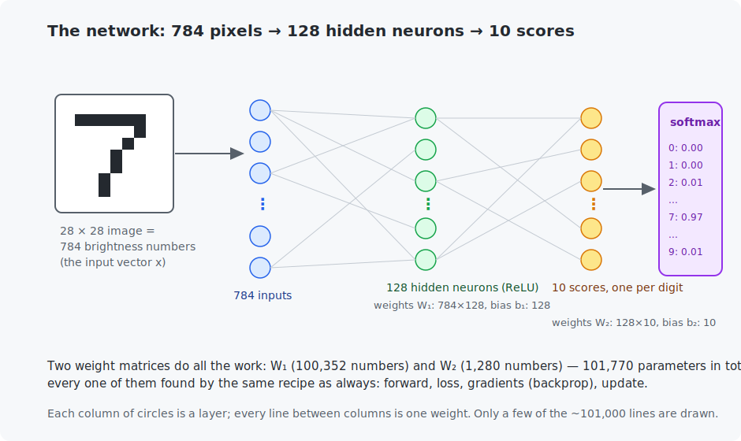

# Chapter 9 — Your first neural network

The milestone chapter. Everything from Chapters 0–8 assembles into one machine: a real neural network, built from scratch with no framework, that reads **handwritten digits it has never seen** and gets about 96% of them right. You will build it twice — in NumPy and in pure C — and by the end, the sentence "a neural network learned to read digits" will contain no mystery for you at all.

<!-- CONTENTS_START -->
## Contents

- [What you will learn](#what-you-will-learn)
- [Prerequisites](#prerequisites)
- [1. The data: 70,000 handwritten digits](#1-the-data-70000-handwritten-digits)
- [2. The architecture](#2-the-architecture)
- [3. Softmax: sigmoid for ten answers](#3-softmax-sigmoid-for-ten-answers)
- [4. Backpropagation as matrix operations](#4-backpropagation-as-matrix-operations)
- [5. Mini-batch stochastic gradient descent](#5-mini-batch-stochastic-gradient-descent)
- [6. The run](#6-the-run)
- [Code walkthrough](#code-walkthrough)
- [Run it](#run-it)
- [What the C version covers](#what-the-c-version-covers)
- [Exercises](#exercises)
- [Next](#next)

<!-- CONTENTS_END -->

## What you will learn

- MNIST, the "hello world" dataset: what an image is to a network.
- Softmax — Chapter 6's sigmoid, grown up to handle ten classes.
- Backpropagation written as matrix operations (and why we do that instead of using Chapter 8's engine directly).
- Mini-batch stochastic gradient descent — how real training actually iterates.
- Reading a training run: loss, test accuracy, and what they tell you.

## Prerequisites

- [Chapter 8](../08-backpropagation/README.md) — backpropagation.
- [Chapter 2](../02-vectors-and-matrices/README.md) — matrix multiplication (it is about to do all the work).

## 1. The data: 70,000 handwritten digits

**MNIST** is a classic dataset: 70,000 grayscale images of handwritten digits (0–9), each 28×28 pixels, collected from census forms — 60,000 for training, 10,000 held back for testing. It is the traditional first dataset because it is small (12 MB), trains in minutes on any machine, and is genuinely nontrivial: thousands of people's messy handwriting.

To the network, an image is nothing but a vector: 28×28 = **784 brightness numbers** (0 = black, 255 = white, scaled to 0–1). Unroll the grid row by row and a "7" becomes a point in 784-dimensional space — exactly like Chapter 1's fruits were points in 2-dimensional space. Same idea, more dimensions. The label is the digit, 0–9.

## 2. The architecture



This shape — layers of neurons where each layer feeds the next — is called a **multi-layer perceptron** (MLP), Chapter 7's idea at scale. Written as Chapter 2 matrix operations:

$$H = \text{ReLU}(X W_1 + b_1) \qquad\qquad P = \text{softmax}(H W_2 + b_2)$$

Symbol by symbol: $X$ is a **batch** of images stacked as rows (shape: batch×784). $W_1$ (784×128) and $b_1$ hold the hidden layer's weights — one *column* per hidden neuron, so $XW_1$ computes all 128 weighted sums for all images in one matrix multiplication. ReLU (Chapter 7) bends each result. $W_2$ (128×10) and $b_2$ do the same for the output layer, giving 10 raw scores per image. Softmax turns scores into probabilities — next section. Total: **101,770 parameters**, every one trained by gradient descent.

Why 128 hidden neurons? Honest answer: it is a hyperparameter; 64 works, 256 works slightly better and slower. Powers of two are tradition (and match hardware nicely). Chapter 11 is about tuning such knobs.

## 3. Softmax: sigmoid for ten answers

Chapter 6's sigmoid turned *one* score into *one* probability. Here we have ten scores per image and want ten probabilities that sum to 1. **Softmax** does it:

$$P(\text{class } k) = \frac{e^{z_k}}{\sum_{j=1}^{10} e^{z_j}}$$

Read it: exponentiate every score (making them all positive, and amplifying gaps), then divide each by the total (making them sum to exactly 1). A tiny worked example with three scores $(2.0, 1.0, 0.1)$:

```
e^2.0 = 7.39    e^1.0 = 2.72    e^0.1 = 1.11    total = 11.22
softmax = (7.39/11.22, 2.72/11.22, 1.11/11.22) = (0.66, 0.24, 0.10)
```

Biggest score → biggest probability, but nothing is ever exactly 0 or 1 — softmax keeps honest uncertainty, exactly like the sigmoid did. (With two classes it *is* the sigmoid, in disguise — a two-line algebra exercise.)

One implementation detail you will see in both programs: $e^{50}$ overflows comfortably, so the code subtracts each row's maximum score before exponentiating. The subtraction cancels in the division — same probabilities, no overflow.

The loss is cross-entropy again, now in its many-class form: **the average of $-\log(\text{probability given to the true digit})$**. And the gradient at the output has the same famous cancellation as Chapter 6: the gradient of the loss with respect to the raw scores is simply

$$\text{probabilities} - \text{one-hot truth}$$

where "one-hot" is the truth written as ten numbers (a 1 at the true digit, 0 elsewhere — e.g., digit 3 → `0,0,0,1,0,0,0,0,0,0`). Prediction minus truth, for the third chapter in a row. This is a pattern, not a coincidence.

## 4. Backpropagation as matrix operations

Chapter 8's engine could train this network *in principle* — but it tracks one graph node per *number*, and one batch here produces about 1.3 million numbers. Per-node bookkeeping would crawl. The fix: apply Chapter 8's local rules to **whole layers at once**, so every step is one matrix multiplication (which NumPy — and Chapter 13's GPUs — chew through effortlessly).

The complete backward pass is five lines. With $m$ = batch size, $G_2$ = the scores' gradient $(P - Y_{\text{one-hot}})/m$:

| gradient | formula | which Chapter 8 rule it is |
|----------|---------|---------------------------|
| output weights | $\nabla W_2 = H^\top G_2$ | multiply rule: each input's slope is the other factor |
| output biases | $\nabla b_2 = $ column sums of $G_2$ | add rule: gradients pass through, summed over the batch |
| hidden activations | $G_H = G_2 W_2^\top$ | multiply rule, other side |
| hidden weighted sums | $G_1 = G_H$ where the sum was $> 0$, else $0$ | ReLU's rule: gradient flows only where the input was positive |
| hidden weights, biases | $\nabla W_1 = X^\top G_1$, $\nabla b_1 = $ column sums | same two rules again |

You do not have to take these on faith — **both programs numerically spot-check them** (Chapter 3's trick) before training starts, on representative weights from all four parameter arrays.

## 5. Mini-batch stochastic gradient descent

Chapters 5–6 computed the exact gradient over the *whole* dataset per step. With 60,000 images that is wasteful: the gradient from a random sample of 100 points in nearly the same direction, costs 1/600th as much, and lets us take 600 steps per pass instead of one. That is **mini-batch stochastic gradient descent (SGD)**:

```
each epoch:
    shuffle the training set
    for each batch of 100 images:
        forward -> loss -> backward -> update      (the eternal loop)
```

"Stochastic" = random, for the shuffled sampling. The gradients are noisy — each batch pulls slightly differently — but the noise averages out, and (a happy accident of the field) mildly noisy steps often *generalize better* than exact ones. Batch size is another hyperparameter: 100 is a comfortable default here.

## 6. The run

```
Gradient spot-check (analytic vs numerical):
  hidden_weights[400, 7]: analytic = +0.00143114, numerical = +0.00143114
  ...

Training: batch size 100, learning rate 0.1
  epoch   average loss   test accuracy   seconds
      1         0.4220         92.47%       0.1
      2         0.2350         94.20%       0.1
      3         0.1856         95.13%       0.1
      4         0.1541         95.89%       0.1
      5         0.1321         96.19%       0.1

Final test accuracy: 96.19% on 10,000 digits the network never saw.
```

Read it like a practitioner: the loss falls fast, then slower (the bowl flattens near the bottom, Chapter 3); **test** accuracy — measured on the 10,000 held-out images, the only honest number — climbs to 96.19%. One epoch already gets 92%: most learning happens shockingly early. And each epoch is 0.1 seconds, because everything became matrix multiplications.

96% is good, not great: state of the art on MNIST is ~99.8%. The gap has a specific cause — an MLP treats pixels as an unordered list and has no idea which pixels are *neighbors*. Chapter 13 fixes exactly this (convolutions), and the payoff will be visible immediately.

## Code walkthrough

The example is `python/train_mnist_mlp.py` — the first full network, still hand-built in NumPy. The `TwoLayerNetwork` class holds everything; read its methods in order:

| Piece | What it does | What to notice |
|-------|--------------|----------------|
| `load_mnist_as_numpy_arrays()` | Downloads MNIST and returns flat 784-pixel arrays scaled to 0–1. | Uses torchvision only as a *downloader* — the learning below is pure NumPy. |
| `softmax_rows(scores)` | Turns each row of 10 scores into probabilities. | Subtracts each row's max before exponentiating — the overflow guard from Section 3. |
| `TwoLayerNetwork.__init__` | Creates `W1, b1, W2, b2` with **He initialization** (`× √(2/fan-in)`). | That scaling (Section 2 of Chapter 11) is why training starts healthy instead of exploding. |
| `.forward(images)` | The two-layer forward pass, returning the pre-activation, the ReLU'd hidden layer, and the probabilities. | It returns the *intermediates* because backprop needs them — you can see the data backprop will reuse. |
| `.compute_loss_and_gradients(images, labels)` | Cross-entropy loss, then the five matrix-backprop formulas from Section 4. | Each line is a Chapter 8 local rule applied to a whole layer. The output gradient `(probabilities − one_hot)` is the same `prediction − truth` pattern for the third chapter running. |
| `.apply_gradient_step(grads, rate)` | Subtracts `rate × gradient` from all four arrays. | Chapter 5's update, four times. |
| `verify_gradients_numerically(...)` | Spot-checks a few weights of each array against the central difference. | Same trust-but-verify habit — on 101,770 parameters you check representatives, not all. |
| `main()` | Loads data, verifies gradients, runs mini-batch SGD, reports test accuracy, prints five predictions. | 96% on held-out digits, ~0.1 s/epoch — because everything became matrix multiplies. |

`export_mnist_for_c.py` writes the dataset as raw bytes so the C port (`c/train_mnist_mlp.c`) can train the identical network with no dataset-parsing code.

## Run it

```bash
# Python (NumPy). First run downloads MNIST (~12 MB).
.venv/bin/python chapters/09-first-neural-network/python/train_mnist_mlp.py --quick   # smoke test, seconds
.venv/bin/python chapters/09-first-neural-network/python/train_mnist_mlp.py          # full, ~1 minute

# C. First export the dataset to plain binary, then build and run.
.venv/bin/python chapters/09-first-neural-network/python/export_mnist_for_c.py
make -C chapters/09-first-neural-network/c
./chapters/09-first-neural-network/c/build/train_mnist_mlp --quick                   # seconds
./chapters/09-first-neural-network/c/build/train_mnist_mlp                           # full, ~1-2 minutes
```

## What the C version covers

A full port: same architecture, same hyperparameters, same training procedure, landing in the same ~96% region. Two honest differences from every earlier chapter:

- **Outputs are close but not bit-identical to Python's.** The random initial weights come from different generators, and floating-point sums in different orders differ in the last decimals. Same algorithm, same quality — different trajectory. This is normal; from now on "matches" means *statistically*, not digit-for-digit.
- **It is slower than NumPy.** Our C loops are clean but single-threaded and cache-naive, while NumPy calls a matrix library tuned for decades (Chapter 2 foreshadowed this). The C version exists to prove there is nothing in the box — and it still trains the full network in about a minute.

The C program also carries its own random generator (a small LCG) instead of `rand()`, so its output is identical on every platform — worth reading, it is 4 lines.

## Exercises

1. By hand: softmax of the scores $(1.0, 1.0, 1.0)$ — no calculator needed. What does the answer say about a network at the start of training, and why does the first loss print as about $-\log(0.1) \approx 2.30$ here?
2. Change the hidden layer to 16 neurons, then 512. Report accuracy and epoch time for each. Where does this stop paying off?
3. Set the learning rate to 1.0. Diagnose what you see using Chapter 3's vocabulary. Then try 0.001 — what changes and why?
4. Print the network's five *least* confident correct predictions (probability of the true class barely the maximum). Look at their images if you can — are they genuinely ambiguous handwriting?
5. Challenge: after training, take one test image the network classifies correctly and find the *smallest* change to its pixels (trial and error, or use the input gradient) that flips the prediction. You have discovered adversarial examples — a live research area.

## Next

Part I is complete — you can now build and train neural networks from nothing. [Chapter 10 — Introduction to PyTorch](../10-intro-to-pytorch/README.md) hands the arithmetic to a framework so the networks can get big.

<!-- NAV_START -->
---

[← Chapter 8: Backpropagation](../08-backpropagation/README.md) · [↑ Course index](../../README.md) · [Chapter 10: Introduction to PyTorch →](../10-intro-to-pytorch/README.md)

<!-- NAV_END -->
