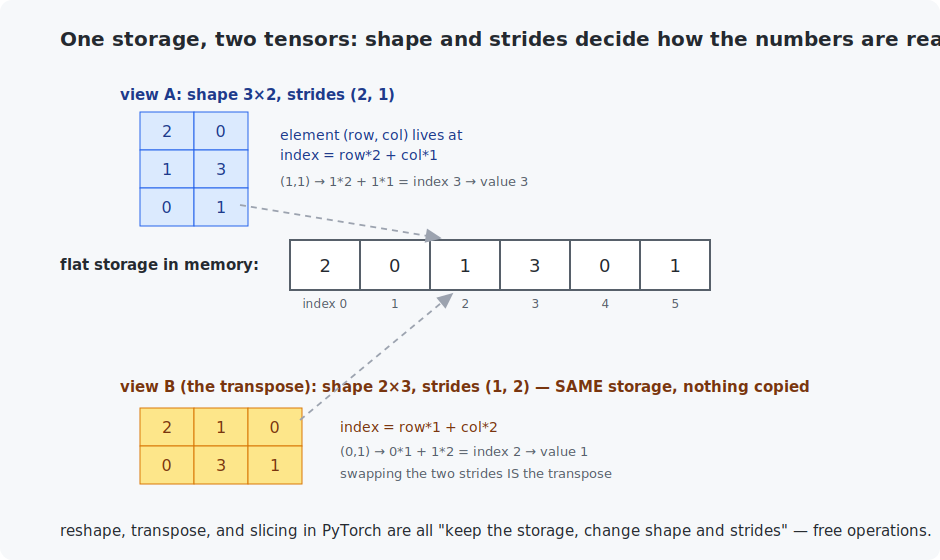

# Chapter 10 — Introduction to PyTorch

You have now built everything yourself: matrix math (Chapter 2), gradients (Chapter 3), an autograd engine (Chapter 8), and a full network (Chapter 9). From this chapter on, a framework does that arithmetic for you — not because you cannot do it, but because *you have already done it* and repeating it at scale is a waste of your time. PyTorch will feel eerily familiar: every one of its three core ideas is a chapter you finished.

<!-- CONTENTS_START -->
## Contents

- [What you will learn](#what-you-will-learn)
- [Prerequisites](#prerequisites)
- [1. Why a framework — and why only now](#1-why-a-framework-and-why-only-now)
- [2. Tensors — and what one actually is](#2-tensors-and-what-one-actually-is)
- [3. Autograd: your Chapter 8 engine, grown up](#3-autograd-your-chapter-8-engine-grown-up)
- [4. Devices: one word moves the work](#4-devices-one-word-moves-the-work)
- [5. Chapter 9 in thirty lines](#5-chapter-9-in-thirty-lines)
- [Code walkthrough](#code-walkthrough)
- [Run it](#run-it)
- [What the C version covers](#what-the-c-version-covers)
- [Exercises](#exercises)
- [Next](#next)

<!-- CONTENTS_END -->

## What you will learn

- Tensors: shapes, views, broadcasting — and what a tensor really is underneath (storage + shape + strides).
- Autograd: Chapter 8's engine, industrial-strength.
- Devices: running the same code on CPU, NVIDIA (CUDA), or Apple Silicon (MPS).
- `nn.Module`: Chapter 9's network in about 30 lines, same ~96% accuracy.

## Prerequisites

- [Chapter 9](../09-first-neural-network/README.md) — you must know what the framework is doing for you.
- [Chapter 0](../00-setup/README.md) installed PyTorch already; nothing new to install.

## 1. Why a framework — and why only now

This course made you build first and automate second, on purpose. Someone who starts *at* PyTorch sees magic incantations: `loss.backward()` — why? `optimizer.zero_grad()` — what could possibly need zeroing? You, instead, will recognize each line as a chapter of your own work. The framework buys three concrete things:

1. **Speed**: tuned matrix kernels on every kind of hardware (Chapter 2 measured the gap).
2. **Autograd for hundreds of operations** — your Chapter 8 engine, but you never write a local rule again.
3. **A parts catalog**: layers, losses, optimizers, data tools — so experiments take minutes, not days.

Why PyTorch, and not something else? It is the dominant framework in research and education, its style ("just Python + tensors") matches everything you have built, and every later chapter's real-world reference code (detectors, diffusion, LLMs) is written in it. Alternatives exist — TensorFlow, JAX — and knowing one deeply makes the others readable in an afternoon.

## 2. Tensors — and what one actually is

A **tensor** is an n-dimensional array of numbers: a vector is a 1-D tensor, a matrix 2-D, a batch of 100 MNIST images a 3-D tensor of shape `(100, 28, 28)`. All of Chapter 2 carries over — `@` multiplies, shapes must agree, `reshape` reorganizes.

Underneath, a tensor is exactly three things — and you already met them in Chapter 2's C code:



The **storage** is one flat block (Chapter 2's row-major array). The **shape** says how to read it as a grid. The **strides** say how many elements to skip per step along each dimension — the generalization of Chapter 2's `row * column_count + column` formula. The payoff of this design: `reshape`, `transpose`, and slicing *never copy data*; they hand back a new shape-and-strides "view" of the same storage. That is why PyTorch code shuffles enormous tensors around casually — most of those operations are free.

Two everyday tensor skills the example demonstrates:

- **Broadcasting**: adding a shape-`(4,)` vector to a shape-`(2,4)` matrix applies it to every row automatically — the implicit loop that replaces most explicit ones.
- **Batch-first thinking**: the first dimension is "which example"; every operation processes the whole batch at once (Chapter 9's matrix formulation, now the default mode of thought).

## 3. Autograd: your Chapter 8 engine, grown up

Chapter 8's `TrackedValue` stored data, a gradient, parents, and a local rule, then walked the graph backward. PyTorch's tensors do *precisely this* when flagged with `requires_grad=True`:

```python
input_a = torch.tensor(2.0, requires_grad=True)     # a leaf, like our TrackedValue(2.0)
loss = (input_a * input_b + input_c) ** 2           # graph builds as a side effect
loss.backward()                                     # our run_backward_pass()
input_a.grad                                        # -> 30, the figure from Chapter 8
```

The example runs Chapter 8's exact $(a \cdot b + c)^2$ case and gets the exact gradients (30, 20, 10). Nothing new to understand — only new spelling. Two habits to acquire now, both explained by Chapter 8:

- **Gradients accumulate** (`+=`, remember?). Before each training step you must clear the old ones: that is all `optimizer.zero_grad()` does.
- **Evaluation should skip graph-building**: wrapping inference in `with torch.no_grad():` tells autograd not to record — faster, lighter, and standard practice.

## 4. Devices: one word moves the work

```python
device = select_best_available_device()   # common/device.py: CUDA, else MPS, else CPU
model = model.to(device)
image_batch = image_batch.to(device)
```

Everything else is unchanged. The basics example times a 2048×2048 matmul on CPU vs your accelerator; the training script moves the whole model with one call. The only rule: tensors that interact must live on the same device (the error message when they do not is unmissable). All course code from here on selects its device through `common/device.py`, so it runs unmodified on an NVIDIA card, an Apple Silicon Mac, or a bare CPU.

## 5. Chapter 9 in thirty lines

The training script rebuilds the exact 784→128→10 network. The model definition:

```python
class DigitClassifier(nn.Module):
    def __init__(self):
        super().__init__()
        self.hidden_layer = nn.Linear(784, 128)   # owns W1 (784x128) and b1 - Chapter 9's arrays
        self.output_layer = nn.Linear(128, 10)    # owns W2 and b2

    def forward(self, image_batch):
        return self.output_layer(torch.relu(self.hidden_layer(image_batch)))
```

`nn.Linear` *is* the weighted-sum layer you wrote by hand — it stores a weight matrix and bias and computes `x @ W.T + b`. `nn.Module` is the bookkeeping base class: it collects every parameter inside, so `model.parameters()` can hand them all to an optimizer and `.to(device)` can move them all at once. And the training step is the eternal loop with framework names:

| the loop (since Chapter 5) | PyTorch spelling |
|---------------------------|------------------|
| forward | `class_scores = model(image_batch)` |
| loss | `loss = loss_function(class_scores, label_batch)` |
| (clear old gradients) | `optimizer.zero_grad()` |
| gradients | `loss.backward()` |
| update | `optimizer.step()` |

One honest detail: the model outputs raw scores, no softmax. `nn.CrossEntropyLoss` applies softmax and the log together internally — fused for numerical stability, the same max-subtraction trick your Chapter 9 code did by hand.

The result (Apple Silicon GPU; your times will vary by hardware):

```
  epoch   average loss   test accuracy   seconds
      1         0.5182         91.66%       1.3
      ...
      5         0.1530         95.81%       1.2

Final test accuracy: 95.81% - Chapter 9's result, a fraction of the code.
```

Same ~96% as Chapter 9 (the small difference is initialization randomness, as discussed there). If the GPU seems *slower* than Chapter 9's NumPy: correct observation! This network is so small that moving batches to the GPU costs more than the GPU saves. Accelerators pay off when models grow — Chapter 14's ResNet will make the point emphatically.

## Code walkthrough

Two Python files. `pytorch_basics.py` is a tour of the three ideas; `train_mnist_pytorch.py` rebuilds Chapter 9 in 30 lines.

**`pytorch_basics.py`:**

| Function | What it does | What to notice |
|----------|--------------|----------------|
| `demonstrate_tensors()` | Redoes Chapter 2's `Wx = (8,10,2)`, reshapes a batch, shows broadcasting. | `reshape` copies nothing — Section 2's storage+strides point, live. |
| `demonstrate_autograd()` | Runs Chapter 8's `(a·b+c)²` with `requires_grad=True` and `.backward()`. | Same gradients (30, 20, 10) as your hand-built engine. PyTorch's autograd *is* your `TrackedValue`, renamed. |
| `demonstrate_devices()` | Times a matmul on CPU vs your GPU. | `.to(device)` is the only change needed to move work to hardware. |

**`train_mnist_pytorch.py`:**

| Piece | What it does | What to notice |
|-------|--------------|----------------|
| `class DigitClassifier` | Chapter 9's network as `nn.Linear(784,128)` → ReLU → `nn.Linear(128,10)`. | `nn.Linear` **is** the weighted-sum layer you wrote by hand; `nn.Module` collects its parameters automatically. |
| `.forward()` | Hidden ReLU then output — no softmax. | The loss applies softmax internally (fused for stability), so the model outputs raw scores. |
| `measure_accuracy()` | Counts correct predictions, wrapped in `torch.no_grad()`. | `no_grad` skips graph-building during evaluation — faster, and standard practice. |
| `main()` | The eternal loop in PyTorch spelling: `zero_grad` → `backward` → `step`. | The table in Section 5 maps each line to a chapter you already did. `optimizer.zero_grad()` exists because gradients accumulate (Chapter 8's `+=`). |

## Run it

```bash
.venv/bin/python chapters/10-intro-to-pytorch/python/pytorch_basics.py
.venv/bin/python chapters/10-intro-to-pytorch/python/train_mnist_pytorch.py --quick   # seconds
.venv/bin/python chapters/10-intro-to-pytorch/python/train_mnist_pytorch.py           # full, ~1 min

make -C chapters/10-intro-to-pytorch/c && ./chapters/10-intro-to-pytorch/c/build/tensor_library
```

## What the C version covers

Not a port this time — a **microscope**. PyTorch itself is C++ underneath (its C++ core is called *libtorch*; per this course's C-only policy we stay in C), and the C example builds the heart of it: a `Tensor2D` struct of storage + shape + strides, with matmul and ReLU that walk any view correctly. It demonstrates the two consequences the figure shows: transpose is free (swap strides, share storage — the program *proves* the sharing by writing through one view and reading through the other), and one matmul works on original and transpose alike with zero special cases.

## Exercises

1. In `pytorch_basics.py`, predict the shape of `torch.ones(3, 1) + torch.ones(1, 4)` before running it. Broadcasting stretched *both* operands — explain how.
2. Rewrite Chapter 5's linear regression in PyTorch: two `requires_grad` tensors `w` and `b`, MSE via `((w*x + b - y)**2).mean()`, and the five-line loop. Compare the fitted line with Chapter 5's `3.0·size + 20`.
3. Change the optimizer in the training script from `SGD` to `torch.optim.Adam` with `lr=0.001`. Compare the epoch-1 accuracy. (Chapter 11 explains what Adam does differently.)
4. Print `model.hidden_layer.weight.shape` and reconcile it with Chapter 9's $W_1$ (784×128). They are transposed relative to each other — find the note in this chapter that explains why that costs nothing.
5. Challenge (C): add a `slice_rows_view(tensor, start_row, row_count)` function to the C library that returns a view of a row range without copying. You need to move only one thing: the storage pointer. Prove the sharing like the transpose demo does.

## Next

[Chapter 11 — Training deep networks](../11-training-deep-networks/README.md)

<!-- NAV_START -->
---

[← Chapter 9: Your first neural network](../09-first-neural-network/README.md) · [↑ Course index](../../README.md) · [Chapter 11: Training deep networks →](../11-training-deep-networks/README.md)

<!-- NAV_END -->
