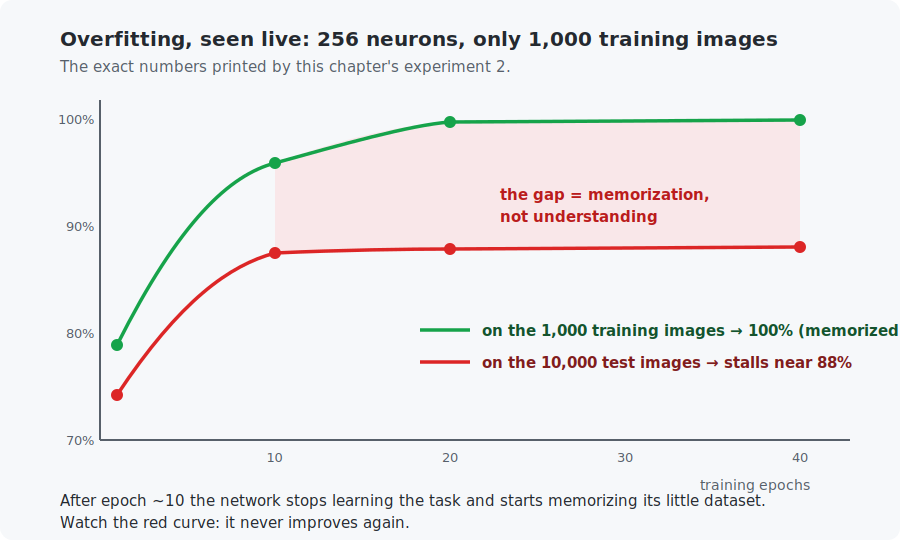

# Chapter 11 — Training deep networks

Training a small network on plentiful data, as you have done so far, mostly just works. Training *deep* networks on *limited* data mostly does not — unless you know the toolkit. This chapter is that toolkit: better optimizers (momentum, Adam), sane initialization, and the art of fighting **overfitting** — the failure mode where a model aces its training data and flunks reality. Every experiment here runs live, and one of them ties all the way back to Chapter 5 with a 200× speedup.

<!-- CONTENTS_START -->
## Contents

- [What you will learn](#what-you-will-learn)
- [Prerequisites](#prerequisites)
- [1. Beyond plain SGD](#1-beyond-plain-sgd)
- [2. Initialization: why Chapter 9 multiplied by √(2/n)](#2-initialization-why-chapter-9-multiplied-by-2n)
- [3. Overfitting: the central disease of machine learning](#3-overfitting-the-central-disease-of-machine-learning)
- [4. The defenses — and their honest limits](#4-the-defenses-and-their-honest-limits)
- [5. Batch normalization, in one paragraph](#5-batch-normalization-in-one-paragraph)
- [Code walkthrough](#code-walkthrough)
- [Run it](#run-it)
- [What the C version covers](#what-the-c-version-covers)
- [Exercises](#exercises)
- [Next](#next)

<!-- CONTENTS_END -->

## What you will learn

- Momentum and Adam: what they add to plain gradient descent, formula by formula.
- Why initialization matters (and what "He initialization" was doing in Chapter 9).
- Overfitting: how to recognize it instantly on a curve.
- The defenses — validation sets, early stopping, weight decay, dropout — and their honest limits.
- Batch normalization, in brief: Chapter 5's standardization trick moved inside the network.

## Prerequisites

- [Chapter 10](../10-intro-to-pytorch/README.md) — PyTorch basics.
- [Chapter 5](../05-linear-regression/README.md) — the feature-scaling story (it returns, twice).

## 1. Beyond plain SGD

Plain gradient descent takes the current gradient and steps. Two upgrades dominate practice.

**Momentum** gives the walker memory. Instead of stepping by the raw gradient, keep a running average of recent gradients and step by that:

$$v \leftarrow \beta \, v + (1-\beta)\, g \qquad\qquad \theta \leftarrow \theta - \eta \, v$$

Symbols: $g$ is the current gradient, $v$ the "velocity" (the running average; $\beta \approx 0.9$ means "keep 90% of yesterday's speed"), $\theta$ any parameter, $\eta$ the learning rate. Effect: consistent directions build up speed; zigzagging directions cancel out. Think of a heavy ball rolling down the loss landscape instead of a cautious hiker re-deciding at every step — mini-batch noise (Chapter 9) averages away, and progress along narrow valleys accelerates.

**Adam** adds a second memory: a running average of the *squared* gradient per parameter, used to normalize each step:

$$\text{step for } \theta = -\eta \; \frac{\text{average of recent } g}{\sqrt{\text{average of recent } g^2}}$$

(Plus small corrections for startup, which the C code spells out.) The division is the point: a parameter whose gradients are habitually large gets its steps shrunk; one with tiny gradients gets boosted. **Every parameter receives its own effective learning rate.** If that sounds like the cure for Chapter 5's scale-mismatch disease — the bias that crawled for 200,000 epochs while the weight raced — it is, and the C example proves it on that exact problem:

```
Plain gradient descent, lr 1e-4:  reaches (w=3.0, b=20) after ~200,000 epochs
Adam, lr 1.0:                     reaches (w=3.0, b=20) after   ~1,000 epochs
```

Rules of thumb the field actually uses: **Adam with learning rate 0.001 is the safe default** for new problems; well-tuned SGD+momentum sometimes generalizes slightly better and remains common for vision models. The Python experiment races all three on MNIST — momentum's epoch-1 jump (91% → 96%) is dramatic.

## 2. Initialization: why Chapter 9 multiplied by √(2/n)

Two facts, briefly, because Chapter 9 used them silently:

- **All-zero weights fail completely**: every neuron in a layer would compute the same output and receive the same gradient, forever — perfect symmetry, never broken. Random starts exist to break ties.
- **The scale of the randomness matters**: too large and activations explode layer by layer; too small and they fade to nothing — and Chapter 8 taught you gradients flow *through* activations, so either way learning stalls. **He initialization** (normal noise × $\sqrt{2/\text{fan-in}}$, where fan-in = the number of inputs to the neuron) keeps the signal's variance steady through ReLU layers. PyTorch's `nn.Linear` does something equivalent by default; you only think about this when something deep refuses to train.

## 3. Overfitting: the central disease of machine learning

Experiment 2 manufactures the disease on purpose: a 256-neuron network, but only **1,000 training images**:



The network reaches **100% on its training set** — it has *memorized* all 1,000 images — while test accuracy freezes at 88% from epoch 10 onward. The growing gap between the curves is overfitting, and diagnosing it needs one habit: **always measure on data the model has not trained on, throughout training** (a *validation set* — kept separate from the final *test set*, which you touch only once at the very end; Chapter 12 formalizes the three-way split).

Why does a big model memorize? Because it can: 200,000+ parameters versus 1,000 examples means the easiest way to drive training loss to zero is to store the answers rather than learn the pattern. Deep learning's core tension in one line: **capacity to learn = capacity to memorize.**

## 4. The defenses — and their honest limits

- **Early stopping**: watch validation accuracy; stop when it stops improving (around epoch 10 in the figure). Free and universally used.
- **Weight decay**: add a small penalty pulling every weight toward zero ($\lambda \approx 10^{-4}$, the `weight_decay=` argument). Memorization tends to need large, oddly specific weights; decay taxes them.
- **Dropout**: during training, randomly zero each hidden activation with probability $p$ (0.5 here) — a different random subset every batch. No neuron can rely on a specific partner existing, so features must be redundant and robust; conspiracies to memorize individual examples become hard to coordinate. At evaluation time dropout switches off (that is why the code calls `model.eval()` before measuring).

Experiment 3 applies both to the 1,000-image setup. Honest results: test accuracy improves (88.07% → 88.82%) and the gap grows more slowly, but the network *still* eventually memorizes. Defenses buy percentage points, not miracles — and then experiment 4 plays the real trump card, the same defended network on all 60,000 images:

```
    epoch   5:  train 97.99%   test 97.29%   gap +0.70%
```

The gap nearly vanishes. **The strongest regularizer ever discovered is more data.** When you can get it, get it; the defenses are for when you cannot. (Chapter 12 adds a clever middle path: *augmentation*, manufacturing more data from what you have.)

## 5. Batch normalization, in one paragraph

Chapter 5 standardized inputs (mean 0, spread 1) and training sped up 200×. **Batch norm** applies that idea to the *hidden* activations: each layer's outputs are re-standardized over the current batch, with two small learned parameters per neuron so the network keeps its expressive power. Deep stacks train dramatically better because each layer sees inputs on a stable scale regardless of what the layers below are doing. In code it is one line (`nn.BatchNorm1d(128)` between layer and activation); you will use it inside every convolutional network from Chapter 14 on, and this paragraph is all the theory those chapters need.

## Code walkthrough

The example is `python/training_toolkit.py`, structured as four experiments you can read independently:

| Function | What it does | What to notice |
|----------|--------------|----------------|
| `build_classifier(hidden_size, dropout)` | A 784 → hidden → 10 net, optionally with a `nn.Dropout` layer. | One builder, reused by every experiment so the comparisons are fair. |
| `run_training(model, ..., optimizer, ...)` | The shared training loop; reports train and test accuracy at chosen epochs. | Takes the optimizer as an *argument* — that is how the race swaps SGD/momentum/Adam without touching anything else. |
| `optimizer_race(...)` | Experiment 1: same net and data, three optimizers. | A fresh `torch.manual_seed(42)` before each keeps the start identical — the only variable is the optimizer. |
| `overfitting_demonstration(...)` | Experiments 2 & 3: overfit a big net on 1,000 images, then add dropout + weight decay. | Watch the train/test *gap* — the printed `gap` column is overfitting, quantified. |
| `more_data_demonstration(...)` | Experiment 4: the same defended net on all 60,000 images. | The gap nearly vanishes — "more data beats every trick", shown not told. |

The C file `c/adam_from_scratch.c` implements **Adam** in ~25 lines and races it against plain gradient descent on Chapter 5's problem — reaching the answer in ~1,000 epochs where plain descent needed 200,000. Read it to see there is no magic in `optimizer.step()`, just two running averages and a division.

## Run it

```bash
.venv/bin/python chapters/11-training-deep-networks/python/training_toolkit.py --quick   # ~1 min
.venv/bin/python chapters/11-training-deep-networks/python/training_toolkit.py           # ~5 min

make -C chapters/11-training-deep-networks/c && ./chapters/11-training-deep-networks/c/build/adam_from_scratch
```

The Python program runs the four experiments (optimizer race, manufactured overfitting, the defenses, the more-data cure). The C program runs the Chapter-5 rematch shown in Section 1.

## What the C version covers

Adam implemented from scratch — about 25 lines of actual algorithm, matching the formulas in Section 1 including the startup corrections — applied to Chapter 5's raw-feature regression. Reading it demystifies the last black box in `optimizer.step()`: there is no magic in there either, just two running averages and a division.

## Exercises

1. In the optimizer race, momentum beat Adam on this problem. Swap in learning rate 0.01 for Adam and race again. Lesson: optimizer rankings are problem- and learning-rate-dependent; defaults are starting points, not laws.
2. Using the figure, apply early stopping by eye: which epoch would you stop at, and what test accuracy do you keep? How close is that to the best the defenses achieved in 40 epochs?
3. Set dropout to 0.9 in experiment 3. Predict before running: which curve suffers more, train or test? Explain with Section 4's "no reliable partners" argument.
4. Add `nn.BatchNorm1d(256)` after the hidden layer in the overfitting experiment (before the ReLU). Does it help the *overfitting*, or only the training speed? (Batch norm is a trainer, not primarily a regularizer — verify.)
5. Challenge (C): extend `adam_from_scratch.c` with SGD+momentum as a third contender (four lines: one velocity per parameter). Where does it land between the other two on this problem?

## Next

[Chapter 12 — Data pipelines](../12-data-pipelines/README.md)

<!-- NAV_START -->
---

[← Chapter 10: Introduction to PyTorch](../10-intro-to-pytorch/README.md) · [↑ Course index](../../README.md) · [Chapter 12: Data pipelines →](../12-data-pipelines/README.md)

<!-- NAV_END -->
