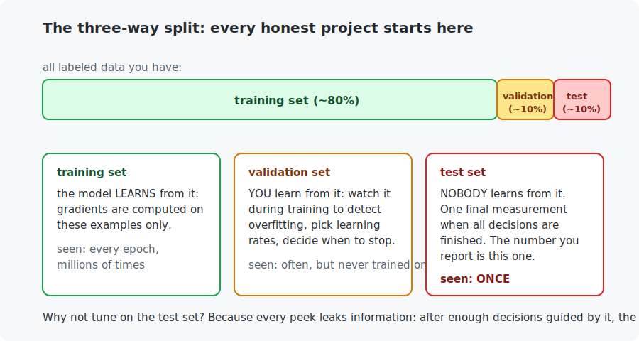

# Chapter 12 — Data pipelines

Practitioners share a secret: most of the work — and most of the wins — are in the *data*, not the model. This chapter closes Part II with the data-side craft: honest splits, loaders, augmentation (which beats Chapter 11's defenses on Chapter 11's own problem), and metrics that tell you *where* a model fails instead of just how often.

<!-- CONTENTS_START -->
## Contents

- [What you will learn](#what-you-will-learn)
- [Prerequisites](#prerequisites)
- [1. The three-way split](#1-the-three-way-split)
- [2. Datasets and loaders](#2-datasets-and-loaders)
- [3. Augmentation: the free data machine](#3-augmentation-the-free-data-machine)
- [4. The confusion matrix: mistakes have structure](#4-the-confusion-matrix-mistakes-have-structure)
- [Code walkthrough](#code-walkthrough)
- [Run it](#run-it)
- [What the C version covers](#what-the-c-version-covers)
- [Exercises](#exercises)
- [Next](#next)

<!-- CONTENTS_END -->

## What you will learn

- The train/validation/test split, and the discipline that makes scores trustworthy.
- What `Dataset` and `DataLoader` actually do (you will build the loader in C).
- Data augmentation: manufacturing variety, the poor practitioner's "more data".
- The confusion matrix: reading a classifier's mistakes like a map.

## Prerequisites

- [Chapter 11](../11-training-deep-networks/README.md) — overfitting and its defenses (this chapter reuses its exact experiment).

## 1. The three-way split

Chapter 11 warned that you need data the model never trained on to *see* overfitting, and hinted that the validation and test sets differ. Here is the full discipline:



The subtle part is the middle: *you* are also a learner. Every time you compare two learning rates or decide when to stop, **you** extract information from whatever data guided the decision. Make enough decisions against the test set and you have quietly fitted yourself to it — the reported score becomes a lie without a single dishonest line of code. Hence the rule: tune against **validation**, report **test**, touch test **once**.

Demo 1 practices the ritual on Chapter 11's 1,000-image problem: split 800/200, watch validation every epoch, keep a copy of the weights whenever validation peaks (that is all "early stopping" is), and only at the very end measure test — 87.57%, from the epoch-25 weights the validation set chose. One more habit shown there: the split must be decided *before* training, and for imbalanced data should preserve class mix (*stratified* splitting — MNIST is balanced enough that a simple cut works).

## 2. Datasets and loaders

PyTorch splits data handling into two small ideas:

- A **`Dataset`** answers two questions: *how many examples?* (`__len__`) and *give me example i* (`__getitem__`). Anything answering both — files on disk, a database, a generator of synthetic fruit — plugs into everything else.
- A **`DataLoader`** wraps a dataset and does three jobs per epoch: **shuffle** the visiting order, **gather** examples into batches, and apply **transforms** on the way out (normalization, augmentation). Optionally it does this in parallel worker processes so the GPU never waits on the disk.

You have used both since Chapter 10; the C example de-mystifies them completely by rebuilding the loader — 60 lines — and *auditing* it: one epoch delivers every example exactly once (600 × 100 = 60,000, each visited once), and any single shuffled batch's label mix tracks the whole dataset's within a few percent. That second property is why Chapter 9's mini-batch gradients point roughly like the full gradient: a random batch is a fair poll of the dataset.

## 3. Augmentation: the free data machine

A digit is still the same digit if the ink shifts a millimeter, tilts ten degrees, or shrinks a touch. **Augmentation** exploits that: apply small *label-preserving* random distortions to every training image, fresh ones each epoch, so the network never sees the exact same pixels twice:

```python
transforms.RandomAffine(degrees=10, translate=(0.1, 0.1), scale=(0.9, 1.1))
```

Demo 2 replays Chapter 11's overfitting experiment — same 1,000 images, same network, same defenses — with augmentation added. The scoreboard across the two chapters:

| setup (1,000 training images, 40 epochs) | test accuracy |
|------------------------------------------|---------------|
| plain (Chapter 11) | 88.07% |
| + dropout + weight decay (Chapter 11) | 88.82% |
| + augmentation as well (**this chapter**) | **91.01%** |

Augmentation wins because it attacks the disease at its root: memorization is impossible when the training set is effectively infinite. It is Chapter 11's "more data beats every trick", implemented for free. Notes for honest use: augment **only the training set** (never validation/test — you would be grading on distorted questions); match distortions to the domain (horizontal flips are great for cats and catastrophic for digits — a flipped "5" is not a "5"); and expect *slower* training, since the task is genuinely harder.

## 4. The confusion matrix: mistakes have structure

One accuracy number hides everything interesting. The **confusion matrix** counts every (true class, predicted class) pair; row = truth, column = the model's answer, diagonal = correct:

```
   true\pred     0     1     2     3     4     5     6     7     8     9
        0    970     0     1     2     1     0     4     1     1     0
        4      0     1     3     0   951     0     8     2     2    15
        5      2     1     0    15     1   857     9     1     3     3
        ...
   Most common mistake: true 4 predicted as 9 (15 times)
```

Demo 3 trains on the full dataset (97.33% accuracy) and prints the full matrix. The mistakes are *not* random noise: 4↔9 and 5↔3 dominate — pairs that genuinely look alike in handwriting. This is how practitioners debug models: the matrix tells you *which* data to collect more of, or which classes need attention. Two named metrics you will meet in the wild generalize this: **precision** (of everything the model called class X, how much really was?) and **recall** (of all true X, how much did it find?). They matter most when classes are imbalanced — a fraud detector that never fires scores 99.9% accuracy and 0% recall.

## Code walkthrough

The example is `python/data_pipelines.py`. Almost none of it is new model code — it is the *data-handling* craft around a fixed network. No prior programming assumed.

### Step 1 — the transform pipelines (where augmentation lives)

```python
PLAIN_TRANSFORM = transforms.Compose([transforms.ToTensor(), FLATTEN_TRANSFORM])

AUGMENTED_TRANSFORM = transforms.Compose([
    transforms.RandomAffine(degrees=10, translate=(0.1, 0.1), scale=(0.9, 1.1)),
    transforms.ToTensor(),
    FLATTEN_TRANSFORM,
])
```

A `transform` is a small recipe applied to each image *as it leaves the dataset*. `transforms.Compose([...])` chains steps in order. `PLAIN_TRANSFORM` just converts the image to a tensor and flattens it to 784 numbers. `AUGMENTED_TRANSFORM` adds one line — `RandomAffine`, a small random rotation/shift/zoom — in front. Because the `DataLoader` re-applies the transform every time it hands out an image, that single line means **the network sees a slightly different version of each digit every epoch**. That is the entire augmentation idea; everything else is the same network from Chapter 11.

### Step 2 — a training loop with a hook

```python
def train_epochs(model, training_loader, optimizer, device, number_of_epochs, per_epoch_callback=None):
    ...
    for epoch_number in range(1, number_of_epochs + 1):
        for image_batch, label_batch in training_loader:
            ...   # the usual zero_grad -> backward -> step
        if per_epoch_callback is not None:
            per_epoch_callback(epoch_number)
```

The loop is Chapter 10's. The one addition is `per_epoch_callback` — an *optional function* passed in and called after each epoch. It lets the early-stopping demo peek at validation accuracy every epoch without cluttering the training loop with demo-specific code. (Passing a function as an argument is the same idea that let Chapter 11 swap optimizers.)

### Step 3 — demo 1: split, then let validation decide when to stop

```python
training_part = Subset(full_dataset, range(800))
validation_part = Subset(full_dataset, range(800, SMALL_TRAINING_SIZE))
...
def check_validation(epoch_number):
    validation_accuracy = measure_accuracy(model, validation_loader, device)
    if validation_accuracy > best_validation_accuracy:
        best_model_state = {name: tensor.clone() for name, tensor in model.state_dict().items()}
```

`Subset` carves the 1,000 labeled images into 800 train / 200 validation. Each epoch, `check_validation` (the callback) measures validation accuracy, and whenever it hits a new peak it saves a **copy** of the model's weights (`state_dict()` is the bag of all parameters; `.clone()` makes a snapshot that later training will not overwrite). At the end it restores that best snapshot and only *then* measures the test set — **once**. That save-the-peak-weights logic *is* early stopping.

### Step 4 — demo 2: augmentation, by swapping one transform

The augmentation demo is byte-for-byte Chapter 11's overfitting experiment, except the training dataset is built with `AUGMENTED_TRANSFORM` instead of `PLAIN_TRANSFORM`. That single swap lifts test accuracy from Chapter 11's 88.8% to 91.0% — a real gain from changing *nothing but the data pipeline*.

### Step 5 — demo 3: the confusion matrix

```python
confusion_counts = torch.zeros(10, 10, dtype=torch.long)
for image_batch, label_batch in test_loader:
    predictions = model(image_batch.to(device)).argmax(dim=1).cpu()
    for true_label, predicted_label in zip(label_batch, predictions):
        confusion_counts[true_label, predicted_label] += 1
```

A 10×10 grid of counters. For every test image it adds 1 to the cell `[true digit, predicted digit]`. Correct predictions land on the diagonal (true == predicted); everything off the diagonal is a mistake. Zeroing the diagonal and taking the maximum finds the single most common confusion (true 4 predicted as 9) — which is exactly how practitioners decide what to fix next.

The C file `c/batch_loader.c` rebuilds `DataLoader` — shuffle, batch, normalize — and **audits** it: one epoch touches every example exactly once, and each shuffled batch's label mix tracks the whole dataset. After this, no line of a PyTorch training script is a black box.

### Quick reference

| Function | What it does | What to notice |
|----------|--------------|----------------|
| `AUGMENTED_TRANSFORM` (module top) | `RandomAffine` (rotate/shift/zoom) + ToTensor + flatten. | This one line *is* the augmentation; applied fresh each epoch. |
| `train_epochs(..., per_epoch_callback)` | The training loop, with a hook called after each epoch. | The callback lets the early-stopping demo peek at validation without cluttering the loop. |
| `demonstrate_validation_split(...)` | 800 train / 200 validation; keeps the best-validation weights. | The `best_model_state` copy **is** early stopping; test is measured *once*. |
| `demonstrate_augmentation(...)` | Chapter 11's setup with augmentation added. | Beats Chapter 11's defenses (88.8% → 91.0%). |
| `demonstrate_confusion_matrix(...)` | Counts every (true, predicted) pair. | The off-diagonal max finds the worst mistake (4↔9). |

## Run it

```bash
.venv/bin/python chapters/12-data-pipelines/python/data_pipelines.py --quick   # ~2 min
.venv/bin/python chapters/12-data-pipelines/python/data_pipelines.py           # ~10 min

# The C loader reads Chapter 9's exported files (run that export once first):
make -C chapters/12-data-pipelines/c && ./chapters/12-data-pipelines/c/build/batch_loader
```

## What the C version covers

A complete `DataLoader` equivalent — shuffle (Fisher-Yates), batch gathering, and the normalize-transform — plus the audit described in Section 2. It is the last piece of the framework whose insides you had not yet seen: after this chapter, every line of a standard PyTorch training script corresponds to C code you have personally read.

## Exercises

1. In demo 1, the validation curve wobbles (86.5% → 87.0% → 86.5%...) while it climbs. Why is a 200-image validation set noisy, and what is the trade-off in making it bigger?
2. Crank augmentation to `degrees=90`. Predict which digit pairs will start colliding before you run it (a rotated 6 is a ...?). Lesson: augmentation encodes *domain knowledge* about what does not change the label.
3. From demo 3's matrix, compute precision and recall for digit 5 (you need its row and its column). Which is worse, and what does that mean in words?
4. Write a `Dataset` for Chapter 1's fruit (a dozen tuples in memory). Wrap it in a `DataLoader` with `batch_size=4, shuffle=True` and iterate — the point is feeling how little is required.
5. Challenge (C): add a `--stratified` mode to the batch loader that makes every batch contain exactly 10 examples of each digit. Compare its per-batch label table with the shuffled one. When would you actually want this? (Hint: Chapter 12's imbalance discussion.)

## Next

Part II is complete — you command the full modern toolkit. [Chapter 13 — Convolutions](../13-convolutions/README.md) begins computer vision: the fix for the MLP's pixel-order blindness that Chapter 9 promised.

<!-- NAV_START -->
---

[← Chapter 11: Training deep networks](../11-training-deep-networks/README.md) · [↑ Course index](../../README.md) · [Chapter 13: Convolutions →](../13-convolutions/README.md)

<!-- NAV_END -->
