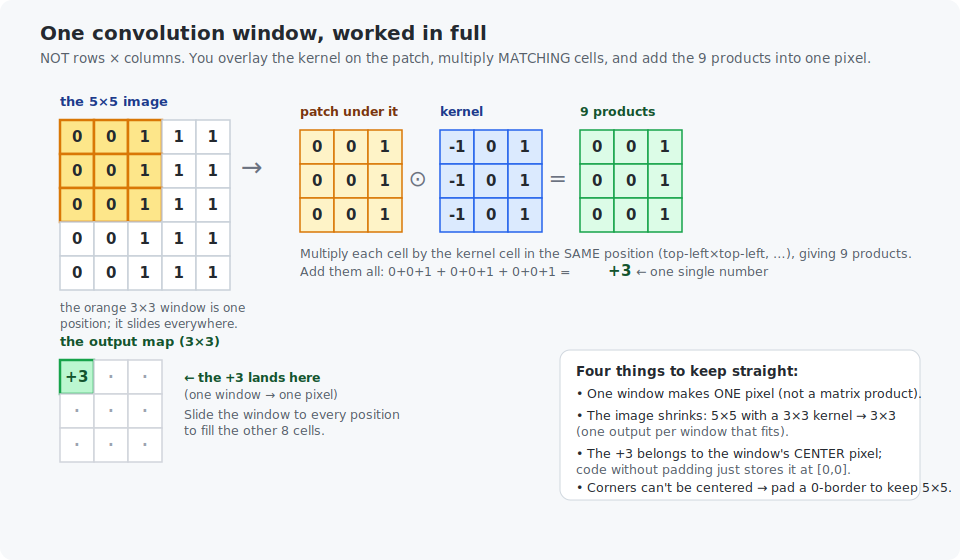

# Chapter 13 — Convolutions

Chapter 9 ended with a diagnosis: the MLP scored "only" 96% on digits because it treats an image as an unordered bag of 784 numbers — shuffle the pixels consistently and it would learn just as well. Images have *structure*: nearby pixels form edges, edges form shapes. The **convolution** is the operation that finally looks at images the way images work, and it powers everything visual from here to the end of the course.

<!-- CONTENTS_START -->
## Contents

- [What you will learn](#what-you-will-learn)
- [Prerequisites](#prerequisites)
- [1. The operation](#1-the-operation)
- [2. Why this beats a dense layer at seeing](#2-why-this-beats-a-dense-layer-at-seeing)
- [3. The four knobs](#3-the-four-knobs)
- [Code walkthrough](#code-walkthrough)
- [Run it](#run-it)
- [What the C version covers](#what-the-c-version-covers)
- [Exercises](#exercises)
- [Next](#next)

<!-- CONTENTS_END -->

## What you will learn

- The convolution operation, worked by hand on paper-sized numbers.
- Kernels as pattern detectors; feature maps as "where the pattern is".
- Padding, stride, channels, and pooling — the four knobs of every CNN layer.
- Why convolutions need ~100× fewer parameters than an MLP for the same job.

## Prerequisites

- [Chapter 9](../09-first-neural-network/README.md) — the MLP whose blindness we cure.
- [Chapter 2](../02-vectors-and-matrices/README.md) — weighted sums (a convolution is many of them).

## 1. The operation

Take a small grid of weights — a **kernel**, typically 3×3 — and slide it across the image. At each position: multiply the patch under the window by the kernel, element by element, and sum. One weighted sum per position; the results form a new grid called a **feature map**.

Because "multiply and sum" is easy to picture wrongly as matrix multiplication, here is **one window computed in full** first — it is *not* a matrix product:



Read it left to right, and notice the four things that trip everyone up at first — they are exactly the questions worth asking:

- **It is not rows × columns.** You lay the kernel *on top of* the patch and multiply each cell by the kernel cell in the **same position** (top-left × top-left, and so on) — nine products — then **add all nine into one number**. No dot products of rows against columns; just overlay, multiply, add.
- **One window makes exactly one output pixel.** Slide the window one step over and you compute the next pixel. So the output is a grid with one entry per window position, not a transformed copy of the input.
- **The image shrinks.** A 3×3 window only *fits* in `input − 2` positions each way, so a 5×5 image gives a 3×3 output (Section 3 turns this into a formula). That shrinkage is just the window needing room around itself.
- **Which pixel is the result?** Conceptually the `+3` belongs to the window's **center** — it is the center pixel, rewritten as a weighted sum of its neighbors. The code, without padding, simply stores it at the window's top-left index; the two views differ only by a shift, which is why the output looks offset.

And the **corners**? A window centered on a border pixel would hang off the edge of the image, so without help those pixels get no output — which is *why* the image shrank. To keep the output the same size, you **pad** a border of zeros around the image so every pixel, corners included, can sit at a window's center (Section 3's *padding* knob). With the mechanics clear, here is the same operation *sliding across a whole image*:


Follow the figure's arithmetic once by hand — it is Chapter 0's weighted sum, applied at every window position. The kernel shown, $(-1, 0, 1)$ in every row, answers one question everywhere: *"is it brighter on my right than on my left?"* On the striped image, its output is +3 along the stripe's left edge, −3 along the right edge, 0 on flat regions. **This kernel is a vertical-edge detector, and its output map says where the edges are.**

Different weights ask different questions: rotate the kernel to detect horizontal edges; other patterns detect corners, blobs, textures. In a CNN, **nobody designs the kernels — the weights are learned by backpropagation**, exactly like every weight so far. Trained networks reliably rediscover edge detectors in their first layer, because edges genuinely are the atoms of images.

## 2. Why this beats a dense layer at seeing

Two structural advantages over Chapter 9's `nn.Linear`:

1. **Locality.** Each output looks at a 3×3 neighborhood, matching how images work: a pixel's meaning depends on its neighbors, not on a pixel in the far corner.
2. **Weight sharing.** The *same* 9 weights are reused at every position. An edge detector is equally valid in the top-left and bottom-right, so learning it once suffices — and a pattern learned from edges appearing anywhere in *any* training image benefits detection *everywhere*. Compare parameter counts for one layer on a 224×224 image: dense, 224²→224² would need ~2.5 *billion* weights; a conv layer with 32 kernels needs about **9 × 32 ≈ 300**.

The price is fair: convolutions assume the pattern's *position* does not change its meaning (true for photos, less true for, say, board games), and each layer sees only locally — which is why CNNs stack many layers, each seeing further than the last (its *receptive field* grows).

## 3. The four knobs

Section 1 was one kernel making one feature map. A real convolutional layer adds four settings — **padding, stride, channels, and pooling** — and together they are the whole vocabulary of every CNN. Treat this section as the **parts list**: here we define each part and, more importantly, *what problem it solves*; [Chapter 14](../14-image-classification/README.md) then bolts them together into a network that classifies real photographs, and every vision chapter after leans on them. So yes, this is groundwork — but each knob exists to fix a concrete difficulty, and that "why" is what makes the later chapters click.

**Padding — so you can go deep, and so the borders count.** A border of zeros around the image lets the kernel sit on edge pixels too. It fixes two concrete problems. First, without padding, every 3×3 layer shaves a pixel off each side (Section 1's shrinkage) — stack ten layers and you have lost twenty pixels, so deep networks would literally consume the image. With `padding=1` the output stays the same size as the input ("same" padding), so you can stack as many layers as you want. Second, an unpadded corner pixel falls inside only *one* window while a center pixel falls inside nine, so the borders get under-counted; padding gives every pixel a fair share of windows. In short, **padding is what makes depth practical** — and depth is where vision comes from.

**Stride — a cheap way to zoom out.** Stride is how far the window jumps each step: stride 1 visits every position, stride 2 skips every other one and so halves the map's width and height in a single layer. Why deliberately throw away resolution? Because a smaller map means each later position now summarizes a *bigger* patch of the original image — the network zooms out from fine detail toward object scale — and it costs a quarter as much to compute. The exact output size, verified live by both programs:

$$\text{output size} = \left\lfloor \frac{\text{input size} + 2 \cdot \text{padding} - \text{kernel size}}{\text{stride}} \right\rfloor + 1$$

**Channels — where a CNN's real power lives.** Two ideas hide under this one word. *Input* channels: a color image has 3 numbers per pixel (red, green, blue), so a kernel on it is really 3×3×**3**, summing over the color channels as well — it can react to color patterns, not just brightness. *Output* channels: a layer does not apply one kernel but **many** (32, 64, 128…), each a different pattern-detector producing its own feature map; stacking those maps gives the next layer that many input channels. Now the consequence that matters, because it is *how vision is actually built*: a layer-2 kernel spans **all** of layer 1's channels at once, so it looks at *combinations* of layer 1's edge maps and can learn, say, "a horizontal edge sitting above a vertical edge" — a **corner**. Layer 3 combines corners and textures into **object parts** (an eye, a wheel); deeper layers combine parts into **whole objects**. Edges → corners → parts → objects: the network composes simple detectors into complex ones, one level at a time, and "more channels" simply means "how many different things this layer is allowed to look for." **That compositional hierarchy is *the* reason a CNN can turn raw pixels into "cat".** (This is why the tensor shapes read `(batch, channels, height, width)` — the channel dimension is carrying all those detectors.)

**Pooling — shrink, and forgive small shifts.** Pooling summarizes each little neighborhood into one number; the common form, *max pooling*, keeps the largest value in each 2×2 block. Like stride, that halves the resolution (cheaper, wider view). But max pooling buys one extra thing that directly helps recognition: by keeping only the *strongest* response in a neighborhood, it answers "was this feature found *somewhere around here*?" instead of "was it found at this exact pixel?" — so a cat shifted a few pixels still lights up the same pooled feature. That tolerance to small shifts (*translation invariance*) is part of why a CNN trained on one photo generalizes to the next. (Modern networks often use a stride-2 convolution instead of pooling for the same shrink-and-summarize effect, but *learned* rather than fixed.)

Notice the thread running through stride, pooling, and depth: each one lets a later layer *see more of the image at once*. The patch of input that influences a single deep value is called its **receptive field**, and it grows as you climb the network — which is precisely why the first layers find local edges while deep layers recognize entire objects.

Put together, a classic CNN is just these pieces repeated — conv, ReLU, (pool or stride-2), repeat — with the maps getting **smaller but deeper** (fewer pixels, more channels): space is steadily traded for meaning, until a final dense layer reads the distilled features and decides. [Chapter 14](../14-image-classification/README.md) builds exactly that on real photographs, plus the one trick (residual connections) that lets the stack go genuinely deep.

## Code walkthrough

The example is `python/convolution_from_scratch.py`. The whole chapter lives in **one function**; everything else checks or times it. No prior programming assumed.

### Step 1 — the whole convolution, in one function

```python
def convolve_2d(input_image, kernel, padding=0, stride=1):
    if padding > 0:
        input_image = numpy.pad(input_image, padding)
    input_height, input_width = input_image.shape
    kernel_height, kernel_width = kernel.shape
    output_height = (input_height - kernel_height) // stride + 1
    output_width = (input_width - kernel_width) // stride + 1

    output_map = numpy.zeros((output_height, output_width))
    for output_row in range(output_height):
        for output_column in range(output_width):
            image_patch = input_image[
                output_row * stride: output_row * stride + kernel_height,
                output_column * stride: output_column * stride + kernel_width,
            ]
            output_map[output_row, output_column] = (image_patch * kernel).sum()
    return output_map
```

Read it top to bottom — it is exactly Section 1's "slide and sum":

- `numpy.pad(input_image, padding)` adds the border of zeros (Section 3's *padding* knob), so the kernel can sit on edge pixels.
- The `output_height`/`output_width` lines *are* the size formula from Section 3, in code — how many window positions fit given the kernel size and stride.
- `numpy.zeros((output_height, output_width))` makes the empty feature map to fill in.
- The **two nested `for` loops** visit every output position (row, then column). At each one, `input_image[row : row+kh, column : column+kw]` is a NumPy slice that grabs the little **patch** under the window (`stride` controls how far the window jumps).
- The one line that *is* convolution: `(image_patch * kernel).sum()`. `image_patch * kernel` multiplies the patch by the kernel element by element (NumPy does the whole grid at once), and `.sum()` adds the results — **one weighted sum, exactly Chapter 0**, producing one output pixel. Do that at every position and you have the feature map.

That is the entire operation. Everything below just exercises it.

### Step 2 — the worked example (does it detect edges?)

```python
striped_image = numpy.zeros((5, 5))
striped_image[:, 2:4] = 1.0          # paint two bright columns
output_map = convolve_2d(striped_image, VERTICAL_EDGE_KERNEL)
```

`demonstrate_worked_example` builds the figure's striped image (`[:, 2:4] = 1.0` sets columns 2–3 to bright) and runs the `(-1, 0, 1)` vertical-edge kernel over it. The printed output is +3 where brightness rises and −3 where it falls — the figure's exact numbers, confirming the kernel really is an edge detector.

### Step 3 — padding and stride, against the formula

```python
for padding, stride in ((0, 1), (1, 1), (1, 2), (0, 2)):
    output_map = convolve_2d(test_image, VERTICAL_EDGE_KERNEL, padding, stride)
    formula_size = (28 + 2 * padding - 3) // stride + 1
```

`demonstrate_padding_and_stride` runs four padding/stride combinations on a 28×28 image and prints the actual output shape next to the Section 3 formula's prediction — they match. You can watch `padding=1` keep the size at 28×28 ("same" padding) and `stride=2` halve it to 14×14, which is how CNNs shrink their maps.

### Step 4 — is it *correct*, and how slow?

`demonstrate_agreement_with_pytorch` runs our loops and PyTorch's real `torch.nn.functional.conv2d` on the same image and reports the largest difference — about 1e-15, i.e. identical to floating-point precision. That is the true correctness check: our from-scratch version computes exactly what the framework does. Then `demonstrate_speed` times both on a 224×224 image, setting up the chapter's punchline — on one small single-channel image, plain compiled C loops match PyTorch; the framework's real edge is batched, many-channel workloads on a GPU.

### Quick reference

| Function | What it does | What to notice |
|----------|--------------|----------------|
| `convolve_2d(image, kernel, padding, stride)` | **The whole operation** — pad, then slide the kernel computing `(patch × kernel).sum()`. | The core line is one weighted sum (Chapter 0!) per output pixel. |
| `demonstrate_worked_example()` | The vertical-edge kernel on the striped image. | Output is +3 / −3 along the edges — the figure's exact numbers. |
| `demonstrate_padding_and_stride()` | Output sizes for four padding/stride combos vs the formula. | `padding=1` keeps size (28→28); `stride=2` halves it. |
| `demonstrate_agreement_with_pytorch()` | Compares against `torch.nn.functional.conv2d`. | Difference ~1e-15 — the real correctness check. |
| `demonstrate_speed()` | Times Python loops vs PyTorch on a 224×224 image. | Sets up the punchline; C lands close to PyTorch on this single-channel case. |

**Carry forward:** `convolve_2d` is the operation behind every vision chapter. Chapter 14's C ResNet calls a multi-channel version of this exact loop.

## Run it

```bash
.venv/bin/python chapters/13-convolutions/python/convolution_from_scratch.py
make -C chapters/13-convolutions/c && ./chapters/13-convolutions/c/build/convolution_benchmark
```

The Python program: the figure's example, the size formula live, an exact-agreement check against `torch.nn.functional.conv2d` (differences ~1e-15), and a timing. The C program: the same example and the same 224×224 workload, timed.

Numbers from the reference machine — the punchline is worth staring at:

```
Python loops: 32.1 ms      PyTorch: 0.06 ms      C loops (-O2): 0.058 ms
```

On one small single-channel image, **60 lines of plain C match PyTorch** — the "magic" of fast frameworks is largely just compiled loops. PyTorch pulls ahead where it counts: batched, many-channel workloads, and above all on GPUs, where thousands of those weighted sums run at once (convolution is embarrassingly parallel — every output pixel is independent).

## What the C version covers

A full port of the core algorithm plus the padding helper and the benchmark. Note how small it is: convolution needs no framework, no allocation tricks, nothing — four nested loops and the flat-index formula from Chapter 2.

## Exercises

1. By hand: apply the horizontal-edge kernel (the figure's kernel, transposed) to the striped image. Predict the output before computing: where are the *horizontal* edges in vertical stripes?
2. In the Python file, build a 3×3 kernel of all 1/9 values and convolve any image. What everyday image-editor operation did you just implement?
3. Using the size formula: what padding keeps a 5×5 kernel "same"? A 7×7? State the general rule for odd kernel sizes.
4. Stack two 3×3 convolutions (convolve the output again). What is the receptive field of one output value — how many input pixels influence it? This is why deep stacks of small kernels replaced single big kernels.
5. Challenge (C): extend `convolve_2d` to multi-channel input (a `channel_count` parameter and a 3D kernel) — the sum gains one more loop. Verify against PyTorch with a 3-channel image.

## Next

[Chapter 14 — Image classification](../14-image-classification/README.md)

<!-- NAV_START -->
---

[← Chapter 12: Data pipelines](../12-data-pipelines/README.md) · [↑ Course index](../../README.md) · [Chapter 14: Image classification →](../14-image-classification/README.md)

<!-- NAV_END -->
