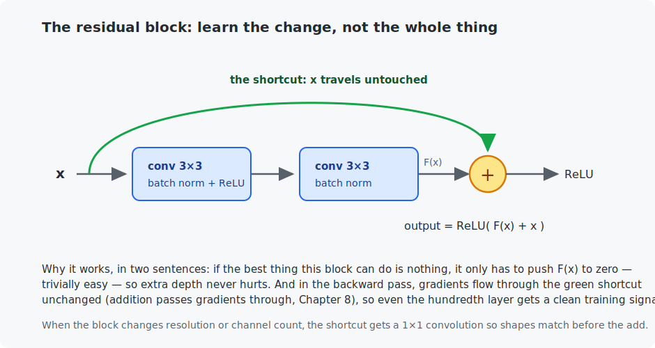

# Chapter 14 — Image classification

Chapter 13 gave you the convolution; this chapter assembles convolutions into a real image classifier and trains it on real photographs — CIFAR-10, the classic "small but honest" vision benchmark. On the way you meet the architecture that made deep learning *deep* (the ResNet), and close the loop with C: the network you train here runs, weight for weight, in a pure-C inference engine — including a genuine deployment trick, batch-norm folding.

## What you will learn

- CIFAR-10 and why it is a real step up from MNIST.
- The CNN recipe: stages of conv-BN-ReLU with shrinking maps and growing channels.
- The residual block — why deep networks refused to train before it, and how a shortcut fixes that.
- Global average pooling, learning-rate schedules, and the standard CIFAR training recipe.
- Batch-norm folding: how training-time layers vanish at deployment time.

## Prerequisites

- [Chapter 13](../13-convolutions/README.md) — convolutions, channels, stride.
- [Chapter 11](../11-training-deep-networks/README.md) — momentum, batch norm, weight decay.
- [Chapter 12](../12-data-pipelines/README.md) — augmentation.

## 1. The data: CIFAR-10

60,000 color photos, 32×32 pixels, 10 classes: airplane, automobile, bird, cat, deer, dog, frog, horse, ship, truck. Tiny images, but *photographs* — lighting varies, poses vary, backgrounds clutter. The gap from MNIST is brutal and instructive: Chapter 9's MLP, retrained on CIFAR-10, manages only ~50%. Structure-blind pixel bags do not survive contact with the real world.

Each image is a tensor of shape `(3, 32, 32)` — three channels (red, green, blue), exactly as Chapter 13 described. The pipeline normalizes each channel by the dataset's mean and spread (Chapter 5's rule) and augments training images with random crops and horizontal flips (Chapter 12 — and note flips are safe here: a mirrored truck is a truck).

## 2. The architecture, stage by stage

The classic CNN plan, which this chapter's `SmallResNet` follows:

```
input 3x32x32
  stem:    conv 3x3, 3->16 channels                    (a first look at the pixels)
  stage 1: blocks at 16 channels, maps stay 32x32      (edges, colors)
  stage 2: blocks at 32 channels, maps shrink to 16x16 (textures, parts)
  stage 3: blocks at 64 channels, maps shrink to 8x8   (object-scale patterns)
  global average pool: 64 numbers                      (one summary per channel)
  linear 64 -> 10 scores                               (the classifier)
```

Two design rhythms to internalize. **Shrink space, grow channels**: each stage halves the map (stride-2 convolution) and doubles the channels — trading *where* for *what*, until 8×8 maps of 64 abstract features describe the image. **Global average pooling** then collapses each channel to its mean: 64 numbers total, so the final linear layer is tiny (650 parameters) — compare Chapter 9, where the dense layers held *all* the parameters.

## 3. The residual block: the idea that unlocked depth

Depth helps — each layer builds on the last's features — so why not just stack 50 conv layers? Because before 2015, they *refused to train*: stacking more layers made even the **training** loss worse. Not overfitting — plain optimization failure. Backprop's chain rule (Chapter 8) multiplies local derivatives across every layer; across dozens of layers those products shrivel toward zero, and the early layers stop receiving any signal (the *vanishing gradient* problem).

The fix is almost insultingly simple:



Instead of asking the block to compute the new representation outright, let it compute a **correction**: $\text{output} = \text{ReLU}(F(x) + x)$, where $F$ is the two convolutions. Two consequences, one per direction:

- *Forward*: if the best thing a block can do is nothing, it just drives $F(x)$ to zero — trivial. Extra depth can no longer hurt, so you can afford lots of it.
- *Backward*: the chain rule through an addition passes gradients **unchanged** (Chapter 8's add rule). The shortcuts form an uninterrupted gradient highway from the loss to the first layer, no matter how deep the stack.

When a block changes resolution or channel count, the shortcut gets a 1×1 convolution so the shapes match before the add — you can see both variants in the code. ResNets scaled to 152 layers within a year of the idea, and residual connections are now in *everything* — including every transformer and every LLM (wait for Chapter 22).

## 4. Training and results

The standard CIFAR recipe (all pieces from Chapter 11): SGD + momentum 0.9, weight decay 5e-4, and a **cosine learning-rate schedule** — start at 0.1 and glide smoothly toward zero, so early training takes bold steps and late training fine ones. The default run is 10 epochs; reference results:

```
SmallResNet: 175,258 parameters
  epoch   average loss   test accuracy   seconds
      1         1.6013         48.49%       8.3
      3         0.8733         68.51%       5.7
      5         0.6576         73.28%       5.7
      8         0.4661         82.51%       5.7
     10         0.3785         85.08%       5.7

Final test accuracy: 85.08%
```

(Reference machine: Apple Silicon GPU. Times scale with your hardware; the accuracies do not.)

For perspective: ~70% of a random 32×32 photo's class recovered in minutes of training, versus ~10% chance. Longer runs keep paying on this architecture — `--epochs 50` lands around 91% (roughly an hour on Apple Silicon, ~15 minutes on a fast NVIDIA card); published ResNets with more blocks and longer schedules reach ~95%. Meanwhile the checkpoint machinery saves the trained model for what comes next.

## 5. Deployment preview: batch norm folds away

The C program does *not* implement batch normalization — yet matches the Python evaluation. The trick, performed by `export_for_c.py`: at inference time a batch norm is frozen (fixed mean, variance, scale, shift — Chapter 11), which makes it a per-channel multiply-and-add, and *that* can be **absorbed into the preceding convolution's weights**:

$$W' = W \cdot \frac{\gamma}{\sqrt{\sigma^2 + \epsilon}} \qquad b' = \beta - \frac{\gamma \, \mu}{\sqrt{\sigma^2 + \epsilon}}$$

Sixteen batch norms vanish into sixteen convolutions. Every production inference engine does this; you will meet the idea again (harder) in Chapter 25's quantization and Chapter 31.

## Code walkthrough

Two Python files: `train_cifar10_resnet.py` builds and trains the network, `export_for_c.py` prepares it for the C engine.

**`train_cifar10_resnet.py`:**

| Piece | What it does | What to notice |
|-------|--------------|----------------|
| `class ResidualBlock` | Two 3×3 convs plus the shortcut: `relu(F(x) + x)`. | The `if stride != 1 or channels differ` branch adds a 1×1 conv to the shortcut so shapes match before the add — the two shortcut variants from Section 3. |
| `class SmallResNet` | Stem + three stages of residual blocks (16→32→64 channels, 32→16→8 spatial) + global average pool + linear head. | Follow the `forward`: maps get smaller but deeper, then `feature_map.mean(dim=(2,3))` collapses each channel to one number — global average pooling. |
| `build_data_loaders(quick)` | Augmented training loader (random crop + flip), plain test loader. | Flips are safe for photos (a mirrored truck is a truck) — unlike Chapter 12's digits. |
| `main()` | SGD + momentum + cosine schedule, saves a checkpoint. | The cosine `learning_rate_schedule.step()` glides the rate to zero — bold early, precise late. |

**`export_for_c.py`:**

| Function | What it does | What to notice |
|----------|--------------|----------------|
| `fold_batch_norm_into_convolution(conv, bn)` | Merges an inference-mode batch norm into the preceding conv's weights and bias. | This is the deployment trick from Section 5 — 16 batch norms *vanish* into 16 convolutions, so the C engine needs only convs. |
| `export_weights` / `export_test_images` | Write the folded weights and 1,000 test images as flat binaries. | The fixed layer order documented here is the contract the C file reads back. |

## Run it

```bash
# Train (downloads CIFAR-10, ~170 MB, on first run)
.venv/bin/python chapters/14-image-classification/python/train_cifar10_resnet.py --quick    # smoke test, ~2 min
.venv/bin/python chapters/14-image-classification/python/train_cifar10_resnet.py            # 10 epochs
.venv/bin/python chapters/14-image-classification/python/train_cifar10_resnet.py --epochs 50 # ~91%

# Export folded weights + 1,000 test images, then run the C engine
.venv/bin/python chapters/14-image-classification/python/export_for_c.py
make -C chapters/14-image-classification/c
./chapters/14-image-classification/c/build/resnet_inference
```

## What the C version covers

Full inference of the exact trained network: the generic strided/padded multi-channel convolution (Chapter 13's exercise 5, solved), residual blocks with both shortcut types, global average pooling, and the linear head — reading the folded weights blob the export script writes. It classifies the 1,000 exported test images in seconds and scores 86.4% (the Python 85.08% is measured over all 10,000 images; the first 1,000 happen to be marginally easier — same model, same arithmetic). A trained deep network is, in the end, a file of numbers and a few hundred lines of loops.

## Exercises

1. Compute the parameter count of stage 3's first block by hand (two 3×3 convs 32→64 and 64→64, plus the 1×1 shortcut 32→64) and check against the printed model total.
2. Remove the shortcut from `ResidualBlock.forward` (return `torch.relu(block_output)` only) and retrain 10 epochs. Compare curves — this network is shallow enough to survive, but watch the early epochs.
3. Turn off augmentation (use the plain transform for training) and retrain. Where does the train/test gap land, and why is CIFAR more augmentation-hungry than MNIST was? (Hint: 50,000 photos of the whole visual world vs 60,000 digits.)
4. Train with Adam (lr 0.001, no schedule) instead of the SGD recipe. Compare 10-epoch accuracy — on CIFAR ResNets, the old-school recipe usually wins; Chapter 11 warned optimizer rankings are problem-dependent.
5. Challenge (C): time the C engine per image, then work out which convolution stage costs the most multiply-adds (channels × positions × kernel size — count them per stage). Does the measurement match the count? The answer explains why real networks put their channels where the maps are small.

## Next

[Chapter 15 — Object detection](../15-object-detection/README.md)
