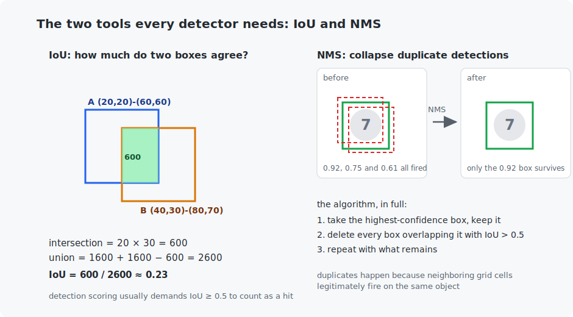

# Chapter 15 — Object detection

Classification answers *what*; detection answers *what and where* — for every object in the scene at once. This is the chapter of bounding boxes, and of the three ideas that make box-prediction work: **IoU** (measuring box agreement), **grid-based prediction** (every image region votes), and **NMS** (cleaning up duplicate votes). You will train a real single-stage detector — the same design family as YOLO — on scenes it can never memorize, because every training image is generated fresh.

## What you will learn

- The detection task and how boxes are represented.
- IoU — intersection over union — worked by hand.
- The single-stage recipe: a grid of cells, each predicting objectness + box + class.
- Non-maximum suppression, and why detectors need it.
- Honest detection metrics: precision and recall at an IoU threshold.

## Prerequisites

- [Chapter 14](../14-image-classification/README.md) — conv backbones.
- [Chapter 12](../12-data-pipelines/README.md) — precision and recall.

## 1. The task, and the dataset trick

A detector receives an image and returns a *list*: for each object, a class label, a **bounding box** (here as corner coordinates $(x_{\min}, y_{\min}, x_{\max}, y_{\max})$), and a confidence score. Lists are awkward for networks — variable length, no natural order — and the whole design of this chapter is about turning "predict a list" into "fill in a fixed grid".

The dataset is manufactured, and that is a feature: each 64×64 training scene is composed on the fly by pasting 1–3 random MNIST digits at random positions, so the ground-truth boxes are known *exactly* (we placed them) and the supply of scenes is infinite (Chapter 12's augmentation idea taken to its limit). Real detection datasets — COCO is the standard — work the same way conceptually, with humans drawing the boxes instead.

## 2. IoU: the ruler for boxes

Any claim like "the predicted box is right" needs a number. **Intersection over union** divides the overlap area of two boxes by the area of their combined footprint:



Work the figure's example by hand once: boxes A = (20,20)–(60,60) and B = (40,30)–(80,70) intersect in a 20×30 = 600 rectangle; the union is 1600 + 1600 − 600 = 2600; IoU = 600/2600 ≈ **0.23**. The scale is intuitive: 1.0 is a perfect match, 0 is disjoint, and the field's standard bar for "close enough to count" is **IoU ≥ 0.5**.

## 3. The single-stage detector

The design that turned detection into one forward pass (the YOLO family, 2016 onward):

1. A small conv backbone (Chapter 14's kind) shrinks the 64×64 image to an **8×8 grid** of feature vectors — each cell effectively summarizes an 8×8 patch of the image.
2. A 1×1 convolution head makes every cell predict 15 numbers: **1 objectness score** ("does an object's *center* fall in my patch?"), **4 box numbers** (center offset within the cell via sigmoid, width and height as fractions of the image), and **10 class scores**.
3. Training assigns each ground-truth digit to the one cell containing its center; that cell is "responsible" for it.

The loss has three parts, one per prediction type: binary cross-entropy on objectness over *all* cells, box regression (MSE) and class cross-entropy only on responsible cells. One imbalance needs handling — only ~2 of 64 cells contain an object, so unweighted BCE teaches the network that "no" is almost always correct and its confidence never rises; weighting positive cells 5× (the code's `pos_weight`) rebalances the lesson. Class imbalance is *the* recurring headache of detection — real detectors fight it with focal loss and hard-negative mining, both descendants of this same fix.

At inference, cells above a confidence threshold each emit a box — and neighboring cells routinely fire on the same object, which is not a bug (their patches genuinely both contain it) but leaves duplicates. **Non-maximum suppression** cleans up: keep the highest-confidence box, delete everything overlapping it with IoU > 0.5, repeat. Three lines of algorithm, run by every detector on earth; the figure shows it collapsing three candidate boxes into one.

## 4. Scoring a detector

Accuracy makes no sense for lists. Instead, match each detection to an unmatched ground-truth object (same class, IoU ≥ 0.5): matched detections are **true positives**, unmatched detections **false positives** (hallucinated boxes), unmatched truths **false negatives** (missed objects) — and Chapter 12's precision and recall apply verbatim. The training run reports both:

```
   step    loss    precision  recall   (precision/recall at IoU>=0.5, class must match)
      1   3.8976      0.61%    9.47%
    100   2.0531     23.18%   34.54%
   2000   1.0093     62.79%   67.69%
   8000   1.0303     75.62%   76.88%

Detections on three fresh scenes (threshold 0.25 so near-misses are visible too):
  scene 0 truth:     digit 5 at (2, 25, 30, 53)
  scene 0 detected:  digit 1 conf 0.40 at (2, 26, 30, 54)      <- perfect box, wrong class
  scene 1 truth:     digit 8 at (34, 17, 62, 45)  digit 9 at (23, 35, 51, 63)
  scene 1 detected:  digit 9 conf 0.99 at (23, 35, 51, 63)     <- exact
  scene 1 detected:  digit 8 conf 0.76 at (36, 19, 64, 47)
  scene 1 detected:  digit 2 conf 0.48 at (31, 28, 59, 56)     <- a ghost between two real digits
```

The failure modes on display are the real ones: a pixel-perfect box carrying the wrong class (scene 0 — the digit was half cut off at the image edge), and a "ghost" detection hallucinated *between* two overlapping objects (scene 1) — the kind NMS cannot remove because it overlaps neither real box enough.

Reading the trade-off: raise the confidence threshold and precision climbs while recall falls; lower it and the reverse. Real benchmarks sweep the threshold and integrate the whole curve into **mAP** (mean average precision, averaged over classes and IoU thresholds) — the number in every detection paper. Our single-threshold precision/recall is mAP's honest little sibling.

Also visible in the results: detection is genuinely harder than classification. The same digits that Chapter 9 classified at 96% yield much lower detection scores — the model must *find* them, *box* them, and classify them, with overlapping digits and truncated context. State-of-the-art detectors close the gap with anchors of multiple sizes, multi-scale feature pyramids, and much bigger backbones — extensions, not different ideas.

## Run it

```bash
.venv/bin/python chapters/15-object-detection/python/train_digit_detector.py --quick   # ~1 min
.venv/bin/python chapters/15-object-detection/python/train_digit_detector.py           # ~8 min

make -C chapters/15-object-detection/c && ./chapters/15-object-detection/c/build/iou_and_nms
```

## What the C version covers

IoU and NMS, complete — reproducing the chapter's worked example (0.231) and running suppression on five candidate detections (three duplicates of one digit collapse to the strongest; a distant weak box correctly survives, because NMS removes *duplicates*, not low-confidence detections — that is the threshold's job). These ~60 lines are exactly the post-processing that runs inside every deployed detector, including the ones in your phone's camera.

## Exercises

1. By hand: compute the IoU of (0,0)–(10,10) and (5,5)–(15,15). Then of (0,0)–(10,10) and (10,0)–(20,10) — boxes that share only an edge.
2. In the training script, sweep the decode threshold (0.2 / 0.4 / 0.6 / 0.8) on the final model and tabulate precision vs recall. You have hand-computed a precision-recall curve.
3. Break NMS: set `nms_iou_threshold=0.05` and describe what happens when two *different* digits sit close together. Now set 0.95 — what comes back?
4. The center-cell assignment fails when two digits' centers fall in the same cell. Estimate how often that happens with 3 digits on an 8×8 grid, then check: print a warning in `build_scene_batch` when it occurs. (Real YOLO assigns multiple "anchors" per cell partly for this.)
5. Challenge: add a fourth digit to every scene and retrain. Which metric suffers more, precision or recall, and why? (Think about what crowding does to the center-cell scheme.)

## Next

[Chapter 16 — Segmentation](../16-segmentation/README.md)
