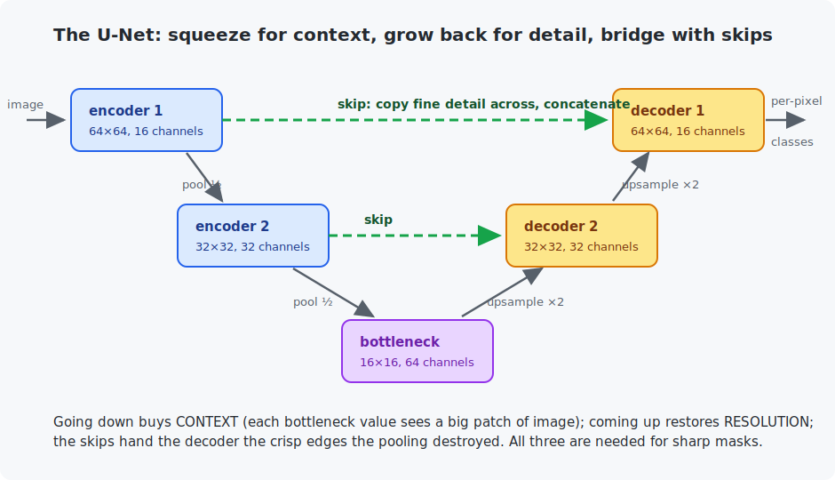

# Chapter 16 — Segmentation

Detection draws boxes; **segmentation** answers at the finest possible grain: a class for *every pixel*. It powers medical imaging (which pixels are tumor?), autonomous driving (which pixels are road?), and photo editing (which pixels are the person?). The good news: you already know almost everything needed — segmentation is classification, run 4,096 times per image. The one new idea is an architecture problem, and its famous solution is the **U-Net**.

<!-- CONTENTS_START -->
## Contents

- [What you will learn](#what-you-will-learn)
- [Prerequisites](#prerequisites)
- [1. The task, and the dilemma](#1-the-task-and-the-dilemma)
- [2. The U-Net](#2-the-u-net)
- [3. Results](#3-results)
- [4. From mask to objects: the C part](#4-from-mask-to-objects-the-c-part)
- [Code walkthrough](#code-walkthrough)
- [Run it](#run-it)
- [What the C version covers](#what-the-c-version-covers)
- [Exercises](#exercises)
- [Next](#next)

<!-- CONTENTS_END -->

## What you will learn

- Semantic segmentation as per-pixel classification.
- The resolution dilemma: context needs shrinking, masks need full size.
- The U-Net: encoder, decoder, and skip connections.
- IoU on pixel sets, and turning masks into objects (connected components — the C part).

## Prerequisites

- [Chapter 14](../14-image-classification/README.md) — conv stages, downsampling.
- [Chapter 15](../15-object-detection/README.md) — IoU.

## 1. The task, and the dilemma

Input: an image. Output: a **mask** — an integer class per pixel (here: background, circle, rectangle; scenes are generated with exact masks, Chapter 15's trick). The loss is nothing new: cross-entropy applied at every pixel and averaged. Softmax over classes, per pixel; argmax at inference. *Segmentation is classification with position.*

The hard part is architectural. Chapter 14 taught that classification networks *shrink* the image — pooling and striding buy each deep feature a wide receptive field (context: "this bright blob is part of a large round thing"). But a mask must come out at **full resolution** — 64×64 in, 64×64 out. Shrink and you lose the *where*; don't shrink and every feature is myopic, seeing 3×3 neighborhoods of raw pixels. You need both context and resolution, and each seems to cost the other.

## 2. The U-Net

The 2015 solution (from medical imaging, still everywhere):



- The **encoder** is a normal CNN: convolutions and pooling, 64→32→16, channels growing. At the bottleneck, every feature sees a large patch — full context.
- The **decoder** mirrors it upward: **transposed convolutions** (a learnable upsampling — think of a convolution run in reverse, spreading each value over a 2×2 area) grow the maps 16→32→64.
- The problem: what pooling destroyed, upsampling cannot resurrect — decoder features alone give blurry, blob-edged masks. The fix is the U-Net's signature: **skip connections** copy the encoder's feature maps straight across to the decoder at each matching resolution, where they are **concatenated** with the upsampled features. The decoder then sees context (from below) *and* crisp spatial detail (from the skip) at once.

Notice the family resemblance to Chapter 14's residual shortcut: both are "give the later layer direct access to earlier information". The residual block *adds* (same shape, learn the change); the U-Net *concatenates across the network* (bridge the resolution gap). Skips of both kinds are now default engineering in deep networks.

## 3. Results

Training on infinite synthetic scenes, per-pixel cross-entropy, Adam, 2,000 steps (~2 minutes on Apple Silicon). The metric is Chapter 15's IoU, applied to *pixel sets* — for each class, (pixels where both prediction and truth say the class) / (pixels where either says it):

```
   step    loss     IoU background / circle / rectangle
      1   1.3034   0.000 / 0.024 / 0.152
    100   0.2674   0.999 / 0.883 / 0.937
   1000   0.0070   1.000 / 0.972 / 0.980
   2000   0.0091   1.000 / 0.980 / 0.986
```

The program ends by printing one scene's truth and prediction side by side as character grids — at IoU 0.98 you have to hunt for disagreeing pixels (they live where they should: on shape boundaries, where even the "truth" is a rasterization judgment call). Circles score slightly below rectangles at the same accuracy for exactly that reason — proportionally more boundary.

Two terms you will meet in the wild: this chapter is **semantic** segmentation (all circles share one label); **instance** segmentation additionally separates circle #1 from circle #2. Our C program bridges the two cheaply.

## 4. From mask to objects: the C part

Applications rarely want a mask; they want *"two circles, here and here, this big."* The bridge is classic computer science, no learning required: **connected-component labeling**. Flood-fill from any unlabeled foreground pixel, marking every reachable same-class pixel as one component; repeat. Per component, count pixels (area), average coordinates (centroid), track min/max (bounding box) — and drop tiny components as noise, the poor practitioner's mask cleanup. The C program does all of it on a demo mask, including correctly flagging a 2-pixel speck for deletion.

## Code walkthrough

The example is `python/train_unet_shapes.py`. The whole chapter is the `MiniUNet` class, and its `forward` is where the famous skip connections happen. No prior programming assumed.

### Step 1 — the data: shapes with pixel-perfect masks

`build_shape_batch` paints 1–3 circles and rectangles at random spots on a noisy 64×64 canvas — and, because *we* drew each shape, it records the exact class of **every pixel** in a `masks` tensor (0 = background, 1 = circle, 2 = rectangle). That is Chapter 15's synthetic-data trick again: the ground truth is exact and the supply is infinite. The pixel noise added at the end matters — it means no single pixel's brightness can decide its class, so the network must use *context*.

### Step 2 — the U-Net: encoder down, decoder up, skips across

```python
def forward(self, image_batch):
    encoder_1_features = self.encoder_stage_1(image_batch)                              # 64x64, fine detail
    encoder_2_features = self.encoder_stage_2(self.downsample(encoder_1_features))      # 32x32
    bottleneck_features = self.bottleneck(self.downsample(encoder_2_features))          # 16x16, most context
    decoder_2_features = self.decoder_stage_2(
        torch.cat([self.upsample_2(bottleneck_features), encoder_2_features], dim=1))
    decoder_1_features = self.decoder_stage_1(
        torch.cat([self.upsample_1(decoder_2_features), encoder_1_features], dim=1))
    return self.per_pixel_classifier(decoder_1_features)
```

Read it as a U. Going **down** the left side, the encoder convolves and `downsample` (max-pool) halves the resolution twice — 64→32→16 — so the bottleneck sees the whole scene at once but has lost fine position. Going **up** the right side, `upsample_2`/`upsample_1` (`nn.ConvTranspose2d`, a learnable "un-pooling") double the resolution back — 16→32→64.

The U-Net's whole idea is the **`torch.cat([upsampled, encoder_features], dim=1)`** lines: at each up-step, the decoder's coarse-but-context-rich features are *concatenated* (stacked along the channel dimension) with the encoder's features from the same resolution, carried straight across by a **skip connection**. So the decoder gets *what* the object is (from below) and *exactly where its edges are* (from the skip) at the same time — which is why segmentation masks come out sharp instead of blurry. The final `per_pixel_classifier` is a 1×1 conv that turns each pixel's features into 3 class scores.

### Step 3 — the loss: segmentation is classification, per pixel

```python
loss_function = nn.CrossEntropyLoss()
loss = loss_function(model(images.to(device)), masks.to(device))
```

No new loss. `nn.CrossEntropyLoss` is Chapter 4's cross-entropy — here PyTorch applies it to *every one of the 4,096 pixels* and averages. Segmentation is just classification run once per pixel, so the model outputs a class score map and the loss compares it to the true mask.

### Step 4 — scoring: per-class IoU

```python
predicted_set = predicted_masks == class_id
true_set = true_masks == class_id
intersection = (predicted_set & true_set).sum().item()
union = (predicted_set | true_set).sum().item()
iou_per_class.append(intersection / union if union > 0 else 1.0)
```

`compute_per_class_iou` is Chapter 15's IoU, now on **pixel sets** instead of boxes. For each class, `predicted_masks == class_id` is a grid of True/False marking that class's pixels; `&` is the intersection, `|` the union, and their ratio is the IoU. Same ruler ("overlap over union"), different shape of thing being measured.

The C file `c/mask_postprocessing.c` turns a mask into *objects* via flood-fill connected-component labeling — the glue between a segmentation model and whatever consumes it (counting cells, driving a robot arm).

### Quick reference

| Piece | What it does | What to notice |
|-------|--------------|----------------|
| `build_shape_batch(size, rng)` | Noisy circles/rectangles with **exact** per-pixel masks. | Masks are exact because we drew the shapes — Chapter 15's trick. |
| `class MiniUNet` | Encoder (64→32→16), bottleneck, decoder (16→32→64), per-pixel classifier. | The `torch.cat([upsampled, encoder_features], dim=1)` lines **are** the skip connections. |
| `compute_per_class_iou(predicted, true)` | IoU per class over pixel sets. | Chapter 15's box IoU, applied to pixels — same formula. |
| `render_mask_as_text(mask)` | Prints a mask as a `.`/`o`/`#` grid. | Wrong pixels sit on boundaries. |
| `main()` | Per-pixel cross-entropy, Adam, prints IoU + a truth-vs-prediction view. | `nn.CrossEntropyLoss()` — classification run 4,096 times per image. |

## Run it

```bash
.venv/bin/python chapters/16-segmentation/python/train_unet_shapes.py --quick   # ~40 s
.venv/bin/python chapters/16-segmentation/python/train_unet_shapes.py           # ~2 min

make -C chapters/16-segmentation/c && ./chapters/16-segmentation/c/build/mask_postprocessing
```

## What the C version covers

The full post-processing stage: iterative flood fill (a stack instead of recursion, so big components cannot overflow the call stack), component statistics, and noise filtering. This is real production glue — the code between a segmentation model and the robot arm/cell counter/photo filter that consumes it.

## Exercises

1. By hand: two 4-pixel masks disagree on exactly 2 pixels (both claim 4). What is the IoU? (Careful: intersection 2, union 6.)
2. Delete the skip connections (feed only the upsampled features to each decoder stage, halving `double_convolution`'s input channels). Retrain and compare boundary quality in the text rendering. You are watching the figure's caption happen.
3. Add a third shape (triangle: `row_distance >= -half and |column_distance| <= row_distance + half` makes one). Retrain with 4 classes. Which class boundary suffers most, and why?
4. In the C program, switch to 8-connectivity (add the four diagonal directions). Construct a mask where 4- and 8-connectivity disagree about the number of objects.
5. Challenge: turn the chapter's semantic output into *instance* segmentation for circles: run the U-Net, then the C program's algorithm (port it to Python or pipe the mask out) and report each circle separately. You have built a two-stage instance segmenter.

## Next

[Chapter 17 — Video understanding](../17-video-understanding/README.md)

<!-- NAV_START -->
---

[← Chapter 15: Object detection](../15-object-detection/README.md) · [↑ Course index](../../README.md) · [Chapter 17: Video understanding →](../17-video-understanding/README.md)

<!-- NAV_END -->
