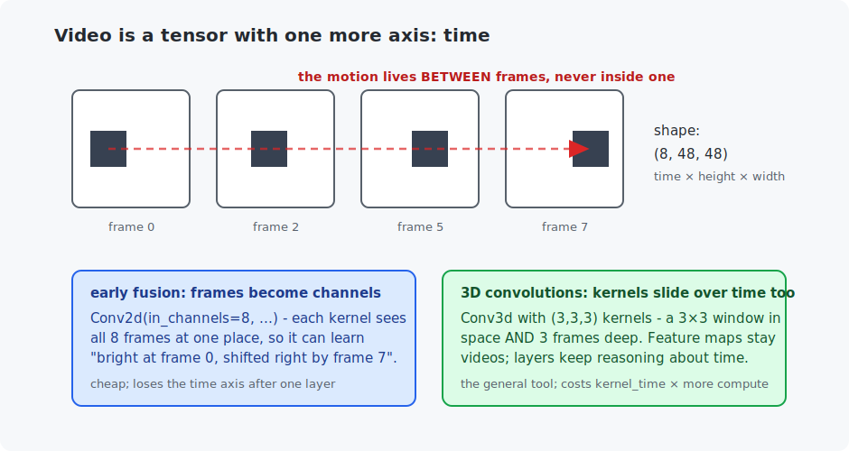

# Chapter 17 — Video understanding

Video adds one axis to everything you know — time — and that axis carries information that literally does not exist in any single frame: motion. This chapter proves that claim with a controlled experiment (a network that sees one frame *cannot* solve the task; networks that see time solve it perfectly), introduces the two standard ways to let convolutions see time, and closes Part III with a C program that solves the same task with no learning at all — a lesson about choosing tools.

## What you will learn

- Video as a tensor: the time axis, and what only it can carry.
- Early fusion (frames as channels) vs 3D convolutions — trade-offs.
- A controlled experiment: the same task with and without temporal vision.
- Classic motion analysis (frame differencing) and when learning is overkill.

## Prerequisites

- [Chapter 13](../13-convolutions/README.md) — convolutions and channels.
- [Chapter 14](../14-image-classification/README.md) — conv backbones.

## 1. The task: designed so stills must fail

Each example is an 8-frame clip of an MNIST digit sliding smoothly up, down, left, or right; the label is the **direction of motion**. This task was chosen for one property: any single frame shows a digit at *some* position — with zero evidence of where it is heading. Whatever accuracy a single-frame model achieves is pure chance, which turns the chapter into a controlled experiment: add temporal vision, watch the task go from impossible to trivial.

A clip is a tensor of shape `(8, 48, 48)` — time × height × width (a color video would be `(time, 3, H, W)`):



## 2. Two ways to let a CNN see time

**Early fusion** — the pragmatic hack: stack the 8 frames as 8 *channels* and use a plain 2D CNN (`Conv2d(in_channels=8, ...)`). Chapter 13 taught that a kernel spans all input channels at each position, so every first-layer kernel sees all 8 frames of a neighborhood at once and can learn patterns like "bright here in frame 0, bright two pixels right in frame 7" — a motion detector. Cheap and effective for short clips; the limitation is that time collapses after the first layer (the output is an ordinary 2D map).

**3D convolutions** — the general tool: kernels of shape (time, height, width), e.g. 3×3×3, sliding over all three axes (`Conv3d`). Feature maps remain little videos, so *every* layer keeps reasoning about time, and temporal pooling/striding works just like spatial. The price is proportional: a 3×3×3 kernel costs 3× the compute of 3×3, and video tensors are large. (The field's third option, covered in concept only: run a 2D CNN per frame and feed the sequence of features to a sequence model — exactly what Part V's recurrent networks and transformers are for; modern video transformers are this idea at scale.)

## 3. The experiment

Three models, same data, same budget (600 steps each):

```
  single frame (control)           4,932 params   accuracy 22.5%
  early fusion (frames=channels)   5,940 params   accuracy 100.0%
  3D convolutions                 14,436 params   accuracy 100.0%
```

The control group sits at chance (25% would be exactly random over 4 classes) — not because it is weak, but because **the information is not in its input**. Both temporal models saturate. This is the cleanest demonstration in the course of a principle worth keeping forever: *before tuning a model, ask whether its input can contain the answer at all.*

## 4. The C counterpoint: motion by arithmetic

Classic computer vision read motion without any learning: subtract consecutive frames (static background cancels; only moving things survive — "motion energy"), threshold, track the bright region's **centroid** frame to frame. The accumulated displacement *is* the motion; its dominant axis and sign give the direction. The C program implements exactly this — zero learned parameters — and scores:

```
  up 100%   down 100%   left 100%   right 100%
```

Matching the networks. Is deep learning pointless here? On *this* task — clean background, one rigid object — yes, and knowing that is professional competence: a 60-line C program that ships today beats a model that needs a GPU. The networks earn their keep when the assumptions break: multiple objects (whose centroid?), moving backgrounds (differencing lights up everywhere), deformable subjects, and above all *semantic* questions — "is this person waving or falling?" — where motion must be interpreted, not just measured. Real action-recognition systems are this chapter's temporal CNNs scaled up (3D ResNets, video transformers) trained on datasets like Kinetics.

## Run it

```bash
.venv/bin/python chapters/17-video-understanding/python/train_motion_classifier.py --quick   # ~1 min
.venv/bin/python chapters/17-video-understanding/python/train_motion_classifier.py           # ~3 min

make -C chapters/17-video-understanding/c && ./chapters/17-video-understanding/c/build/motion_energy
```

## What the C version covers

The full classical pipeline: clip synthesis with background noise, per-frame thresholded centroids, displacement accumulation, direction decision — evaluated over 1,000 clips. Read it next to the Python: the two files answer the same question with entirely different philosophies, and both are legitimate engineering.

## Exercises

1. Reduce the clips to 2 frames (`FRAME_COUNT = 2`). Do the temporal models still solve it? What is the theoretical minimum number of frames for this task?
2. Add diagonal directions (8 classes). Which breaks first, early fusion or the C centroid tracker? (Trick question — check before assuming.)
3. In the C program, raise the background noise from 0.15 to 0.6 so the threshold no longer separates object from noise. Watch the classic method degrade — then argue (or test) why a *trained* model handles this better.
4. Make the digit *bounce* off a wall mid-clip (reverse direction at frame 4) and label clips by their *final* direction. Which of the three models can even represent the answer? (Hint: where does early fusion lose the time axis?)
5. Challenge: implement "late fusion" — run the single-frame CNN on every frame, average the 8 feature vectors, classify. Explain its failure on this task using the word "average", then explain why replacing the average with Part V's sequence models fixes it.

## Next

Part III complete — you can classify, detect, segment, and track. [Chapter 18 — Sound and spectrograms](../18-sound-and-spectrograms/README.md) begins audio: a world where the *frequency* axis plays the role pixels played here.
