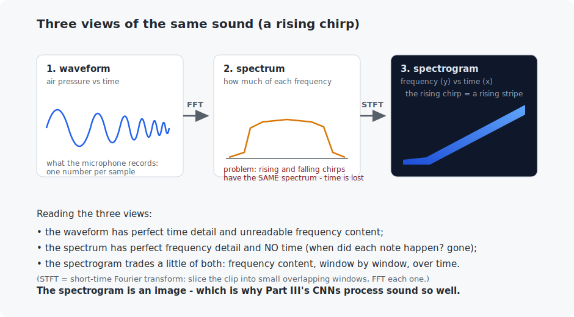

# Chapter 18 — Sound and spectrograms

Audio AI rests on one beautiful move: turn sound into an *image* (the spectrogram) and reuse everything you built in Part III. This chapter earns that move from first principles: what sound is as data, the Fourier transform (built from its definition — it is two dot products per frequency), and the spectrogram. As payoff, a CNN learns to classify sounds it can only distinguish by *seeing time and frequency at once* — and the C program writes a real `.wav` file you can play, then extracts the musical notes back out of it with a from-scratch FFT.

<!-- CONTENTS_START -->
## Contents

- [What you will learn](#what-you-will-learn)
- [Prerequisites](#prerequisites)
- [1. Sound is a vector](#1-sound-is-a-vector)
- [2. The Fourier transform, from its definition](#2-the-fourier-transform-from-its-definition)
- [3. The spectrogram: sound becomes an image](#3-the-spectrogram-sound-becomes-an-image)
- [4. Sound classification = image classification](#4-sound-classification-image-classification)
- [Code walkthrough](#code-walkthrough)
- [Run it](#run-it)
- [What the C version covers](#what-the-c-version-covers)
- [Exercises](#exercises)
- [Next](#next)

<!-- CONTENTS_END -->

## What you will learn

- Sound as a vector: sampling, sample rates, and synthesis with `sin`.
- The discrete Fourier transform, from its definition — no black boxes.
- The spectrogram (STFT): the time-frequency picture behind all audio AI.
- Classifying sounds with an ordinary CNN — Part III recycled wholesale.

## Prerequisites

- [Chapter 2](../02-vectors-and-matrices/README.md) — dot products (the DFT is made of them).
- [Chapter 13](../13-convolutions/README.md) — CNNs (they return unchanged).

## 1. Sound is a vector

A microphone measures air pressure thousands of times per second; sound *is* that list of numbers. The **sample rate** says how many per second — 44,100 for CDs, 16,000 for most speech systems, 8,000 here (small arrays, same lessons; the rule — *Nyquist's theorem* — is that a sample rate of $R$ can represent frequencies up to $R/2$, so 8,000 covers up to 4,000 Hz, plenty for our tones).

Synthesis is one line: a **pure tone** at frequency $f$ is $\sin(2\pi f t)$ — the sine completes $f$ cycles per second. A **chord** is the sum of several sines (sound superimposes by addition — remarkable but true). A **chirp** slides its frequency over time. The example builds all of these from `numpy.sin` and, in C, writes a chord to a playable WAV file. **Listen to `chord.wav`**: that is your arithmetic vibrating a speaker.

## 2. The Fourier transform, from its definition

Given a recording, which frequencies are inside? The **discrete Fourier transform** answers with an idea you have used since Chapter 2: *dot products measure agreement*. For each candidate frequency, correlate the signal against a cosine and a sine of that frequency (two dot products), and combine:

$$\text{magnitude}(k) = \sqrt{\Big(\sum_n x_n \cos \tfrac{2\pi k n}{N}\Big)^2 + \Big(\sum_n x_n \sin \tfrac{2\pi k n}{N}\Big)^2}$$

Read it: $x_n$ are the samples, $k$ counts cycles per window, and the two sums ask "how much does the signal look like a cosine (or sine) at this frequency?" Both phases are needed because the wave might be shifted; squaring and adding makes the answer phase-proof. That is the *whole* transform — the example implements it in 12 lines exactly as written, feeds it an A-major chord (440.0 + 554.4 + 659.3 Hz), and gets back:

```
   naive DFT's three strongest frequencies: 437.5 Hz, 554.7 Hz, 656.2 Hz
   numpy's FFT computes the same numbers: True
```

(The ~2 Hz misses are the *frequency resolution*: with a 1024-sample window at 8 kHz, bins sit every 7.8 Hz — exercise 1 tightens them.) The **FFT** — fast Fourier transform — is the identical math reorganized to reuse shared work: $O(N \log N)$ instead of $O(N^2)$. The C program implements the real thing (Cooley-Tukey: a bit-reversal shuffle, then $\log_2 N$ rounds of "butterfly" merges) and recovers the chord from the WAV file it wrote.

## 3. The spectrogram: sound becomes an image

One FFT over a whole clip has a blind spot: it says *which* frequencies occurred but not *when* — a rising chirp and a falling chirp produce the **same** spectrum. The fix: slice the clip into small overlapping windows (32 ms here), FFT each, and stack the results into a picture — frequency up the side, time along the bottom, brightness = energy:



This is the **short-time Fourier transform (STFT)**, and its output is what nearly every audio model actually consumes. (Two practical notes visible in the code: each window is tapered by a smooth *window function* before the FFT, so the slicing itself doesn't ring; and magnitudes are taken in log scale, matching how hearing works. Real speech systems add one more step — the *mel* scale, which spaces frequency bins like human ears do, giving the "mel spectrogram" you will see in every speech paper.)

## 4. Sound classification = image classification

Five classes: pure tone, chord, rising chirp, falling chirp, noise — designed so the spectrogram is *required*: chirps share their overall spectrum and differ only in the time axis. A small CNN (Chapter 14 style, unchanged) on the spectrogram "images":

```
   step    1: loss 1.6039, accuracy on fresh sounds 16.0%
   step  250: loss 0.9399, accuracy on fresh sounds 77.5%
   step  500: loss 0.7517, accuracy on fresh sounds 93.5%
```

From chance to 93.5% in 500 steps, using literally the machinery of Part III — the kernels now learn "diagonal stripe going up" (a chirp) instead of "cat ear". This one trick — spectrogram + CNN — carries you into real audio work: replace the synthetic sounds with recordings of glass breaking / dogs barking / machinery humming and the same script is an industrial sound monitor.

## Code walkthrough

The example is `python/audio_and_spectrograms.py`. It builds sound from `sin`, computes the Fourier transform from its definition, then reuses a vision CNN unchanged. No prior programming assumed.

### Step 1 — sound is just a vector of numbers

```python
time_axis = numpy.arange(CLIP_SAMPLES) / SAMPLE_RATE
waveform = numpy.sin(2 * numpy.pi * base_frequency * time_axis)
```

`synthesize_sound` makes a sound as a plain array. `time_axis` is the list of moments (8000 per second), and a pure tone is one line: `sin(2π · f · t)`, a sine wave at frequency `f`. A **chord** is a *sum* of sines (sounds add), and a **chirp** sweeps its frequency over time. That is all sound is to a computer — a long vector of amplitude numbers.

### Step 2 — the Fourier transform, from its definition

```python
for frequency_index in range(sample_count // 2):
    angles = 2 * numpy.pi * frequency_index * sample_indices / sample_count
    cosine_correlation = (waveform * numpy.cos(angles)).sum()
    sine_correlation = (waveform * numpy.sin(angles)).sum()
    magnitudes[frequency_index] = numpy.sqrt(cosine_correlation ** 2 + sine_correlation ** 2)
```

`naive_discrete_fourier_transform` answers "which frequencies are in this sound?" the honest way. For each candidate frequency, it correlates the waveform with a cosine and a sine of that frequency — **two dot products**, Chapter 2's "how aligned are these two things?" applied to frequencies. A strong correlation means that frequency is present; the magnitude combines the cosine and sine parts. It is O(N²) and slow, but exact — feed it a chord and its three notes come straight back out. (The `numpy.fft.rfft` used later is the *same math*, reorganized to O(N log N).)

### Step 3 — the spectrogram: sound becomes an image

```python
for start in range(0, len(waveform) - window_size + 1, hop_size):
    windowed = waveform[start:start + window_size] * window_function
    magnitudes = numpy.abs(numpy.fft.rfft(windowed))
    frames.append(numpy.log(magnitudes + 1e-6))
return numpy.stack(frames, axis=1)
```

A single Fourier transform tells you *what* frequencies are present but not *when*. `compute_spectrogram` fixes that: it slides a short window across the clip (`hop_size` apart, overlapping), FFTs each window, and stacks the results side by side — frequency on one axis, time on the other. The `window_function` (a Hann taper) softens each window's edges so the slicing does not create false clicks. The result is a 2-D array: a **picture of the sound**.

### Step 4 — classify sounds with a vision CNN, unchanged

```python
self.network = nn.Sequential(
    nn.Conv2d(1, 16, 3, stride=2, padding=1), nn.BatchNorm2d(16), nn.ReLU(),
    ...
```

`SpectrogramCNN` is an ordinary Chapter 14 CNN — conv, batch norm, ReLU, pool, linear — run on the spectrogram as if it were an image. **That is the chapter's whole payoff: once sound is a picture, all of Part III's vision machinery works on audio with zero changes.** Rising and falling chirps contain the *same* frequencies overall and differ only along the spectrogram's time axis, so the CNN has to read both axes — exactly what a 2-D CNN does.

The C file `c/wav_and_fft.c` writes a **playable `.wav` file**, reads it back, and runs a real radix-2 FFT (Cooley-Tukey) — recovering the chord's notes from the file. Open `chord.wav` and listen to your arithmetic.

### Quick reference

| Piece | What it does | What to notice |
|-------|--------------|----------------|
| `synthesize_sound(class, rng)` | A tone, chord, chirp, or noise as a plain array. | A pure tone is `sin(2π·f·t)`; a chord is a *sum* of sines. |
| `naive_discrete_fourier_transform(waveform)` | The DFT from its definition — two dot products per frequency. | Chapter 2's "how aligned?" applied to frequencies; the chord's notes come back out. |
| `compute_spectrogram(waveform, window, hop)` | Overlapping windows, FFT each (the STFT). | Sound becomes a picture; the Hann window stops edge artifacts. |
| `class SpectrogramCNN` | A Chapter 14 CNN over the spectrogram. | Unchanged from vision — sound became an image. |
| `train_sound_classifier(...)` | Trains on five sound classes, prints accuracy. | Rising vs falling chirps differ only along the *time* axis. |

## Run it

```bash
.venv/bin/python chapters/18-sound-and-spectrograms/python/audio_and_spectrograms.py --quick   # ~1 min
.venv/bin/python chapters/18-sound-and-spectrograms/python/audio_and_spectrograms.py           # ~2 min

make -C chapters/18-sound-and-spectrograms/c && ./chapters/18-sound-and-spectrograms/c/build/wav_and_fft
# then play the result:  open chord.wav
```

## What the C version covers

Three real artifacts: a WAV **writer** with every header field spelled out (44 bytes of bookkeeping — after this, audio files are not mysterious), a WAV **reader**, and a complete **radix-2 FFT** — the actual Cooley-Tukey algorithm with bit-reversal and butterflies, ~50 lines. It ends by pulling 440.4, 554.7 and 659.2 Hz back out of the file: the chord, recovered from arithmetic.

## Exercises

1. In the Python DFT demo, use 4096 samples instead of 1024. The peaks land within 1 Hz of the true notes — explain why via the frequency-resolution formula (sample rate / window size).
2. Spectrogram trade-off: change the window from 256 samples to 1024 and re-look at a chirp's stripe (print the spectrogram's shape and a few columns' argmax). Frequency detail improves; what got worse? This is the time-frequency uncertainty trade-off — you cannot win both.
3. Add a sixth class: a chord whose notes turn on one at a time (an arpeggio). Which existing class does the *spectrum* confuse it with, and does the CNN separate them?
4. In the C program, change the chord to a single 1000 Hz tone and verify the FFT finds it. Then try 5000 Hz — above the 4000 Hz Nyquist limit — and explain the frequency that comes out instead (aliasing: it folds back).
5. Challenge: record one second of yourself (any tool that saves WAV, 16-bit mono), read it with the C reader, FFT it, and find your voice's fundamental frequency. Typical adult speech: 85–255 Hz.

## Next

[Chapter 19 — Speech recognition](../19-speech-recognition/README.md)

<!-- NAV_START -->
---

[← Chapter 17: Video understanding](../17-video-understanding/README.md) · [↑ Course index](../../README.md) · [Chapter 19: Speech recognition →](../19-speech-recognition/README.md)

<!-- NAV_END -->
