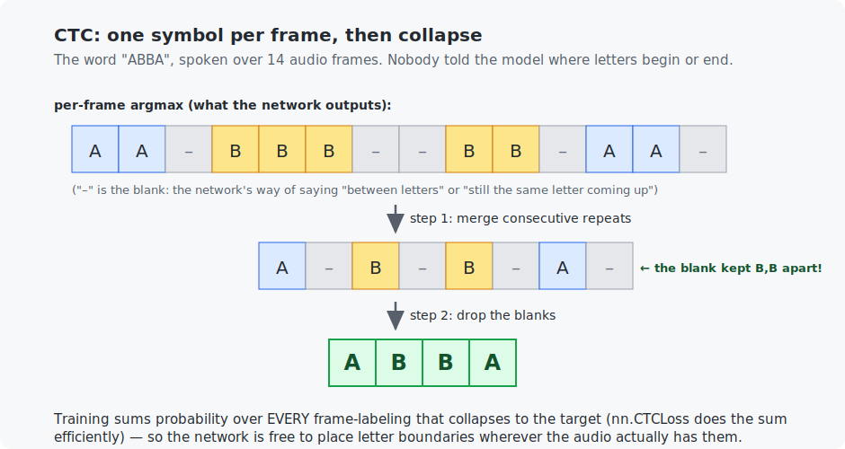

# Chapter 19 — Speech recognition

Speech-to-text hides one problem that dwarfs the others: **alignment**. A second of audio is dozens of spectrogram frames; the transcript is a handful of letters; and no dataset tells you which frames belong to which letter. This chapter teaches the elegant solution the field used for a decade and still ships today — **CTC** — by training a model that genuinely learns to *spell what it hears*, and closes Part IV with the decoder in pure C.

<!-- CONTENTS_START -->
## Contents

- [What you will learn](#what-you-will-learn)
- [Prerequisites](#prerequisites)
- [1. The alignment problem](#1-the-alignment-problem)
- [2. CTC: let the network place the letters itself](#2-ctc-let-the-network-place-the-letters-itself)
- [3. The miniature speech-to-text system](#3-the-miniature-speech-to-text-system)
- [4. Decoding, greedy and beyond](#4-decoding-greedy-and-beyond)
- [Code walkthrough](#code-walkthrough)
- [Run it](#run-it)
- [What the C version covers](#what-the-c-version-covers)
- [Exercises](#exercises)
- [Next](#next)

<!-- CONTENTS_END -->

## What you will learn

- Why speech is not just Chapter 18 + a classifier: the alignment problem.
- CTC: the blank symbol, the collapse rule, and training over all alignments.
- A working miniature speech-to-text system: audio in, spelling out.
- Greedy decoding (and where beam search fits).

## Prerequisites

- [Chapter 18](../18-sound-and-spectrograms/README.md) — spectrograms.
- [Chapter 12](../12-data-pipelines/README.md) — honest evaluation.

## 1. The alignment problem

Fixed-length problems are solved: chop audio into one-second windows and Chapter 18's CNN classifies each — that is **keyword spotting**, and it is how "Hey Siri"-style wake words actually work (a tiny always-on classifier). But real transcription is *sequence-to-sequence with unknown alignment*: the input has one length (frames), the output another (letters), and the mapping between them — who spoke how fast, where each letter starts — is different in every recording and labeled in none. You cannot use cross-entropy per frame when you do not know each frame's letter.

The toy language makes this concrete while keeping everything inspectable: words are 2–5 letters from {A…E}; "speaking" a letter plays its tone (A=300 Hz … E=1100 Hz) for a **random duration**. The model receives only (spectrogram, "DDECD") pairs — never the boundaries.

## 2. CTC: let the network place the letters itself

CTC (*connectionist temporal classification*, 2006 — the engine of speech recognition through the deep learning era and still in production) reframes the task:

1. The network outputs a symbol for **every frame**, from the alphabet plus one special symbol: the **blank** (written –), meaning "nothing to report here".
2. Text is recovered by the **collapse rule**: merge consecutive repeats, then drop blanks.



The blank looks bureaucratic and is actually the heart of the design. Merging repeats is what lets the network say "still the same A" across a held note — but then how could a *genuine* double letter ever survive? Answer: the network emits a blank *between* the two B's ("B B – B B" → "BB"), and it **learns** to do so, because that is the only path to the right answer. You can watch it in the trained model's raw output below.

Training: for a given target word, *many* frame-labelings collapse to it (the letters can start anywhere). CTC's loss is the summed probability of **all** of them — computed efficiently by a dynamic-programming algorithm packaged as `nn.CTCLoss`. The network is thereby left free to put boundaries where the audio has them. (One practical footnote in the code: Apple's MPS backend lacks a CTC kernel, so the loss hops to the CPU — a real-world lesson about framework backends, solved in two lines.)

## 3. The miniature speech-to-text system

Architecture: Chapter 18's spectrogram → two 1-D convolutions along time → a per-frame linear classifier over {A…E, blank}. No recurrence — the tones are simple enough that a few frames of conv context suffice (real systems put Chapters 21–22's sequence models here; everything else stays the same). Results:

```
   step    CTC loss   exact-match accuracy on 100 fresh words
      1    25.5558   0.0%
    500     0.1360   88.0%
   1000     0.0983   91.0%

  spoken 'DDECD'  ->  frames: ---------DDD------------DD-------...--EE--------CC-------...-D
           -> collapsed: 'DDECD'
  spoken 'AEEBC'  ->  frames: ------AAA----------EE----------------EE---------BBB---------CCC
           -> collapsed: 'AEEBC'
```

Read the raw frames of `AEEBC`: the network spelled the double E as `EE---...---EE` — **it placed a blank wall between them, exactly as Section 2 promised, and nobody programmed that**. It also silently learned where letters start and end (look at the dashes tracking the random durations). 91% exact-match on words it never heard; the errors are almost all double-letter boundary cases, the genuinely hard part.

Scaling this to real speech is engineering, not new theory: characters → subword tokens, tones → human phonemes, conv encoder → a big sequence model, plus a language model to guide decoding. Systems like early Alexa/Google Voice were exactly this shape.

## 4. Decoding, greedy and beyond

At inference the model gives per-frame scores; **greedy decoding** takes the argmax per frame and applies the collapse rule — what our Python and the C program both do. Its weakness: it commits frame by frame, so a near-tie decided wrong can never be repaired. **Beam search** keeps the $k$ best partial transcripts alive across frames (optionally scored by a language model — why "recognize speech" beats "wreck a nice beach" despite similar sound). Greedy is what you ship when latency rules; beams when accuracy does.

## Code walkthrough

The example is `python/train_ctc_speller.py`. The heart of it is the **alignment problem** — hundreds of audio frames, a few letters, and nobody says which frames go with which letter — and how CTC sidesteps it. No prior programming assumed.

### Step 1 — the alignment problem, built into the data

```python
for letter in word:
    duration_samples = int(random_generator.uniform(0.08, 0.2) * SAMPLE_RATE)
    ...
    pieces.append(numpy.sin(2 * numpy.pi * LETTER_FREQUENCIES[letter] * time_axis))
```

`speak_word` plays each letter's tone (Chapter 18) for a **random duration**. That randomness is the whole difficulty: the word "AB" might be 5 frames of A then 12 of B one time, 9 and 6 the next. The model is never told where a letter starts or ends — it must learn to read a variable-length sound into a short letter sequence.

### Step 2 — the model: one symbol per frame (letters + a blank)

```python
self.per_frame_classifier = nn.Conv1d(64, len(ALPHABET) + 1, kernel_size=1)
```

`FramewiseSpeller` runs 1-D convolutions over time, then a 1×1 conv classifier that gives every frame a score over **6 symbols: A, B, C, D, E, and a special "blank"**. So the raw output is one symbol per frame — say `--AAA--BB-` — far longer than the answer "AB". The blank is CTC's key invention: a "nothing / boundary" symbol that fills the gaps.

### Step 3 — the collapse rule that recovers text

```python
for index in best_indices:
    if index != previous_index and index != BLANK_INDEX:
        decoded_letters.append(ALPHABET[index])
    previous_index = index
```

`greedy_ctc_decode` turns that long per-frame string into text with two rules, **in this order**: first **merge repeats** (`--AAA--BB-` → `-A-B-`), then **drop blanks** (→ `AB`). The order matters and is the clever bit: to spell a genuine double letter, the network learns to place a blank *between* the two — `A-A` — so that "merge repeats" does not collapse them into one. This same function is the deployment decoder.

### Step 4 — training with CTCLoss, and a real backend gap

```python
log_probabilities = framewise_logits.permute(2, 0, 1).log_softmax(dim=2)
if device.type == "mps":
    log_probabilities = log_probabilities.cpu()
    loss = ctc_loss(log_probabilities, targets, frame_counts, target_lengths)
```

`nn.CTCLoss` does the magic we do not have to: it trains by summing the probability of **every** per-frame alignment that collapses to the true word, so the network is rewarded for *any* valid alignment and discovers the letter boundaries on its own. It wants shapes `(frames, batch, classes)` as log-probabilities, hence the `permute` + `log_softmax`. The `if device.type == "mps"` branch is an honest real-world lesson: Apple's GPU backend has no CTC kernel, so the log-probabilities hop to the CPU just for the loss — autograd still routes gradients back across the device copy, and the conv encoder stays on the GPU.

The C file `c/greedy_ctc_decoder.c` is `greedy_ctc_decode` in pure C, run over hand-built cases (held notes, true doubles, silence) — the exact decoder shipped in production speech systems.

### Quick reference

| Piece | What it does | What to notice |
|-------|--------------|----------------|
| `speak_word(word, rng)` | Plays each letter's tone for a **random** duration. | The randomness is the point — no letter boundaries are given. |
| `build_word_batch(size, rng)` | Words → spectrograms → padded batch + the lengths CTC needs. | Returns `frame_counts` and `target_lengths` for the real (unpadded) sizes. |
| `class FramewiseSpeller` | 1-D convs, then a per-frame classifier over {A–E, blank}. | Emits a symbol *per frame*; the blank fills the gaps. |
| `greedy_ctc_decode(logits)` | The collapse: merge repeats, then drop blanks. | Order matters — a blank between repeats spells a true double letter. |
| `main()` | Trains with `nn.CTCLoss`; prints raw frames and collapsed text. | The blank "wall" between doubles is learned, not programmed; note the MPS→CPU hop. |

## Run it

```bash
.venv/bin/python chapters/19-speech-recognition/python/train_ctc_speller.py --quick   # ~1 min
.venv/bin/python chapters/19-speech-recognition/python/train_ctc_speller.py           # ~3 min

make -C chapters/19-speech-recognition/c && ./chapters/19-speech-recognition/c/build/greedy_ctc_decoder
```

## What the C version covers

The complete greedy CTC decoder — the exact code path that turns model output into text in deployed speech systems — run over five hand-built emission matrices demonstrating every collapse case: held notes, true double letters, adjacent different letters, scattered blanks, and pure silence. Twenty lines of logic; read them once and CTC stops being exotic.

## Exercises

1. By hand: collapse the frame strings `CC--C-C` and `CCCC` and explain why they differ.
2. The evaluation demands *exact* word match. Add a character-level score (edit distance, or just "fraction of letters right") and compare — which words fail exactly, and on which letters?
3. Shrink every letter's duration range to 0.03–0.05 s and retrain. Accuracy drops — is the bottleneck the spectrogram's time resolution (Chapter 18, exercise 2) or the model? Test by also shrinking `HOP_SIZE`.
4. Add a sixth "letter" whose frequency (320 Hz) sits close to A's 300 Hz. Where do the errors go? Relate to Chapter 18's frequency-resolution formula.
5. Challenge: implement 2-best beam search in the C decoder (track the two highest-scoring partial transcripts per frame using the emission scores). Construct an emission matrix where it beats greedy.

## Next

Part IV complete — you have taken sound from air pressure to text. [Chapter 20 — Text and tokenization](../20-text-and-tokenization/README.md) opens Part V: the road to your own language model.

<!-- NAV_START -->
---

[← Chapter 18: Sound and spectrograms](../18-sound-and-spectrograms/README.md) · [↑ Course index](../../README.md) · [Chapter 20: Text and tokenization →](../20-text-and-tokenization/README.md)

<!-- NAV_END -->
