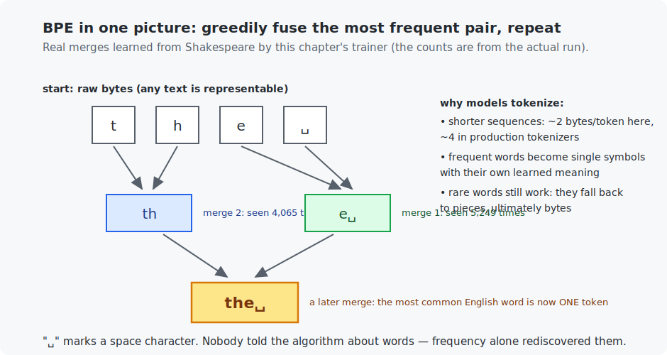

# Chapter 20 — Text and tokenization

Part V begins the road to your own language model, and it begins where every LLM begins: turning text into numbers. The answer used by GPT and virtually every modern model is **byte-pair encoding (BPE)** — a compression algorithm from 1994 that, given nothing but raw text and a counter, rediscovers letters' habits, then syllables, then whole words. You will build it completely (train in Python, encode in C from the same merges file), and the tokenizer you train here is *literally the one Chapter 24's mini-LLM will use*.

## What you will learn

- Why models read tokens (not characters, not words).
- The BPE algorithm — all of it; it fits in 40 lines.
- Encoding, decoding, and the compression-is-capacity principle.
- Embeddings: what happens to token ids inside the model (preview).

## Prerequisites

- [Chapter 12](../12-data-pipelines/README.md) — data thinking.
- No new math.

## 1. The goldilocks problem

Neural networks eat numbers, so text needs an alphabet of ids. Two obvious choices both fail at scale:

- **Characters** (Chapter 21 will use them for simplicity): tiny vocabulary, but sequences get long — and sequence length is the scarcest resource a language model has (attention, Chapter 22, pays *quadratically* for it). "The" costs 3 steps of model thought instead of 1.
- **Words**: short sequences, but the vocabulary explodes (every name, typo, and new word), and anything unseen at training time becomes an unrepresentable `<UNK>`.

**Tokens** sit between: a vocabulary of a few thousand (here) to ~100,000 (GPT-scale) *learned chunks* — common words whole, rare words in pieces. The trick is where the chunks come from: not from a linguist, but from counting.

## 2. BPE: the whole algorithm

Start from **bytes** (ids 0–255 — so any text in any language is representable from the first moment; this is exactly GPT-2's design). Then:

> Count every adjacent pair of tokens in the corpus. Fuse the most frequent pair into a new token. Repeat.

That is the entire algorithm. Watch it run on Shakespeare (real output):

```
   merge   1: 'e' + ' ' -> 'e '   (seen 5,249 times)
   merge   2: 't' + 'h' -> 'th'   (seen 4,065 times)
   merge   5: 'o' + 'u' -> 'ou'   (seen 2,529 times)
   merge   8: 'e' + 'r' -> 'er'   (seen 2,128 times)
   merge 200: 'm' + 'an' -> 'man' (seen 127 times)
```



Nobody told it about English. Frequency alone finds `th`, `ou`, `er` — the true statistical joints of the language — then assembles words; by merge 200 the vocabulary contains `' the '`, `'your '`, `'have '`, and (this being Shakespeare) `'MENENIUS:\n'` as single tokens. **A tokenizer is a mirror of its training corpus** — which is why code-heavy models train tokenizers on code, and why oddly-tokenized strings can make LLMs behave strangely.

**Encoding** new text replays the learned merges in training order (earlier = more frequent = higher priority). **Decoding** is trivial: every token knows its bytes; concatenate. The round trip is exact — verified in both languages.

## 3. Compression is capacity

On held-out Shakespeare the 456-token vocabulary packs **1.85 bytes per token** (production tokenizers with 100k vocabularies reach ~4). This number quietly governs LLM economics: context windows, training budgets, and API prices are all counted in tokens, so every extra byte-per-token means the same model reads, remembers, and learns from proportionally more text. When Chapter 24 trains the mini-LLM with this exact tokenizer, its 256-token context will hold ~470 characters of story instead of 256.

## 4. What happens to the ids: embeddings (preview)

A token id is just an index — 315 is not "more" than 314. The model's first layer is an **embedding table**: a learned matrix with one row of, say, 128 numbers per vocabulary entry; reading token 315 means fetching row 315. Those vectors are parameters like any other, trained by the same backpropagation as everything since Chapter 5 — and after training, tokens used similarly end up with similar vectors (the famous king − man + woman ≈ queen arithmetic falls out of this). Chapters 21–24 all start with an embedding table; now you know what it is.

## Run it

```bash
.venv/bin/python chapters/20-text-and-tokenization/python/bpe_tokenizer.py   # trains, ~1 min; writes datasets/bpe_merges.txt
make -C chapters/20-text-and-tokenization/c && ./chapters/20-text-and-tokenization/c/build/bpe_encoder
```

## What the C version covers

The deployment half: load the Python-trained merges file, encode, decode. Training happens once; *encoding happens at every single inference*, which makes it the part worth owning in C — and Chapter 25's pure-C LLM engine reuses this exact code path. The two implementations produce **identical token ids** from one shared merges file: one tokenizer, two languages.

## Exercises

1. By hand: with merges `[t+h→th, th+e→the]`, encode `"then the"` step by step. (Mind the spaces.)
2. Retrain with 1,000 merges instead of 200. How do bytes-per-token and the longest tokens change? Where would you expect diminishing returns?
3. Train the tokenizer on only the *first half* of the alphabet's lines (grep for speakers A–L) and measure compression on the rest. Quantify the "mirror of its corpus" claim.
4. Feed the encoder a string with characters absent from Shakespeare (emoji, accented text). Verify nothing breaks and explain *why* byte-level BPE cannot have an out-of-vocabulary problem.
5. Challenge (C): the C encoder replays all 200 merges over the whole sequence (O(merges × length)). Implement the faster standard approach: repeatedly find the *highest-priority mergeable pair present* using the merge ranks. Verify identical output.

## Next

[Chapter 21 — Recurrent networks](../21-recurrent-networks/README.md)
