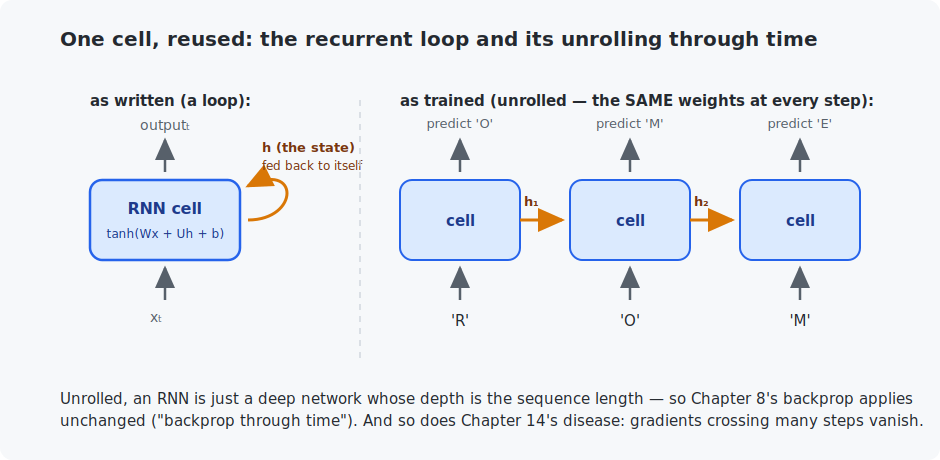

# Chapter 21 — Recurrent networks

Every model so far received its whole input at once. Language arrives as a *sequence*, and this chapter introduces the first architecture that reads one — the **recurrent neural network** — by giving a network the one thing it lacked: **memory**. You will train your first *language model* (it writes Shakespeare-shaped text after three minutes), hand-wire a two-neuron RNN in C that provably does something no feedforward network can, and meet the limitation that will hand the crown to transformers in the next chapter.

<!-- CONTENTS_START -->
## Contents

- [What you will learn](#what-you-will-learn)
- [Prerequisites](#prerequisites)
- [1. The recurrence: a neuron that remembers](#1-the-recurrence-a-neuron-that-remembers)
- [2. Language modeling: the task that scales to everything](#2-language-modeling-the-task-that-scales-to-everything)
- [3. Results, and how sampling works](#3-results-and-how-sampling-works)
- [4. The bottleneck that ends the RNN era](#4-the-bottleneck-that-ends-the-rnn-era)
- [Code walkthrough](#code-walkthrough)
- [Run it](#run-it)
- [What the C version covers](#what-the-c-version-covers)
- [Exercises](#exercises)
- [Next](#next)

<!-- CONTENTS_END -->

## What you will learn

- The recurrence: one cell, a hidden state, reused at every time step.
- Language modeling — predict-the-next-token — and why it is *the* task of Part V.
- Sampling: how a next-character predictor becomes a text generator.
- Backprop through time, gradient clipping, and the long-range-memory problem (LSTMs in concept).

## Prerequisites

- [Chapter 8](../08-backpropagation/README.md) — backprop (it gets unrolled today).
- [Chapter 20](../20-text-and-tokenization/README.md) — text as ids (we use characters here for maximum transparency).

## 1. The recurrence: a neuron that remembers

An RNN processes a sequence step by step, carrying a **hidden state** $h$ — a vector that is the network's working memory:

$$h_t = \tanh(W x_t + U h_{t-1} + b)$$

Read it: the new state is a plain Chapter-7 neuron layer whose inputs are the current element $x_t$ *and the network's own previous state*. That feedback connection ($U$) is the entire novelty. The same cell — the same $W, U, b$ — is applied at every step:



The C program makes the memory tangible twice. First, a single neuron with a strong self-connection is poked *once* — and its state stays lit forever after (weaken the self-connection and the echo fades in steps: the vanishing-memory problem, in one number). Second, a hand-wired two-neuron RNN solves bracket balancing — `(()())` vs `(()))(` — with a counter neuron and an error-latch neuron. **No feedforward network of any size can check arbitrary-length brackets; it has no state to count with.** That is what recurrence buys.

## 2. Language modeling: the task that scales to everything

A **language model** does one thing: given text so far, predict the next symbol — as a probability distribution (Chapter 4). Training data is any text, labeled by itself: input = a window, target = the same window shifted one step. Every position is a training example, no human labeling ever. This humble objective is the exact task, unchanged, that Chapter 24's mini-LLM and every GPT trains on — the only differences from today are the symbol set (tokens vs characters) and the architecture reading the context.

The model: an embedding table (Chapter 20's preview, here over 65 characters), the handmade RNN cell unrolled over 128 characters, a linear head to next-character logits, cross-entropy. Training is Chapter 8's backprop applied to the unrolled graph — the venerable name "backpropagation through time" names nothing new. One practical addition: **gradient clipping** — through 128 steps gradients can snowball, so their norm is capped at 1.0 (one line, standard for all recurrent training).

## 3. Results, and how sampling works

```
   step    loss    (2.9 = random guessing over 65 chars; ~1.4 = decent char model)
      1   4.1886
    500   1.5995
   3000   1.4270
```

To *generate*, feed a prompt, sample the next character from the predicted distribution, feed it back, repeat. A **temperature** divides the logits first: low = safe and repetitive, high = chaotic; 0.8 below. Three minutes of training, verbatim output:

```
ROMEO:
O Carryout, that I in place
And all therein fair bed us the mark, and in the silence to me always ...

DUKE OF YORK:
Thou art 'tis no stands a season with the wrong,
And a rividence live or entration.

PAULINA:
No matter's ring, ...
```

Read what it learned with no rules given: the play *format* (SPEAKER, colon, newline, indented verse), capitalization, punctuation rhythm, and English word *shape* — "rividence" and "entration" are not words, but they are impeccable English-shaped non-words. It learned spelling statistics, not meaning. More training and a bigger model push loss toward ~1.4 → 1.2 and the words become real; the *grammar of long thoughts* stays out of reach, for a reason worth understanding.

## 4. The bottleneck that ends the RNN era

Everything the model knows about the past must squeeze through $h$ — one fixed-size vector, rewritten at every step. Information 300 steps back has been overwritten 300 times; gradients teaching the model to remember it must survive 300 multiplications (Chapter 14's vanishing-gradient disease, now along time instead of depth). **LSTMs** and **GRUs** — the workhorses of 2014–2018 — fight this with learned *gates* that decide what to write, keep, and expose (an LSTM cell is roughly the C program's error-latch, generalized and made trainable). They stretch memory from tens to hundreds of steps and are worth recognizing on sight in older code.

But the fix that actually ended the arms race was a different question entirely: *what if, instead of squeezing history through a state, every position could just look directly at every other position?* That is **attention** — [Chapter 22](../22-attention-and-transformers/README.md).

## Code walkthrough

The example is `python/char_rnn_shakespeare.py`. Two small classes and a sampler — the recurrence itself is only a few lines. No prior programming assumed.

### Step 1 — the RNN cell: a neuron that also reads its own memory

```python
def forward(self, input_vector, previous_state):
    return torch.tanh(self.input_transform(input_vector) + self.state_transform(previous_state))
```

`HandmadeRNNCell` is one step of memory. It takes two inputs — the current `input_vector` (this character) and the `previous_state` (everything remembered so far) — puts a weighted sum through each (`input_transform` and `state_transform`, both `nn.Linear`), adds them, and applies `tanh` to get the **new state**. That is Chapter 7's neuron, except one of its inputs is *the network's own previous output*. That self-connection — feeding the state back into itself — **is** the memory, and it is the entire novelty of an RNN.

### Step 2 — unrolling the cell over the sequence

```python
for time_index in range(time_steps):
    hidden_state = self.rnn_cell(embedded[:, time_index], hidden_state)
    logits_per_step.append(self.next_character_head(hidden_state))
```

`CharRNN.forward` turns each character id into a vector (`nn.Embedding` — a learned lookup table, replacing Chapter 9's one-hot) and then runs this loop. The loop is the **unrolling**: the *same* cell with the *same* weights is applied at every time step, with the hidden state chaining forward from one step to the next. At each step it also predicts the next character (`next_character_head`), so a length-128 sequence yields 128 training examples in one pass — the efficiency that makes language models train fast. Backprop then flows back through the whole unrolled chain ("backprop through time" is just Chapter 8's backprop on a long graph).

### Step 3 — training: predict-the-next-character, with gradient clipping

```python
input_ids = torch.stack([corpus[s:s + SEQUENCE_LENGTH] for s in starts]).to(device)
target_ids = torch.stack([corpus[s + 1:s + SEQUENCE_LENGTH + 1] for s in starts]).to(device)
...
loss.backward()
nn.utils.clip_grad_norm_(model.parameters(), 1.0)
```

The targets are just the inputs **shifted by one character** — at every position the model must predict the next one, scored by cross-entropy. The one new trick is `clip_grad_norm_`: because gradients flow back through 128 time steps, they can *snowball* (the exploding-gradient cousin of vanishing). Clipping caps the total gradient size, and it is the standard one-line cure for training recurrent nets.

### Step 4 — generating text one character at a time

```python
probabilities = torch.softmax(logits[0, -1] / temperature, dim=0)
next_id = torch.multinomial(probabilities, 1)
```

`sample_text` first "warms up" the hidden state by feeding it the prompt, then generates: predict the next character's probabilities, **sample** one from them (`torch.multinomial` — a weighted dice roll, not always the top choice, which keeps text from looping), append it, feed it back in, repeat. `temperature` divides the logits before softmax: below 1 the model plays safe and repetitive, above 1 it gambles and gets chaotic; 0.8 is a pleasant middle. This feed-your-own-output-back loop is exactly how every LLM generates, GPT included.

The C file `c/rnn_memory.c` runs the recurrence and hand-wires a two-neuron RNN that checks bracket balancing — provably something no feedforward net can do. It makes "the hidden state is memory" unmistakable.

### Quick reference

| Piece | What it does | What to notice |
|-------|--------------|----------------|
| `class HandmadeRNNCell` | One step: `tanh(W·input + U·state)`. | The `state_transform` (U) self-connection is the memory. |
| `class CharRNN` | Embedding → cell unrolled over time → next-char logits. | The `for time_index` loop is the **unrolling** — same cell, same weights, every step. |
| `sample_text(..., temperature)` | Generates one character at a time, feeding each back in. | `temperature` divides the logits: low = safe, high = wild. |
| `main()` | Trains with **gradient clipping**, then samples. | `nn.utils.clip_grad_norm_(..., 1.0)` stops gradients snowballing over 128 steps. |

## Run it

```bash
.venv/bin/python chapters/21-recurrent-networks/python/char_rnn_shakespeare.py --quick   # ~1 min
.venv/bin/python chapters/21-recurrent-networks/python/char_rnn_shakespeare.py           # ~3 min

make -C chapters/21-recurrent-networks/c && ./chapters/21-recurrent-networks/c/build/rnn_memory
```

## What the C version covers

The recurrence itself (the general cell, with dimensions as arguments) plus the two hand-wired demonstrations described above — persistence and the bracket counter. Nothing is trained; every weight is visible and chosen, which is exactly why the memory mechanism is unmistakable.

## Exercises

1. In the C program, change the self-weight from 2.5 to 0.5 and rerun. How many steps until the poke's echo drops below 0.01? Relate to Section 4.
2. Sample at temperatures 0.2, 0.8, and 1.5. Characterize each output in one phrase. Which produces real words most often, and why is it still the worst *writer*?
3. Prime the sampler with `"QUEEN:"` vs `"First Citizen:"`. Does the continuation style differ? What does that say about how much context survives in $h$?
4. Train with `SEQUENCE_LENGTH = 16` instead of 128 (same steps). Compare loss and samples — the model literally cannot learn dependencies longer than its training window.
5. Challenge: swap the handmade cell for `nn.LSTM` (a three-line change; keep everything else). Compare loss at 3,000 steps and sample quality. The gates should buy a visibly better Shakespeare.

## Next

[Chapter 22 — Attention and transformers](../22-attention-and-transformers/README.md)

<!-- NAV_START -->
---

[← Chapter 20: Text and tokenization](../20-text-and-tokenization/README.md) · [↑ Course index](../../README.md) · [Chapter 22: Attention and transformers →](../22-attention-and-transformers/README.md)

<!-- NAV_END -->
