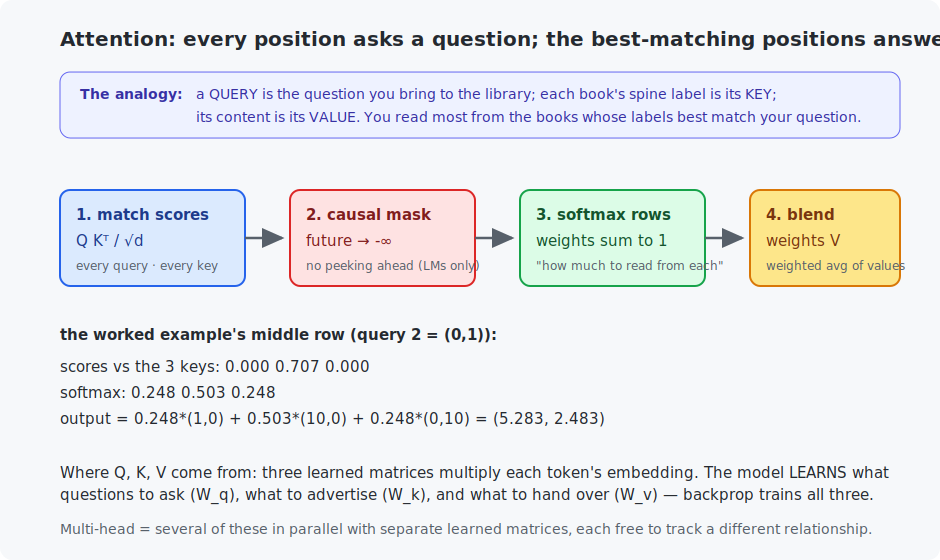

# Chapter 22 — Attention and transformers

This is the architecture chapter of the modern era. Chapter 21 ended with the RNN's bottleneck — all history squeezed through one overwritten vector — and a question: *what if every position could just look directly at every other position?* The answer, **attention**, is one formula built entirely from Chapter 2 dot products and Chapter 9's softmax. Wrapped with pieces you already own (residuals, normalization, MLPs), it becomes the **transformer** — the architecture inside GPT, and the one you will train in Chapters 23 and 24.

<!-- CONTENTS_START -->
## Contents

- [What you will learn](#what-you-will-learn)
- [Prerequisites](#prerequisites)
- [1. The mechanism](#1-the-mechanism)
- [2. Watching attention learn to look](#2-watching-attention-learn-to-look)
- [3. The transformer block: assembly of known parts](#3-the-transformer-block-assembly-of-known-parts)
- [Code walkthrough](#code-walkthrough)
- [Run it](#run-it)
- [What the C version covers](#what-the-c-version-covers)
- [Exercises](#exercises)
- [Next](#next)

<!-- CONTENTS_END -->

## What you will learn

- Queries, keys, values — attention worked by hand on tiny matrices.
- The causal mask; multi-head attention; positional information.
- The transformer block: how the parts you already know assemble.
- Watching a trained model *decide where to look* (the lookup experiment).

## Prerequisites

- [Chapter 2](../02-vectors-and-matrices/README.md) — dot products measure agreement (today's headline act).
- [Chapter 14](../14-image-classification/README.md) — residual connections.
- [Chapter 21](../21-recurrent-networks/README.md) — the problem being solved.

## 1. The mechanism

Each position in the sequence computes three vectors from its embedding, via three learned matrices:

- a **query** $q$ — *what am I looking for?*
- a **key** $k$ — *what can I be found by?*
- a **value** $v$ — *what do I hand over if chosen?*

The library analogy holds up well: your question (query) is compared against every book's spine label (keys); you read (values) mostly from the best matches. Formally, for all positions at once:

$$\text{Attention}(Q, K, V) = \text{softmax}\!\left(\frac{QK^\top}{\sqrt{d}}\right)V$$



Piece by piece: $QK^\top$ is every query dotted with every key — Chapter 2's "how aligned are these?" — giving a score for every (asker, offerer) pair. $\sqrt{d}$ (the key dimension) keeps scores from growing with dimension and saturating the softmax. Softmax per row turns each position's scores into weights summing to 1 ("how much to read from each position"). The final multiply blends the value vectors by those weights.

**Worked by hand** — 3 tokens, 2 dimensions, both programs print exactly this. Take the middle position, whose query is $(0,1)$, with keys $(1,0), (0,1), (1,0)$ and values $(1,0), (10,0), (0,10)$:

```
scores  = (0, 0.707, 0)          <- matches key 2 best (their dot product is 1)
softmax = (0.248, 0.503, 0.248)
output  = 0.248·(1,0) + 0.503·(10,0) + 0.248·(0,10) = (5.283, 2.483)
```

Notice what did *not* appear: distance. Position 2 reads from position 300 exactly as easily as from its neighbor — **content decides, not location**. That is the RNN bottleneck, gone (the trade: comparing everything with everything costs $O(n^2)$ in sequence length — the price of the quadratic attention matrix is why "context length" is such contested territory in LLMs).

Two additions complete the mechanism. The **causal mask**: a language model must not peek at the future, so scores where key-position > query-position are set to $-\infty$ before the softmax (their weights become exactly 0 — see both programs' masked output). And **multi-head attention**: run several attentions in parallel with separate learned $W_q, W_k, W_v$, concatenate the results — each head is free to track a different relationship (one may bind pronouns, another adjacent words, another quote pairs).

## 2. Watching attention learn to look

The experiment: sequences of four "cards", each a key:value pair, then a query key; the model must answer with the matching card's value. The matching card sits *at a different position every time* — positional tricks cannot work; only content-matching can. One attention layer, nothing else:

```
   step    1: loss 1.6046, accuracy 16.2%
   step  250: loss 0.0319, accuracy 100.0%

   One test sequence, and where the query's attention actually went:
     k0:v3      attention 0.995  <-- it looked HERE
     k1:v2      attention 0.000
     k3:v2      attention 0.002
     k2:v4      attention 0.002
     QUERY k0   attention 0.000
     model answers v3, truth v3
```

Read that middle column twice. The model was never told *where* to look — it **learned** query/key projections such that matching keys light up, and you can see 99.5% of its attention landing on the correct card. This is content-based addressing, learned by gradient descent, and it is the atomic skill underneath an LLM finding the relevant clause fifty paragraphs back.

## 3. The transformer block: assembly of known parts

A transformer is this block, stacked N times:

```
x = x + MultiHeadAttention(LayerNorm(x))     <- positions exchange information
x = x + MLP(LayerNorm(x))                    <- each position thinks about what it gathered
```

Every ingredient is a previous chapter. The `x +` is Chapter 14's **residual connection** (the gradient highway — transformers are 12–100+ blocks deep and train *because* of it). **LayerNorm** is Chapter 11's normalization idea, applied per token instead of per batch. The **MLP** is Chapter 9's two-layer network, applied to each position independently. Attention is the only new part, and you just built it. The rhythm worth remembering: attention *mixes across positions*, the MLP *processes each position* — communicate, then compute, alternating.

One last necessity: attention treats input as a *set* (shuffle the tokens and outputs shuffle identically), so word order must be injected — each position adds a learned **positional embedding** to its token embedding before the first block. With that, the parts list of GPT is complete: token embeddings + positional embeddings + N blocks + a linear head predicting the next token. [Chapter 23](../23-gpt-from-scratch/README.md) writes it down and trains it.

## Code walkthrough

The example is `python/attention_from_scratch.py`. The entire mechanism behind every transformer — and every LLM — is one four-line function. No prior programming assumed.

### Step 1 — the whole mechanism, in four lines

```python
def scaled_dot_product_attention(queries, keys, values, causal_mask=False):
    key_size = queries.shape[-1]
    match_scores = queries @ keys.T / math.sqrt(key_size)
    if causal_mask:
        future_positions = torch.triu(torch.ones_like(match_scores, dtype=torch.bool), diagonal=1)
        match_scores = match_scores.masked_fill(future_positions, float("-inf"))
    attention_weights = torch.softmax(match_scores, dim=-1)
    return attention_weights @ values, attention_weights
```

Three inputs, each one vector per token: a **query** ("what am I looking for?"), a **key** ("what do I offer to be found by?"), and a **value** ("what do I hand over if chosen?"). Read the four lines:

- `queries @ keys.T` dots **every** query with **every** key — Chapter 2's "how aligned are these?" run for all pairs at once, giving a score for how well each position matches each other position. Dividing by `math.sqrt(key_size)` keeps those dot products from growing with dimension and saturating the softmax.
- `torch.softmax(match_scores, dim=-1)` turns each row of scores into weights that sum to 1 — how much each position should attend to every other.
- `attention_weights @ values` produces each output as a **weighted average of all the value vectors**, weighted by those attention weights.

That is attention: every position looks at every other, decides how relevant each is by matching queries to keys, and pulls in a blend of their values. `demonstrate_worked_example` runs the figure's 3-token case with these exact lines, and `verify_against_pytorch` confirms it matches PyTorch's fused kernel to 0.00.

### Step 2 — the causal mask (hiding the future)

The `if causal_mask` branch is what makes a *language* model. `torch.triu(..., diagonal=1)` marks every position *above* the diagonal — i.e. every future position — and `masked_fill(..., float("-inf"))` sets those scores to negative infinity **before** the softmax, so they come out as exactly zero weight. The effect: position *i* can attend only to positions ≤ *i*, never to words it has not generated yet. Without this a model could cheat by peeking ahead; with it, "predict the next token" stays honest.

### Step 3 — a model that *learns* what to ask, offer, and hand over

```python
self.query_projection = nn.Linear(embedding_size, embedding_size, bias=False)
self.key_projection = nn.Linear(embedding_size, embedding_size, bias=False)
self.value_projection = nn.Linear(embedding_size, embedding_size, bias=False)
...
queries = self.query_projection(embedded)
keys = self.key_projection(embedded)
values = self.value_projection(embedded)
```

Where do the queries, keys, and values come from? From the tokens themselves, through three **learned** matrices `W_q`, `W_k`, `W_v` (the three `nn.Linear` projections). Each token's embedding is projected three ways, so the model *learns* what each token should ask for, what it advertises, and what it contributes. Those three matrices are the only real parameters of an attention layer.

### Step 4 — watching it learn to look

`build_lookup_batch` makes a tiny task: a shuffled list of "key:value cards" followed by a query key, and the model must output the value of the *matching* card — whose position is different every time, so it cannot memorize a location and must match by **content**. `train_lookup_model` trains one attention layer on this and then prints the attention weights: ~99.5% of the weight lands on the correct card. That is content-based addressing, learned from nothing — the atomic skill an LLM uses to find the relevant clause in a long prompt.

The C file `c/attention_head.c` is one attention head in ~60 lines producing the same numbers — proof that the mechanism behind every LLM is dot products and a softmax.

### Quick reference

| Piece | What it does | What to notice |
|-------|--------------|----------------|
| `scaled_dot_product_attention(Q, K, V, causal_mask)` | **The whole mechanism:** `softmax(Q·Kᵀ / √d) · V`. | `Q @ K.T` is every query dotted with every key; the mask sets future scores to `−inf`. |
| `demonstrate_worked_example()` | The 3-token, 2-dim example, masked and unmasked. | The exact numbers you can check by hand. |
| `verify_against_pytorch()` | Compares against PyTorch's fused kernel. | Difference 0.00 — same math. |
| `class OneAttentionLayerModel` | Embedding → one attention layer → classifier. | `query/key/value_projection` are the learned `W_q, W_k, W_v`. |
| `train_lookup_model(device)` | Trains "find the matching card" and **prints attention weights**. | ~99.5% of attention lands on the right card — content-based addressing, learned. |

## Run it

```bash
.venv/bin/python chapters/22-attention-and-transformers/python/attention_from_scratch.py   # ~1 min
make -C chapters/22-attention-and-transformers/c && ./chapters/22-attention-and-transformers/c/build/attention_head
```

The Python: the worked example (masked and unmasked), exact-agreement check against PyTorch's fused attention kernel, and the lookup experiment with the attention-weight printout. The C: the worked example, same numbers.

## What the C version covers

One complete attention head — scores, scaling, causal mask, softmax, blend — in ~60 lines that produce the chapter's exact numbers. There is a lesson in how small it is: the mechanism behind every modern LLM is dot products and a softmax; the billions of parameters live in what feeds it, not in it. Chapter 25's inference engine will call a generalization of this function in a loop.

## Exercises

1. By hand: compute the worked example's *first* row (query $(1,0)$) — scores, softmax, output. Check against the programs.
2. In the lookup experiment, add a fifth card so two cards can share a key. What does the attention row do when the query matches two positions, and what answer results? (Run it — the softmax's behavior here explains real LLM confusions.)
3. Remove the $\sqrt{d}$ scaling and rerun the lookup experiment with `embedding_size=256`. Watch early training — why do big dot products freeze the softmax's gradients? (Chapter 6's sigmoid saturation, same disease.)
4. The causal mask sets future scores to $-\infty$ *before* softmax. What goes wrong if you instead zero the *weights* after softmax? (Check what the rows sum to.)
5. Challenge (C): extend `attention_head.c` to multi-head — two heads of `KEY_SIZE 1`, concatenated. Choose Q/K/V by hand so head 1 attends to the previous token and head 2 to the first token, and verify with printouts.

## Next

[Chapter 23 — GPT from scratch](../23-gpt-from-scratch/README.md)

<!-- NAV_START -->
---

[← Chapter 21: Recurrent networks](../21-recurrent-networks/README.md) · [↑ Course index](../../README.md) · [Chapter 23: GPT from scratch →](../23-gpt-from-scratch/README.md)

<!-- NAV_END -->
