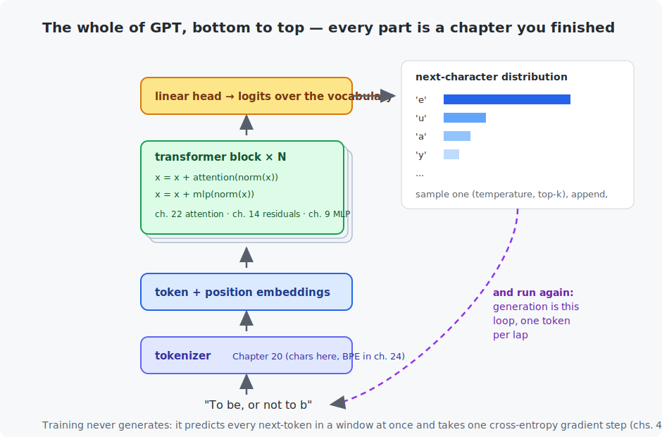

# Chapter 23 — GPT from scratch

The chapter where the pieces become the thing itself. A **GPT** — *generative pre-trained transformer* — is nothing beyond what you now own: Chapter 20's tokens, Chapter 22's blocks, Chapter 9's cross-entropy, Chapter 21's next-token task. You will write it in ~150 readable lines, train it on Shakespeare in about a minute, and watch the same object go from spraying random glyphs to writing blank verse with named characters. Chapter 24 will then scale exactly this file — nothing conceptually new remains.

## What you will learn

- The complete GPT parts list (all of it already yours).
- What "training a language model" actually optimizes, and how generation works.
- Perplexity — the standard yardstick for language models.
- Sampling strategies: greedy, temperature, top-k (the C program measures them).

## Prerequisites

- [Chapter 22](../22-attention-and-transformers/README.md) — attention and the block.
- [Chapter 21](../21-recurrent-networks/README.md) — language modeling and sampling.

## 1. The architecture, in full



That figure is the *entire* architecture of a GPT — including the real ones. From bottom to top: the tokenizer turns text into ids (characters here, 65 of them, for maximum transparency; Chapter 24 swaps in BPE). Each token's embedding is added to a **position embedding** (attention is order-blind; Chapter 22). N transformer blocks alternate *communicate* (causal attention) and *compute* (MLP), with residuals throughout. A final linear layer maps each position's vector to logits over the vocabulary: a prediction of the **next** token at every position simultaneously.

Today's build: 4 blocks, 4 heads, 128-dimensional embeddings, 128 characters of context — **826,433 parameters**. GPT-2 was this times ~180 with the same code shape; GPT-4-class models, this times millions plus engineering. The scaling story is Chapter 24's; the *ideas* end here.

Two code notes worth reading in the source: Q, K, V for all heads come from a single fused linear layer (an efficiency idiom in every real GPT), and the MLP uses GELU — ReLU's smooth cousin, the transformer convention since BERT.

## 2. Training, and the honest yardstick

Nothing you have not done since Chapter 21: random 128-character windows, targets shifted one step, cross-entropy at every position, AdamW. A held-out 10% of the corpus (Chapter 12 discipline) gives the number that matters:

```
   step    train loss   validation loss   seconds
      1       4.2989            4.1720         1
    200       2.5030            2.4968         5
   1000       1.9872            2.0118        21
   3000       1.4800            1.6910        62

Final validation perplexity: 5.4 (untrained would be 65)
```

**Perplexity** = $e^{\text{loss}}$, read as: "the model is as uncertain as a fair choice among this many options." Untrained, 65 (all characters equally likely); after one minute, 5.4 — the model has compressed English spelling, Shakespearean names, and dramatic formatting into effective five-way uncertainty. Note also the train/validation gap opening after step 1000: Chapter 11's overfitting, right on schedule for 0.8M parameters on 1MB of text.

## 3. Before and after

Generation is the purple loop in the figure: predict, sample one token, append, run again. The same weights, same prompt, one minute apart:

```
Before:  ROMEO:i;wENB3xtytKRvPnpHH$iAAClMLK&o
         SEahIET -r$ijdO' ST3DdaueUBp

After:   ROMEO:
         Bnows to appare you affer'd to in man.

         POLIXENES:
         Say he farents, have that would, home reson
         And the master'd to be to there our in the ears
         Of grave and he foult the fear's better--clowed
```

Same critique as Chapter 21 — English-shaped nonsense — but notice what one minute and 0.8M parameters bought over the RNN: cleaner line structure, real character names used consistently (POLIXENES and FLORIZELL are genuine *Winter's Tale* speakers), and phrases with grammatical spines ("Say he ..., have that would"). The recipe from here to a model that *means* things is: more parameters, more data, more compute, better tokens — that is Chapter 24, and then the industry.

## 4. The knob at the end: sampling

Every generated token ends in one decision: given the logits, pick. The C program takes one realistic logit vector ("To be, or not to ___") and runs each strategy 10,000 times:

```
  greedy (T -> 0)        100.0%   0.0%  ...            <- deterministic, gets repetitive
  temperature 0.5         93.2%   4.3%   1.8%  ...     <- confident, safe
  temperature 1.0         67.5%  14.9%   9.0%  ...  0.0%
  temperature 1.5         50.4%  18.4%  13.2%  ...  0.5%  0.2%   <- garbage tokens leak in
  top-k 3 (at T=1)        74.4%  15.9%   9.7%   0%   0%   0%     <- tail amputated
```

The story is in the last columns (the "xylophone" and "%" tokens): plain sampling occasionally picks garbage, high temperature often does, and **top-k never can** — which is why production systems combine moderate temperature with top-k or top-p. When an LLM playground shows you those sliders, this table is what they do.

## Code walkthrough

The example is `python/train_gpt_shakespeare.py`. Three classes stack into a GPT — each is a chapter you finished:

| Piece | What it does | What to notice |
|-------|--------------|----------------|
| `class CausalSelfAttention` | Chapter 22's attention, batched over multiple heads. | One `query_key_value_projection` computes Q, K, V for all heads at once (an efficiency idiom in every real GPT). It calls the fused `scaled_dot_product_attention` you verified in Chapter 22. |
| `class TransformerBlock` | The block: `x = x + attention(norm(x))`, then `x = x + mlp(norm(x))`. | The `x +` is Chapter 14's residual; `norm` is Chapter 11's; the MLP is Chapter 9's. Attention *mixes across positions*, the MLP *thinks per position* — communicate, then compute. |
| `class MiniGPT` | Token embedding + **position** embedding + N blocks + a next-token head. | The `token_embedding(ids) + position_embedding(positions)` line injects word order — attention alone is order-blind. |
| `.generate(ids, count, temperature)` | Autoregressive sampling: predict, sample, append, repeat. | This loop is generation. Training never calls it — training predicts all positions at once. |
| `main()` | Trains, and samples **before and after** so you see what the gradients bought. | Perplexity (`e^loss`) falls from 65 to ~5.4; the output goes from random glyphs to blank verse with character names. |

The C file `c/sampling_strategies.c` measures greedy / temperature / top-k over 10,000 draws — the "decision step" of Chapter 25's inference engine, and the meaning of the sliders in every LLM playground.

## Run it

```bash
.venv/bin/python chapters/23-gpt-from-scratch/python/train_gpt_shakespeare.py --quick   # ~20 s
.venv/bin/python chapters/23-gpt-from-scratch/python/train_gpt_shakespeare.py           # ~2 min

make -C chapters/23-gpt-from-scratch/c && ./chapters/23-gpt-from-scratch/c/build/sampling_strategies
```

## What the C version covers

The sampling toolbox — temperature softmax, distribution sampling, top-k filtering — measured over 10,000 draws so the strategies' characters are visible in the counts. These exact functions are the "decision step" of Chapter 25's pure-C inference engine.

## Exercises

1. Compute the perplexity of Chapter 21's RNN from its final loss (1.427) and compare architectures at equal training time. (Careful: the GPT saw 3,000 steps of 64×128 characters too — is the comparison fair? What else differs?)
2. Generate 500 characters at temperature 0.2. Diagnose the failure mode in one word, and explain it with the C program's greedy row.
3. Double the context to 256 and retrain. Loss improves slightly; step time grows more than slightly. Explain both with Chapter 22's $O(n^2)$.
4. Add top-k to `MiniGPT.generate` (five lines: `torch.topk`, zero the rest). Sample at temperature 1.2 with and without k=10 and compare the worst lines of each.
5. Challenge: print the attention weights of one head in the last block for a prompt containing a colon (like `ROMEO:`). Chapter 22's lookup experiment predicts you will find heads that lock onto the newline and colon structure — go find one.

## Next

[Chapter 24 — Train your mini-LLM](../24-train-your-mini-llm/README.md): this file, scaled, with checkpoints, BPE, and your GPU's full attention for a night.
