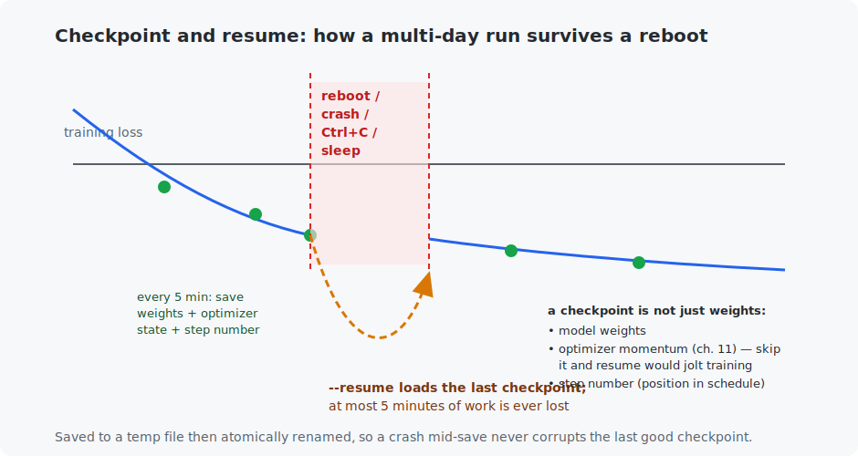

# Chapter 24 — Train your mini-LLM

The capstone. Everything in Part V converges here into a **complete, real language-model pipeline you run yourself**: download and clean a corpus, train a BPE tokenizer on it, train a GPT with checkpoint/resume so the run survives reboots, and generate text from your own model. Nothing here is conceptually new — Chapter 23 already built the GPT — so this chapter is about the *engineering* that turns a toy into a model you leave training overnight, and about the honest realities of scale.

<!-- CONTENTS_START -->
## Contents

- [What you will learn](#what-you-will-learn)
- [Prerequisites](#prerequisites)
- [1. The pipeline, one script at a time](#1-the-pipeline-one-script-at-a-time)
- [2. Checkpoint and resume: the point of the chapter](#2-checkpoint-and-resume-the-point-of-the-chapter)
- [3. A real run](#3-a-real-run)
- [4. Scale: what the missing rows would buy](#4-scale-what-the-missing-rows-would-buy)
- [Code walkthrough](#code-walkthrough)
- [Run it](#run-it)
- [What the C version covers](#what-the-c-version-covers)
- [Exercises](#exercises)
- [Next](#next)

<!-- CONTENTS_END -->

## What you will learn

- The full LLM data pipeline: download → clean → tokenize → pack.
- One model definition that scales from 1 M to 110 M parameters.
- Checkpoint and resume — the machinery that makes multi-day runs practical.
- Learning-rate schedules, weight tying, and mixed precision, briefly.
- Reading a real training run and knowing what more compute would buy.

## Prerequisites

- [Chapter 23](../23-gpt-from-scratch/README.md) — the GPT (this is that model, scaled).
- [Chapter 20](../20-text-and-tokenization/README.md) — BPE.
- [Chapter 11](../11-training-deep-networks/README.md) — optimizers and schedules.

## 1. The pipeline, one script at a time

Real LLM projects are four programs, and so is this one:

**`prepare_data.py`** downloads ten public-domain novels from Project Gutenberg (~6 MB — Austen, Melville, Doyle, Shelley, Stoker…), strips each book's license boilerplate, trains a **4,096-merge BPE tokenizer** on the cleaned text, and packs the whole corpus into `tokens.bin` — a flat array of `uint16` token ids. Two engineering realities appear immediately:

- *Tokenizer training must be fast.* Chapter 20's naive loop rewrites the entire token list every merge — fine for 200 KB, hopeless here. The production trick (GPT-2's) exploits that text is repeated *words*: count unique words with their frequencies, run BPE on those, and each merge only touches the words containing the pair. 4,096 merges on 2 MB in ~100 seconds instead of hours.
- *Encoding must be cached.* Encoding 6 MB word-by-word with a cache of already-seen words is seconds; without it, forever. Result: 1.6 M tokens at **3.67 bytes/token** — the corpus now fits the model's mouth.

**`model.py`** is Chapter 23's GPT with its dimensions lifted into a `MODEL_SIZES` table — one class, four scales:

| size | parameters | blocks × width | context | rough hardware / time |
|------|-----------|----------------|---------|----------------------|
| `tiny` | 1.4 M | 4 × 128 | 128 | any laptop, minutes |
| `small` | 11 M | 6 × 384 | 256 | laptop GPU, ~1 hour |
| `medium` | 45 M | 8 × 640 | 512 | 16 GB GPU / 64 GB Mac, hours |
| `large` | 110 M | 12 × 768 | 512 | strong GPU, **1–3 days** |

`large` is GPT-2-scale — the same code shape OpenAI shipped in 2019, now training on your desk. Two production details live in this file: **weight tying** (the input embedding and output projection share one matrix — fewer parameters, better quality, since "which token" is one question asked at both ends) and GPT-2-style initialization.

## 2. Checkpoint and resume: the point of the chapter

A `large` run takes days. Laptops sleep, GPUs get reclaimed, power blinks, you change your mind. Training that cannot survive interruption is training you cannot actually do. So `train_mini_llm.py` checkpoints every few minutes and resumes exactly:



Three things worth internalizing from the figure and code. A checkpoint is **not just the weights** — it also saves the optimizer's momentum buffers (Chapter 11; resume without them and training lurches) and the step number (which fixes where the learning-rate schedule is). It is written to a temp file then **atomically renamed**, so a crash mid-save can never corrupt the last good checkpoint. And `--resume` reconstructs the exact state — verified in testing: stop at step 400, resume, and step 401 continues as if nothing happened. Ctrl+C is handled too: it saves a final checkpoint on the way out.

## 3. A real run

The `small` model (12 M parameters) on the reference Apple Silicon GPU, cosine schedule with warmup (Chapter 11), ~48k tokens/second:

```
Corpus: 1,596,556 tokens
Model 'small': 12,417,024 parameters (6 blocks, 384 wide, context 256)

   step     loss    perplexity   tokens/sec
      1    8.4337      4599.6       23,259
    100    6.7022       814.2       48,647
   2000    ~3.0          ~20        ~48,000
   6000    2.66          14.2       48,767

Stopped at step 6000. Trained for 17.0 minutes.
```

Sampling the step-6000 checkpoint with the prompt "It was a dark night, and ":

```
It was a dark night, and ZAWATSJOURK--ALALL

_Jonathan Harker's Journal._

_24 October._--I was told him to go so differently to the worked. The others
that I had been glad of the time dusting the work was sleeping. The day of
the night was dark, and ...
```

Seventeen minutes of a laptop GPU bought this: fluent Victorian-novel English (BPE cured Chapter 23's spelling nonsense), and — because *Dracula* is in the corpus — the model reproduced its diary format, complete with the "_Jonathan Harker's Journal._ / _24 October._" heading style. Perplexity fell from 4,600 to 14. It has grammar and voice; it does not yet have plot or memory across paragraphs — those live in the `medium`/`large` rows, which are the same code and your patience.

`sample.py` loads any checkpoint — even mid-training between resume sessions — and generates. What emerges is genuine English sentences with 19th-century novel cadence: real words (BPE fixed Chapter 23's spelling nonsense), quoted dialogue, sentence structure, character-like names. It does *not* have plot, memory across paragraphs, or facts — those need the parameters and tokens of the rows this chapter cannot run for you.

## 4. Scale: what the missing rows would buy

Every reason this model is not ChatGPT is a *quantity*, not a mystery:

- **More parameters** (110 M → 175 B is GPT-3): more patterns storable, grammar of long thoughts becomes reachable.
- **More data** (6 MB → terabytes): the internet instead of ten novels; facts and breadth come from coverage.
- **More compute** (minutes → millions of GPU-hours): lets the above two actually converge.
- Then, beyond pre-training: **instruction tuning** and **RLHF** turn a next-token predictor into an assistant that follows requests (a whole field, gestured at in Chapter 31).

Two techniques from the code deserve names because they are what make bigger runs fit: a **learning-rate schedule** (warm up over the first 100 steps, then cosine-decay to near zero — bold early, precise late) and, mentioned for when you push `medium`/`large`, **mixed precision** (store and compute in 16-bit where safe — roughly halves memory and speeds things up, one `torch.autocast` context in practice). The [hardware guide](../../appendices/E-hardware-guide/README.md) sizes what your machine can actually train.

## Code walkthrough

Four Python files, one per pipeline stage. The key functions:

**`model.py`** — the architecture, shared by everything:
- `MODEL_SIZES` (dict at top) — the menu of runs (tiny/small/medium/large): dimensions and training defaults. Change a number here, not the code.
- `class MiniLanguageModel` — Chapter 23's GPT with configurable dimensions, plus **weight tying** (`next_token_head.weight = token_embedding.weight` — the input and output share one matrix).

**`prepare_data.py`** — data + tokenizer:
- `download_and_clean_corpus()` — fetches ten Gutenberg novels, strips the license boilerplate.
- `train_tokenizer(text)` — BPE, but the *fast* way: count unique **words** with frequencies and merge within those (Chapter 20's loop would take hours on megabytes; this is ~100 s).
- `encode_corpus(text, merges)` — encodes everything with a **word cache**, then writes `tokens.bin` as uint16.

**`train_mini_llm.py`** — the training loop with checkpoint/resume:
- `get_batch(data, ...)` — samples windows from a memory-mapped token file (so gigabyte corpora need no RAM).
- `save_checkpoint(path, model, optimizer, step, ...)` — saves weights **and optimizer state and step number**, then atomically renames. This is what makes `--resume` seamless (Section 2).
- `main()` — the loop, with a cosine+warmup schedule and a checkpoint every few minutes; `--resume` reloads the last checkpoint and continues.

**`sample.py`** — `load_tokenizer` / `encode` / `decode` / `generate` to hear the model at any checkpoint, even mid-training.

## Run it

```bash
# 1. Build the dataset and tokenizer (once, ~2 minutes)
.venv/bin/python chapters/24-train-your-mini-llm/python/prepare_data.py

# 2. Train. Start tiny to see it work end to end, then go bigger.
.venv/bin/python chapters/24-train-your-mini-llm/python/train_mini_llm.py --quick          # 200 steps, ~30 s
.venv/bin/python chapters/24-train-your-mini-llm/python/train_mini_llm.py --size small      # ~1 hour
.venv/bin/python chapters/24-train-your-mini-llm/python/train_mini_llm.py --size large --resume   # the multi-day run; rerun with --resume after any stop

# 3. Generate from whatever you have trained (works mid-training too)
.venv/bin/python chapters/24-train-your-mini-llm/python/sample.py --size small --prompt "The night was"
```

Stop any run with Ctrl+C; rerun the same command with `--resume` to continue. That single habit is what makes the `large` row possible on hardware you own.

## What the C version covers

None in this chapter — training a transformer belongs in PyTorch on a GPU (per the course's honest-scope policy, a from-scratch C trainer would be a toy that misleads about how this is really done). The C payoff comes next: [Chapter 25](../25-llm-inference-in-c/README.md) exports the model you just trained and *runs* it — inference, quantization, and all — in a single pure-C file, no PyTorch anywhere.

## Exercises

1. Run `prepare_data.py`, then open `merges.txt`. What are the first ten merges, and how do they compare to Chapter 20's Shakespeare merges? Explain the differences from the corpora.
2. Train `tiny` for 200 steps, sample, then `--resume` to 1,000 and sample again. Describe the qualitative jump. At what loss did words become real?
3. Kill a run with Ctrl+C mid-step, then `--resume`. Confirm from the step numbers that no more than `--checkpoint-minutes` of work was lost. Now delete the checkpoint and resume — what does the script do?
4. Add three of your own favorite public-domain books to `GUTENBERG_BOOKS` and rebuild. Does the model's "voice" shift? (Delete `corpus.txt`, `merges.txt`, and `tokens.bin` to force a rebuild.)
5. Challenge: implement mixed precision — wrap the forward/loss in `torch.autocast(device_type=...)` and add a `GradScaler` for CUDA. Measure the memory drop and speedup on `medium`, and confirm the loss curve is unchanged.

## Next

[Chapter 25 — LLM inference in C](../25-llm-inference-in-c/README.md)

<!-- NAV_START -->
---

[← Chapter 23: GPT from scratch](../23-gpt-from-scratch/README.md) · [↑ Course index](../../README.md) · [Chapter 25: LLM inference in C →](../25-llm-inference-in-c/README.md)

<!-- NAV_END -->
