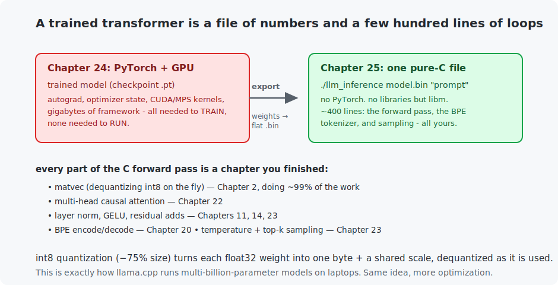

# Chapter 25 — LLM inference in C

The course's biggest payoff, and the reason this book insisted on C the whole way. The language model you trained in Chapter 24 — a real transformer — now **runs in a single pure-C file**: no PyTorch, no framework, nothing but `libm` and about 400 lines of loops. It takes a text prompt and writes English. Along the way you add **int8 quantization**, the trick that lets `llama.cpp` run billion-parameter models on laptops. When you finish this chapter, the last piece of mystery is gone: an LLM is a file of numbers and arithmetic you have personally written.

<!-- CONTENTS_START -->
## Contents

- [What you will learn](#what-you-will-learn)
- [Prerequisites](#prerequisites)
- [1. Training and inference are different jobs](#1-training-and-inference-are-different-jobs)
- [2. Export: from checkpoint to a flat file](#2-export-from-checkpoint-to-a-flat-file)
- [3. The forward pass in C](#3-the-forward-pass-in-c)
- [4. Quantization: 4× smaller, still fluent](#4-quantization-4-smaller-still-fluent)
- [5. Trust, but verify](#5-trust-but-verify)
- [Code walkthrough](#code-walkthrough)
- [Run it](#run-it)
- [What the C version covers](#what-the-c-version-covers)
- [Exercises](#exercises)
- [Next](#next)

<!-- CONTENTS_END -->

## What you will learn

- Why training and inference are different problems with different tools.
- Exporting a PyTorch model to a flat, self-describing binary.
- The complete transformer forward pass in C — every line a chapter you finished.
- int8 quantization: 4× smaller, still coherent.
- Verifying a from-scratch engine against the framework.

## Prerequisites

- [Chapter 24](../24-train-your-mini-llm/README.md) — the trained model (and its `model.py`).
- [Chapter 22](../22-attention-and-transformers/README.md) — attention (you will re-implement it).
- [Chapter 20](../20-text-and-tokenization/README.md) — BPE (built into the engine).

## 1. Training and inference are different jobs



Training needs autograd, optimizer state, huge batches, and a GPU — Chapter 24's world, gigabytes of framework. **Inference needs none of it**: no gradients, no optimizer, one sequence at a time. All that survives is the weights and the forward pass. That asymmetry is why production LLMs are *served* by lean, specialized engines utterly unlike the PyTorch that trained them — and why this chapter can fit a working one in a file you read in an afternoon.

## 2. Export: from checkpoint to a flat file

`export_llm_for_c.py` reads Chapter 24's `.pt` checkpoint and writes a self-describing `.bin`: a small header (magic number + the six dimensions the engine needs to size every buffer), the tokenizer's merges, then every weight tensor in a fixed, documented order. The C engine walks that exact order — the two files are a contract. Small, sensitive tensors (layer-norm parameters, biases, embeddings) stay float32; the big matrices can be quantized (Section 4).

## 3. The forward pass in C

`llm_inference.c` is the whole model, and every piece is something you built:

- **`matvec`** — matrix times vector plus bias, dequantizing int8 as it goes. This is Chapter 2, and it is where ~99% of the runtime lives (an LLM is overwhelmingly matrix multiplies).
- **multi-head causal attention** — Chapter 22's Q·K, scale, causal mask, softmax, blend, done per position per head.
- **layer norm** (Chapter 11), **GELU** (Chapter 23), **residual adds** (Chapter 14), **tied output head** (Chapter 24's embedding, reused as the projection).
- the **BPE tokenizer** (Chapter 20) so it accepts real text, and **temperature + top-k sampling** (Chapter 23) so it generates.

Running it on the Chapter 24 `small` model (float32 export), pure C:

```
$ ./llm_inference checkpoints/mini_llm_small.bin "It was a dark night, and " 60
Loaded: float32, 6 blocks, 384 wide, vocab 4352, context 256

It was a dark night, and identified as we saw the old Redruth of the Regent's
Jove. I found that the Renfield's reality of the affair. He was terribly the
old sly, very first, and I was there I had one wary. ...
```

Not deathless prose — a 12 M-parameter model trained for 17 minutes — but unmistakably English, with characters straight out of the training corpus (*Treasure Island*'s Redruth, *Dracula*'s Renfield), generated with **zero PyTorch**. The engine omits the *KV cache* (real engines save each step's keys/values to avoid recomputing attention over the whole context every token) to stay readable; the exercises add it, and it is the single biggest inference speedup there is.

## 4. Quantization: 4× smaller, still fluent

The float32 export is 49.7 MB. **int8 quantization** stores each weight-matrix entry as a single signed byte plus one shared float32 scale: to read a weight, multiply the byte by the scale (`matvec` does this inline). The `--quantize` export drops the file to **17.9 MB** — under 2.8× here (only the big matrices quantize; norms and embeddings stay float32) and toward the full 4× on larger models — and the text stays coherent:

```
$ ./llm_inference checkpoints/mini_llm_small_int8.bin "The night was "
The night was errory, we might be. At times I could hear the palm of a campstern
bolt of ...
```

Squeezing 32 bits into 8 loses precision, but neural networks are famously tolerant of it — a lesson that scales all the way up: this exact idea (with per-row scales and 4-bit variants) is how people run 7-billion-parameter models on a MacBook. You just implemented its heart.

## 5. Trust, but verify

A from-scratch engine that *looks* right can be subtly wrong. Generation is random, so matching text proves nothing; the honest check is deterministic — do the two implementations compute the same **logits**? `verify_against_c.py` prints PyTorch's top-5 next tokens for a fixed prompt:

```
PyTorch, prompt 'It was a dark night, and ' - the 5 most likely next tokens:
   logit  +8.817   token   46  '.'
   logit  +8.650   token   90  'Z'
   logit  +8.471   token 2451  'edd'
   ...
```

Run the C engine on the same prompt and it samples from exactly this ranking. The float values differ in the last digits (operation order differs between PyTorch's kernels and the C loops); the **ranking matches**, which is the real correctness criterion. That agreement is the proof that your C forward pass and PyTorch's are the same computation.

## Code walkthrough

This chapter's real code is the C file; the Python just exports the weights and checks the answer. The model itself is Chapters 20/22/23, now in loops. No prior programming assumed.

### Step 1 — exporting the weights (and shrinking them to int8)

```python
scale = numpy.abs(array).max() / 127.0
quantized = numpy.round(array / scale).astype(numpy.int8)
output_file.write(struct.pack("f", scale))
output_file.write(quantized.tobytes())
```

`export_llm_for_c.py` writes each trained tensor to a flat `.bin` file. With `--quantize`, the big weight matrices are stored as **int8 instead of float32** — one quarter the size. The idea (int8 **quantization**) is simple: find the largest magnitude in the matrix, define a single `scale` so that value maps to 127, then store every weight as the nearest integer in −127…127 plus that one float `scale`. Four bytes become one, and you only lose a little precision. Small, sensitive tensors stay float32.

### Step 2 — the hot loop: `matvec`, dequantizing on the fly

```c
if (weight->is_quantized) {
    for (int col = 0; col < weight->column_count; col++) {
        sum += weight->scale * weight->int8_values[base + col] * input[col];
    }
} else {
    for (int col = 0; col < weight->column_count; col++) {
        sum += weight->float_values[base + col] * input[col];
    }
}
```

`matvec` is matrix×vector plus bias — Chapter 2's dot product, one per output row — and **about 99% of an LLM's runtime is right here**. The only cleverness: when the weights are int8, it turns each one back into a real number *as it multiplies* — `scale * int8_value` reconstructs the float, no separate unpacking step. So the quantized model uses a quarter of the memory yet runs the same arithmetic. Everything else in the file exists to call this function a few billion times.

### Step 3 — the forward pass, in C

`forward` is Chapters 22 and 23 written as plain loops: look up the token and position embeddings, then for each block run multi-head causal attention (the same scores → mask → softmax → blend, by hand) and the MLP, each wrapped in `layer_norm`, `gelu`, and a residual add, and finally the next-token scores. `encode_prompt`/`print_token` are Chapter 20's BPE tokenizer built in, and `sample` is Chapter 23's temperature/top-k sampling. No framework, no magic — a few hundred lines of arithmetic reading a file of numbers.

### Step 4 — checking it is correct (rank, not text)

Because generation is random, you cannot test it by comparing text. `verify_against_c.py` instead prints PyTorch's **top-5 most likely next tokens** for a fixed prompt, so you can confirm the C engine ranks the same tokens in the same order. Matching *rankings* is the honest correctness check for a sampler.

### Quick reference

| File | Key piece | What to notice |
|------|-----------|----------------|
| `export_llm_for_c.py` | `write_tensor(file, tensor, quantize)` | float32, or **int8 + one scale** for big matrices (¼ the size). |
| `llm_inference.c` | `matvec(...)` | Matrix×vector, **dequantizing int8 on the fly**; ~99% of runtime. |
| `llm_inference.c` | `forward(...)` | Chapters 22/23 as loops: embeddings, attention, MLP, norm, residual. |
| `llm_inference.c` | `encode_prompt` / `sample` | Chapter 20's tokenizer and Chapter 23's sampling, in C. |
| `verify_against_c.py` | prints PyTorch's top-5 | Confirms the C engine's ranking matches — the honest check. |

## Run it

```bash
# Needs a Chapter 24 checkpoint (any size). Then:
.venv/bin/python chapters/25-llm-inference-in-c/python/export_llm_for_c.py --size small
.venv/bin/python chapters/25-llm-inference-in-c/python/export_llm_for_c.py --size small --quantize

make -C chapters/25-llm-inference-in-c/c
./chapters/25-llm-inference-in-c/c/build/llm_inference checkpoints/mini_llm_small.bin "The night was "
./chapters/25-llm-inference-in-c/c/build/llm_inference checkpoints/mini_llm_small_int8.bin "The night was "

.venv/bin/python chapters/25-llm-inference-in-c/python/verify_against_c.py --size small
```

## What the C version covers

Everything — this chapter *is* the C chapter. One file loads the model (float32 or int8), tokenizes the prompt, runs the full forward pass, and samples, in ~400 documented lines. It is the culmination of every C example before it: the tensor library (ch. 10), the conv/matvec loops (chs. 2, 13), the attention head (ch. 22), the BPE encoder (ch. 20), and the samplers (ch. 23), assembled into a working language model. Read it once and no LLM will ever be a black box to you again.

## Exercises

1. Time the engine (`time ./llm_inference ...`) on float32 vs int8. Is int8 faster, slower, or the same? Explain via memory bandwidth vs compute (int8 reads a quarter of the bytes but does a multiply per weight either way).
2. Add a `--temperature` and `--top-k` command-line argument. Regenerate at temperature 0.1 and 1.4 and connect the outputs to Chapter 23's sampling table.
3. **KV cache** (the big one): the engine recomputes attention over the whole context every token — O(n²) per token, O(n³) for a passage. Cache each position's keys and values so each new token only attends, never recomputes. Measure the speedup on a 200-token generation.
4. The tokenizer's `token_byte_strings` table caps token length at 64 bytes. Find where, and reason about when a BPE token could exceed it (hint: it cannot, for this vocabulary — why?).
5. Challenge: implement 4-bit quantization (two weights per byte, per-row scales). Compare file size and output quality against int8. You are now within sight of how `llama.cpp` actually works.

## Next

Part V complete — you trained a language model and run it in pure C. [Chapter 26 — Autoencoders and VAEs](../26-autoencoders-and-vaes/README.md) opens Part VI: teaching machines not to classify, but to *create*.

<!-- NAV_START -->
---

[← Chapter 24: Train your mini-LLM](../24-train-your-mini-llm/README.md) · [↑ Course index](../../README.md) · [Chapter 26: Autoencoders and VAEs →](../26-autoencoders-and-vaes/README.md)

<!-- NAV_END -->
