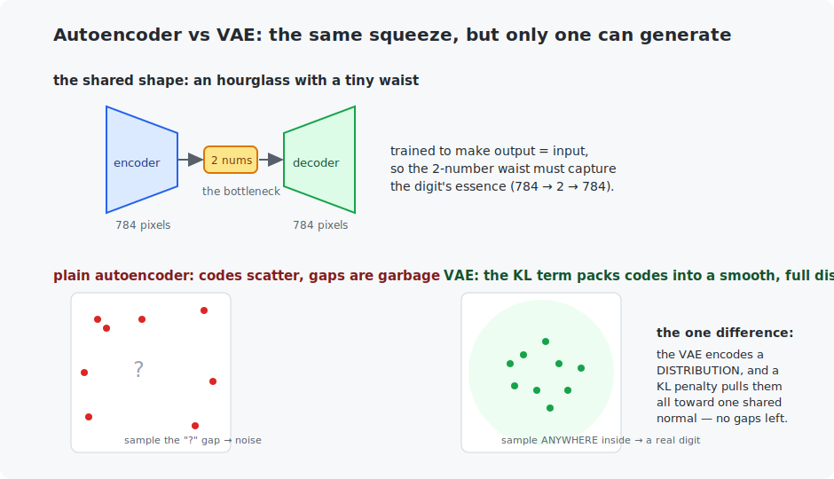

# Chapter 26 — Autoencoders and VAEs

Part VI turns the course around: for 25 chapters, models *recognized* things; now they *create* them. This chapter builds the gentlest generative model — the autoencoder — proves that images secretly live in far fewer dimensions than their pixels suggest, and then makes one clever change that turns compression into genuine **generation**: a model that invents new digits from thin air. The idea (an encoder, a latent space, a decoder) reappears inside the diffusion models that power today's image generators.

## What you will learn

- Autoencoders: compressing data through a bottleneck and rebuilding it.
- The latent space, and why real data lives on a low-dimensional surface.
- The variational autoencoder (VAE): the change that makes a latent space *sampleable*.
- The reparameterization trick and the KL term, in plain terms.

## Prerequisites

- [Chapter 9](../09-first-neural-network/README.md) — MLPs on MNIST.
- [Chapter 4](../04-probability-basics/README.md) — distributions (the VAE leans on them).

## 1. The autoencoder: compression that understands

An **autoencoder** is an hourglass: an *encoder* squeezes an input down to a tiny **latent code**, a *decoder* rebuilds the input from that code, and the whole thing is trained to make output ≈ input.



The magic is the waist. Force 784 MNIST pixels through just **2 numbers** and back, and reconstruction is only possible if those 2 numbers capture what actually matters. The example does exactly this — a '7' becomes the code `(+22.9, +14.5)` and decodes back to a recognizable '7':

```
   original:              reconstructed:
      %@@####*                .+%%%%%%#.
         ::: @                :*#+**+@%.
            @-                     .%*
           :@                      =%-
```

**784 pixels rebuilt from 2 numbers.** This works because handwritten digits do not fill 784-dimensional space randomly — they lie on a thin, curved 2-to-~10-dimensional *surface* within it (the "manifold"). The autoencoder discovers that surface. This is compression that *understands*: unlike ZIP, it learns what digits are, and the code is meaningful (similar digits get nearby codes). Autoencoders are used for exactly this — denoising, anomaly detection (things that reconstruct badly are anomalies), and pretraining.

## 2. Why a plain autoencoder cannot generate

Tempting idea: pick a random latent code, decode it, get a new digit. It fails. A plain autoencoder scatters its codes wherever training happened to push them, leaving **gaps** — and a random point usually lands in a gap, decoding to noise (left side of the figure). The latent space has no structure guaranteeing that "in between" two digits is also a digit. To generate, we need a latent space that is **smooth and full**: every point decodes to something plausible.

## 3. The VAE: one change makes it generative

The **variational autoencoder** earns a sampleable latent space with two modifications:

1. The encoder outputs not a point but a **distribution** per image — a mean and a spread (a little Gaussian). Training samples a code from it.
2. A second loss term (**KL divergence**) pulls every image's little Gaussian toward one shared standard normal — packing all the codes into a smooth, gapless disc centered at the origin (right side of the figure).

Now the two loss terms fight productively: *reconstruction* wants codes spread out and distinct (so digits stay separable); *KL* wants them all squeezed into the same standard normal (so there are no gaps). The balance is a latent space that is both meaningful *and* full — so **sampling a random point and decoding it produces a real digit**. The proof, from the trained VAE decoding points it never saw:

```
  latent (-1.5, -1.5)        latent (0.0, 0.0)         latent (1.5, 1.5)
        .++                     :*%#*=:                   :#+.
        .**:                    :##==++:                 :%%#-
        .=+:                    -*:.:=-.                 .%%===.
        .:#=                    .=###:                    *%: :*.
```

A '1', an '8', a '9' — **invented**, each from two random numbers. That is generation.

One implementation idea deserves its name: the **reparameterization trick**. Sampling is random, and you cannot backpropagate through randomness. The fix is to write the sample as `mean + spread × noise`, where `noise` is a fixed random input — the randomness sits *outside* the path gradients flow through, so backprop (Chapter 8) works unchanged. It is a small trick with a huge payoff: it is what makes VAEs trainable at all.

## 4. Where this leads

The VAE's ideas are load-bearing across generative AI. Its **latent space** — a compact, smooth code that decodes to images — is exactly what **latent diffusion** models (Stable Diffusion and friends, Chapter 29) generate *in*, because denoising a 64×64 latent is far cheaper than denoising a 512×512 image. Chapter 27's GANs attack generation from a completely different angle (a forger vs a detective), and Chapter 28's diffusion from a third (learned denoising) — three routes to the same goal, and the VAE is the one whose machinery survives into production the most directly.

## Run it

```bash
.venv/bin/python chapters/26-autoencoders-and-vaes/python/train_vae_mnist.py --quick   # ~1 min
.venv/bin/python chapters/26-autoencoders-and-vaes/python/train_vae_mnist.py           # ~3 min

make -C chapters/26-autoencoders-and-vaes/c && ./chapters/26-autoencoders-and-vaes/c/build/decoder_inference
```

## What the C version covers

A generative decoder — a latent point in, an image out — as a pure-C MLP, showing that *generating* an image is one forward pass ending in pixels (the image analogue of Chapter 25's text engine). To keep the file self-contained and data-free, its weights are hand-designed so the two latent axes visibly control the image (moving a bar around); a trained VAE decoder is the identical shape with learned weights. The lesson is the mechanism: image generation, stripped of the framework, is Chapter 0's weighted sums arranged to end in pixels.

## Exercises

1. Change `LATENT_SIZE` to 8 and retrain. Reconstruction sharpens — but you lose the 2-D visualization. What is the trade-off between latent size and (a) reconstruction quality, (b) how tightly the KL term can pack the space?
2. In the plain autoencoder, decode the random points that the VAE handled well. Confirm they produce noise, making Section 2's point concrete.
3. Remove the KL term from `vae_loss` (keep only reconstruction). You have turned the VAE back into a plain autoencoder — verify that random-point generation degrades.
4. Interpolate: encode two different test digits to their means, decode 5 points evenly along the line between them, and print the sequence. A good VAE morphs one digit smoothly into the other — a direct picture of the manifold.
5. Challenge: add label conditioning — feed the digit class into both encoder and decoder (a *conditional* VAE). Now you can ask it to generate a specific digit. This is the seed of text-to-image conditioning (Chapter 29).

## Next

[Chapter 27 — GANs](../27-gans/README.md)
