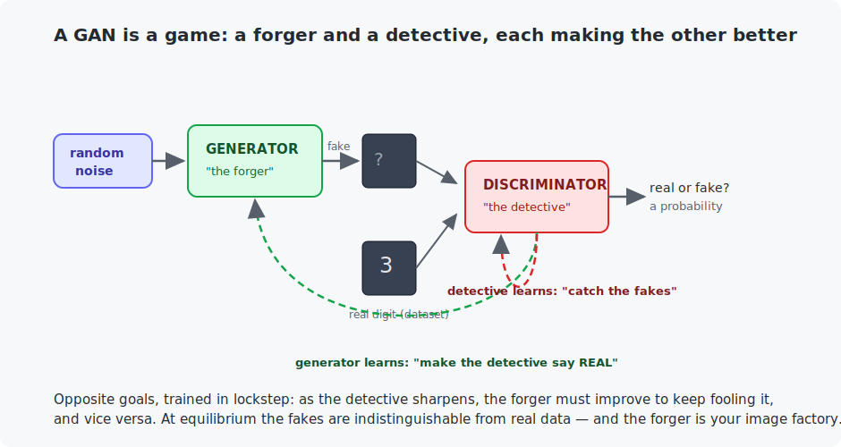

# Chapter 27 — GANs

Chapter 26 generated by *compressing* data and sampling the latent space. This chapter reaches the same goal — a machine that invents realistic images — by a completely different and gloriously simple idea: **make two networks compete**. A forger tries to pass off fakes; a detective tries to catch them; each makes the other better. When the forger wins, you have an image factory. GANs dominated generative AI from 2014 until diffusion (Chapter 28) overtook them, and the adversarial idea remains everywhere.

<!-- CONTENTS_START -->
## Contents

- [What you will learn](#what-you-will-learn)
- [Prerequisites](#prerequisites)
- [1. The game](#1-the-game)
- [2. DCGAN, and watching it learn](#2-dcgan-and-watching-it-learn)
- [3. Why GANs are famously tricky](#3-why-gans-are-famously-tricky)
- [4. Three routes to generation](#4-three-routes-to-generation)
- [Code walkthrough](#code-walkthrough)
- [Run it](#run-it)
- [What the C version covers](#what-the-c-version-covers)
- [Exercises](#exercises)
- [Next](#next)

<!-- CONTENTS_END -->

## What you will learn

- The GAN game: generator vs discriminator, and why it works.
- Building a DCGAN — a small convolutional GAN — on MNIST.
- The adversarial training loop, step by step.
- GANs vs VAEs vs diffusion: three routes to generation, and their trade-offs.

## Prerequisites

- [Chapter 14](../14-image-classification/README.md) — CNNs (the discriminator is one).
- [Chapter 16](../16-segmentation/README.md) — transposed convolutions (the generator upsamples).
- [Chapter 26](../26-autoencoders-and-vaes/README.md) — the generation goal.

## 1. The game



Two networks with opposite jobs:

- The **generator** ("the forger") takes a vector of random noise and produces an image. It has never seen the dataset directly; its only feedback is whether it fooled the detective.
- The **discriminator** ("the detective") takes an image and outputs one number: the probability it is *real* (from the dataset) rather than *fake* (from the generator). It is just a Chapter 14 CNN classifier with a single output.

They train in lockstep with **opposite goals**. The discriminator is trained to score real images 1 and fakes 0 — ordinary classification. The generator is trained on the *opposite* label for its own fakes: it wants the discriminator to call them real. That flip — one network's loss is (roughly) the other's gain — is the entire trick, and it needs no labels: the "real vs fake" supervision is manufactured for free from the dataset and the generator's own output.

The dynamic is an arms race. A weak detective is easy to fool, so the forger stays sloppy; as the detective sharpens, the forger must produce genuinely realistic images to keep winning; that pushes the detective further, and so on. At **equilibrium**, the fakes are indistinguishable from real data and the detective can only guess — at which point the generator is exactly the image factory you wanted.

## 2. DCGAN, and watching it learn

The example is a **DCGAN** (deep convolutional GAN): the discriminator is a strided CNN (28→14→7→one number), the generator runs it in reverse with transposed convolutions (noise → 7×7 → 14×14 → 28×28 image; Chapter 16's upsampling). We print one **fixed noise seed** every epoch, so you watch the *same* seed's image sharpen:

```
epoch 1:  a blobby, broken smudge      epoch 8:  a recognizable digit
    *@@@                                    @@-
   :#:%%*%                                 @@@@@%
   *    -@              -->                @@@
     @                                     @+
    @@.                                      %%
                                            @@=
```

From static to a plausible handwritten digit in eight epochs — **and the generator never once saw a real image**. It learned what digits look like purely from the pressure of trying to fool a detective. That is the astonishing part: labels never entered the process; the structure came from the competition.

## 3. Why GANs are famously tricky

The adversarial loop is beautiful and temperamental. A few realities the example manages and you will meet:

- **Balance is fragile.** If the discriminator wins too fast, the generator gets no useful gradient (everything is "fake", equally) and stalls. Matched learning rates and the DCGAN recipe (batch norm, LeakyReLU, Adam with β₁=0.5) exist to keep the fight fair.
- **Mode collapse.** The generator can discover *one* very convincing digit and produce only that — it fools the detective without covering the data's variety. Watch for it: if every seed yields the same image, the game has degenerated.
- **No clean "loss = quality."** Unlike everything before, the losses oscillate around an equilibrium instead of steadily falling; you judge a GAN by looking at its samples, not its loss curve.

These frictions are exactly why diffusion models (Chapter 28), which train by a stable regression objective, have largely replaced GANs for image generation — while GANs remain unmatched for *speed* (one forward pass per image, versus diffusion's many).

## 4. Three routes to generation

You now know three ways to build an image factory, worth holding side by side:

| approach | how it generates | strengths | weaknesses |
|----------|-----------------|-----------|------------|
| **VAE** (ch. 26) | sample latent, decode | stable, meaningful latent space | blurrier samples |
| **GAN** (this ch.) | noise → generator | sharp, fast (one pass) | unstable training, mode collapse |
| **Diffusion** (ch. 28) | iteratively denoise | best quality + diversity, stable | slow (many passes) |

All three chase the same target — turn noise into realistic data — and modern systems blend them (latent diffusion generates in a VAE's latent space; some fast samplers borrow GAN ideas). Chapter 28 builds the current champion.

## Code walkthrough

The example is `python/train_gan_mnist.py`. Two networks and one loop where they fight — the loop in `main()` is the whole chapter. No prior programming assumed.

### Step 1 — the two players

`Generator` takes 64 random numbers (noise) and grows them into a 28×28 image using transposed convolutions (Chapter 16's upsampling, 7→14→28), ending in a `Sigmoid` for 0–1 pixels — the **forger**. `Discriminator` is a plain Chapter 14 CNN that takes a 28×28 image and outputs *one* number, real-vs-fake — the **detective**. Neither is new; the novelty is entirely in how they train each other.

### Step 2 — the discriminator's turn: learn real from fake

```python
real_labels = torch.ones(batch_size, 1, device=device)
fake_labels = torch.zeros(batch_size, 1, device=device)
discriminator_loss = (
    binary_loss(discriminator(real_images), real_labels)
    + binary_loss(discriminator(fake_images.detach()), fake_labels)
)
```

First the detective learns. It is shown real images with the label **1** ("real") and the generator's fakes with the label **0** ("fake"), and trained by ordinary Chapter 6 binary cross-entropy to tell them apart. The `.detach()` on `fake_images` is important: it cuts the fakes off from the generator's graph so this step trains *only* the discriminator — the generator must not learn on the detective's turn.

### Step 3 — the generator's turn: the label flip that is the whole game

```python
generator_loss = binary_loss(discriminator(fake_images), real_labels)
```

Now the forger learns — and here is the single trick that makes a GAN a GAN. It runs its fakes through the discriminator, but scores them against the label **`real_labels` (1)** — the *opposite* of the truth. In other words, the generator is rewarded whenever it fools the detective into saying "real". The gradient flows back *through* the discriminator into the generator, nudging its weights to make images the detective is more likely to accept. Two networks, opposite goals, taking turns: the arms race that ends with the forger producing real-looking digits.

### Step 4 — judging by eye

```python
grid = pixels.detach().cpu().reshape(28, 28)
```

There is no "loss = quality" number here — GAN losses just oscillate around an equilibrium, so you cannot read progress off the loss. Instead the code runs one **fixed** noise vector through the generator every epoch and prints it: watching the *same* seed sharpen from static into a clean digit is the honest measure of training.

The C file `c/generator_inference.c` shows a generator's forward pass (noise → image) in pure C.

### Quick reference

| Piece | What it does | What to notice |
|-------|--------------|----------------|
| `class Generator` | Noise (64) → 28×28 image via transposed convs. | Chapter 16's upsampling, used to *create*; `Sigmoid` for 0–1 pixels. |
| `class Discriminator` | Image → one real-vs-fake number. | A Chapter 14 CNN with a single output. |
| discriminator step | Real→1, fake→0; `fake_images.detach()`. | `.detach()` trains only the detective on its turn. |
| generator step | Fakes scored against **`real_labels`**. | The label flip *is* the adversarial game. |
| fixed noise sample | One seed, printed every epoch. | GAN losses oscillate; judge by looking at samples. |

## Run it

```bash
.venv/bin/python chapters/27-gans/python/train_gan_mnist.py --quick   # 1 epoch, ~2 min
.venv/bin/python chapters/27-gans/python/train_gan_mnist.py           # 8 epochs, ~15 min

make -C chapters/27-gans/c && ./chapters/27-gans/c/build/generator_inference
```

## What the C version covers

A generator's forward pass — noise in, image out — in pure C, the image analogue of Chapter 25's text engine and Chapter 26's decoder. To stay self-contained it uses a hand-built generator whose noise inputs visibly control the output (ring size, thickness, brightness), showing the noise → image relationship a trained DCGAN generator learns. Generation, once trained, is deterministic arithmetic on a noise seed: no discriminator, no game, just the forward pass.

## Exercises

1. Print three *different* noise seeds' samples from the trained generator (edit the fixed noise to a batch of 3). Do you get three different digits, or the same one three times? Diagnose mode collapse if you see it.
2. Cripple the balance: give the discriminator learning rate 2e-3 (10× the generator's). Describe what happens to the samples and connect it to Section 3's "discriminator wins too fast".
3. Remove batch norm from the generator. GAN training is notoriously sensitive to it — what breaks?
4. The generator's noise is 64-dimensional. Interpolate between two noise vectors (decode 5 points along the line) and print the sequence. Does it morph smoothly like the VAE's latent walk (Chapter 26, exercise 4)?
5. Challenge: make it *conditional* — feed a digit label into both networks (concatenate a one-hot to the noise and to the discriminator's input). Now you can request a specific digit. This is the same conditioning that Chapter 29 will drive with *text*.

## Next

[Chapter 28 — Diffusion models](../28-diffusion-models/README.md)

<!-- NAV_START -->
---

[← Chapter 26: Autoencoders and VAEs](../26-autoencoders-and-vaes/README.md) · [↑ Course index](../../README.md) · [Chapter 28: Diffusion models →](../28-diffusion-models/README.md)

<!-- NAV_END -->
