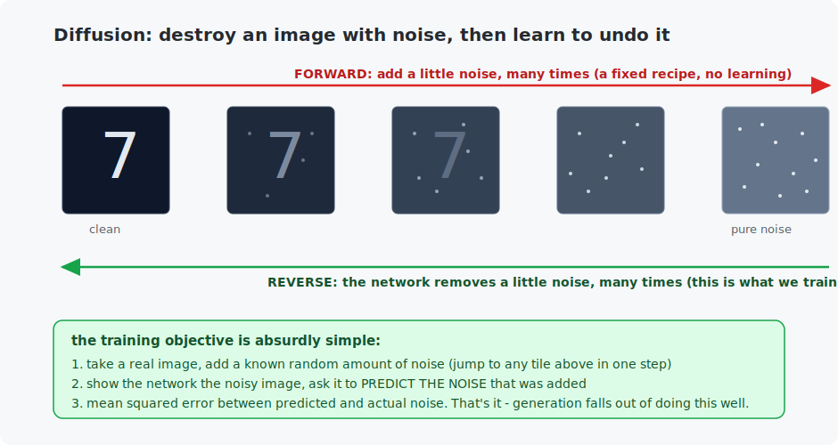

# Chapter 28 — Diffusion models

This is the chapter behind the images you have actually seen — Stable Diffusion, DALL·E, Midjourney all run on **diffusion**. And the surprise, after the VAE's distributions and the GAN's fragile duel, is that diffusion's core is the *simplest* generative idea in the course: destroy an image by gradually adding noise, then train a network to reverse one step of that. You will build a working diffusion model on MNIST from scratch, watch digits crystallize out of static, and run the sampling loop in pure C.

<!-- CONTENTS_START -->
## Contents

- [What you will learn](#what-you-will-learn)
- [Prerequisites](#prerequisites)
- [1. Two processes: destroy, then restore](#1-two-processes-destroy-then-restore)
- [2. The absurdly simple training objective](#2-the-absurdly-simple-training-objective)
- [3. Sampling: the loop that makes the picture](#3-sampling-the-loop-that-makes-the-picture)
- [4. Diffusion vs the others, and the road to real generators](#4-diffusion-vs-the-others-and-the-road-to-real-generators)
- [Code walkthrough](#code-walkthrough)
- [Run it](#run-it)
- [What the C version covers](#what-the-c-version-covers)
- [Exercises](#exercises)
- [Next](#next)

<!-- CONTENTS_END -->

## What you will learn

- The forward process: turning any image into noise, one small step at a time.
- The reverse process: a network that removes noise, and how it generates.
- The "just predict the noise" training objective — and why it is so stable.
- Why diffusion beat GANs on quality, and what it costs (speed).

## Prerequisites

- [Chapter 16](../16-segmentation/README.md) — the U-Net (the denoiser is one).
- [Chapter 26](../26-autoencoders-and-vaes/README.md) & [27](../27-gans/README.md) — the other two generative routes.

## 1. Two processes: destroy, then restore



The **forward process** is not learned — it is a fixed recipe: take a clean image and add a little random noise, then a little more, then more, over a couple hundred steps, until nothing remains but pure static. A digit dissolves into snow. There is nothing to train here; it is a controlled demolition, and it has a convenient property — you can jump *directly* to the noise level of any step in one shot (a closed-form formula), rather than simulating the whole chain.

The **reverse process** is the model. If a network could look at a slightly-noisy image and undo one step of noising, then — starting from pure noise — applying it over and over would walk *backward* along the chain and arrive at a clean image. A clean image that was never in the dataset: a generated one. **Generation is denoising, repeated.**

## 2. The absurdly simple training objective

How do you train a one-step denoiser? Here is the whole recipe, and it is the simplest in Part VI:

1. Take a real image. Pick a random noise level. Add exactly that much random noise (one step, closed form).
2. Show the network the noisy image (and tell it the noise level). Ask it to **predict the noise that was added**.
3. Mean squared error between its prediction and the actual noise. Backprop. Done.

No adversary, no KL term, no distributions — just "predict the noise, MSE", the loss from Chapter 5. If the network can predict the noise in an image, it can subtract a slice of it, which is exactly one reverse step. That stability is diffusion's superpower: it trains like a boringly reliable regression problem (the losses just *fall*, unlike the GAN's oscillation), yet generates at the highest quality we know.

The denoiser is a **time-conditioned U-Net** (Chapter 16, told the noise level via a timestep embedding, because it must behave differently for "barely noisy" and "almost pure static"). Training and sampling from scratch on MNIST:

```
epoch 1/6  noise-prediction loss 0.1040     epoch 6/6  noise-prediction loss 0.0395
   a digit from pure noise:                    a digit from pure noise:
        .                                            *@
        .=                                           @
         *                                          .%
        =                                           @     #@
       :#                     -->                   @      -%
       %*                                           %@     @.
       ==                                           .@@.-+@%
```

By epoch 6 a coherent digit emerges from random static — grown one denoising step at a time, from an objective a beginner could implement.

## 3. Sampling: the loop that makes the picture

Generation is a **loop**, not a single pass (this is the key difference from GANs). Start with pure noise; then for each step from noisy to clean: predict the noise, remove a slice of it, add back a little *fresh* noise (except at the very end), repeat. Two hundred steps, two hundred forward passes through the network, and a digit appears. The re-injected noise matters — removing all the predicted noise at once yields blurry averages; the gradual stochastic walk is what produces sharp, varied samples.

The C program runs exactly this loop (with a stand-in denoiser so it needs no trained weights), printing the image every few steps as it converges from static to a shape. Watching it is worth more than any equation: **the picture is not computed, it is grown.**

## 4. Diffusion vs the others, and the road to real generators

Completing Chapter 27's table with what you now know:

- **Quality & diversity:** diffusion wins — it covers the full data distribution (no mode collapse) and produces the sharpest samples.
- **Stability:** diffusion wins — a plain regression loss vs the GAN's knife-edge duel.
- **Speed:** GANs win, dramatically — one forward pass vs diffusion's hundreds. This is diffusion's one real weakness, and a whole research industry (DDIM, distillation, consistency models) exists to cut those hundreds of steps to a handful.

Two ideas turn this MNIST toy into Stable Diffusion, both previews of Chapter 29. **Latent diffusion:** run the whole process inside a VAE's compact latent space (Chapter 26) instead of on full-size pixels — denoising a 64×64 latent is vastly cheaper than a 512×512 image, and it is why modern generators are fast enough to use. **Conditioning:** feed a text description into the denoiser so it removes noise *toward an image matching the text* — that is text-to-image, and it is the next chapter.

## Code walkthrough

The example is `python/train_diffusion_mnist.py`. The training objective is astonishingly small — four lines — and everything else supports it. No prior programming assumed.

### Step 1 — the noise schedule: jump to any noise level in one step

`build_noise_schedule` precomputes `alpha_bar[t]` — the fraction of the *original* image still present after `t` steps of adding noise. The payoff is a closed form: a `t`-steps-noisy image is just `sqrt(alpha_bar[t]) * image + sqrt(1 - alpha_bar[t]) * noise`. So instead of simulating a long chain of noising steps, you can leap straight to any noise level in one line — which is what makes training cheap.

### Step 2 — the training objective: predict the noise

```python
noise = torch.randn_like(real_images)
signal_scale = torch.sqrt(alpha_bar[timesteps])[:, None, None, None]
noise_scale = torch.sqrt(1 - alpha_bar[timesteps])[:, None, None, None]
noisy_images = signal_scale * real_images + noise_scale * noise
predicted_noise = model(noisy_images, timesteps)
loss = nn.functional.mse_loss(predicted_noise, noise)   # just predict the noise!
```

This is the whole idea of diffusion, and it is almost unbelievably simple. Take a real image, pick a random noise level `t`, and **add a known amount of noise** to it (Step 1's formula). Then ask the network to look at the noisy image and **predict the noise that was added** — scored by plain mean-squared error. That's it. The network never sees a "generate" instruction; it only ever learns to answer "what noise is in this picture?" Everything generative falls out of that one skill.

### Step 3 — the denoiser: a U-Net that knows how noisy its input is

`TimeConditionedUNet` is Chapter 16's U-Net with one addition: the timestep `t` is embedded and mixed in, so the network is *told how noisy* its input is. That matters because denoising a barely-speckled image and denoising near-pure static are different jobs, and one network must do both depending on `t`.

### Step 4 — sampling: grow a picture out of static

```python
image = (image - betas[step] / torch.sqrt(1 - alpha_bar[step]) * predicted_noise) / torch.sqrt(alpha)
if step > 0:
    image = image + torch.sqrt(betas[step]) * torch.randn_like(image)
```

To generate, `sample_image` starts from **pure random noise** and runs the training skill in reverse, ~200 times: predict the noise in the current image, subtract a slice of it, and — except on the last step — **add a little fresh noise back**. Repeating this slowly precipitates structure out of static, one small denoising at a time. The re-injected noise is what keeps samples sharp and varied instead of collapsing to one blurry average.

The C file `c/denoising_sampler.c` runs this reverse loop with a stand-in denoiser, printing the image every few steps — you watch structure precipitate out of static. Swap the stand-in for a network and it is Stable Diffusion's inner loop.

### Quick reference

| Piece | What it does | What to notice |
|-------|--------------|----------------|
| `build_noise_schedule(device)` | Precomputes `alpha_bar[t]`. | Closed form to jump to *any* noise level in one step. |
| `class TimeConditionedUNet` | Chapter 16's U-Net + a **timestep embedding**. | The network must denoise differently at each noise level. |
| training (in `main`) | Add known noise, predict it, MSE. | `mse_loss(model(noisy, t), noise)` — "predict the noise", the whole objective. |
| `sample_image(...)` | From noise: predict, subtract, re-inject, repeat 200×. | The re-injected noise keeps samples sharp, not blurry. |

## Run it

```bash
.venv/bin/python chapters/28-diffusion-models/python/train_diffusion_mnist.py --quick   # 1 epoch, ~3 min
.venv/bin/python chapters/28-diffusion-models/python/train_diffusion_mnist.py           # 6 epochs, ~15 min

make -C chapters/28-diffusion-models/c && ./chapters/28-diffusion-models/c/build/denoising_sampler
```

## What the C version covers

The sampling loop — the schedule, the reverse step, the re-injected noise — in pure C, with a hand-built stand-in denoiser so the *algorithm* is fully visible without shipping U-Net weights. It prints the image at several points in the reverse process, so you literally watch structure precipitate out of noise. Swap the stand-in for a neural network and you have Stable Diffusion's inner loop, in about 100 lines.

## Exercises

1. Change `DIFFUSION_STEPS` from 200 to 20 and retrain/sample. Fewer steps = faster generation but coarser results — find where quality falls off. (This is the exact trade the "fast sampler" research attacks.)
2. In the sampler, stop re-injecting noise (delete the `+ sqrt(beta)*randn` line). The samples get blurry — explain why using Section 3.
3. Plot (or print) the noise schedule `alpha_bar`. Where does the image lose most of its signal — early or late? What does that imply about which steps are "hardest" for the denoiser?
4. Diffusion has no mode collapse. Generate 5 samples and confirm you get varied digits, then contrast with what Chapter 27 exercise 1 may have shown for the GAN.
5. Challenge: make it *class-conditional* — add a digit-label embedding to the timestep embedding, so you can request "generate a 3". You have built the mechanism that Chapter 29 drives with text instead of labels.

## Next

[Chapter 29 — Text-to-image and video](../29-text-to-image-and-video/README.md)

<!-- NAV_START -->
---

[← Chapter 27: GANs](../27-gans/README.md) · [↑ Course index](../../README.md) · [Chapter 29: Text-to-image and video →](../29-text-to-image-and-video/README.md)

<!-- NAV_END -->
