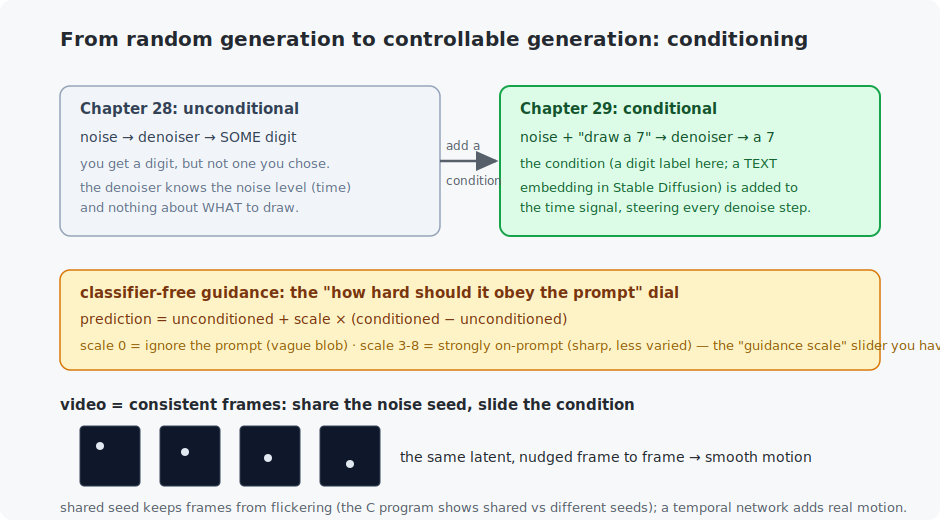

# Chapter 29 — Text-to-image and video

Chapter 28 generated a *random* digit. The magic of DALL·E and Midjourney is that you *ask* — and this chapter adds exactly that: **conditioning**, the mechanism that turns "generate something" into "generate *this*." You will build a diffusion model that draws the digit you request, meet the **guidance scale** slider every image tool exposes, and extend the idea to **video** through frame consistency. The label here stands in for a text prompt; the machinery is identical to the systems you have used.

<!-- CONTENTS_START -->
## Contents

- [What you will learn](#what-you-will-learn)
- [Prerequisites](#prerequisites)
- [1. Conditioning: from "a digit" to "a 7"](#1-conditioning-from-a-digit-to-a-7)
- [2. The guidance scale: how hard to obey the prompt](#2-the-guidance-scale-how-hard-to-obey-the-prompt)
- [3. Video: consistency is the whole problem](#3-video-consistency-is-the-whole-problem)
- [Code walkthrough](#code-walkthrough)
- [Run it](#run-it)
- [What the C version covers](#what-the-c-version-covers)
- [Exercises](#exercises)
- [Next](#next)

<!-- CONTENTS_END -->

## What you will learn

- Conditioning: steering a generator with an instruction.
- How text becomes an image condition (and why a label is the same idea, smaller).
- Classifier-free guidance — the "guidance scale" / "CFG" dial.
- Video generation: frame consistency, and why a shared latent matters.

## Prerequisites

- [Chapter 28](../28-diffusion-models/README.md) — diffusion (this is conditional diffusion).
- [Chapter 26](../26-autoencoders-and-vaes/README.md) — latent spaces (latent diffusion).

## 1. Conditioning: from "a digit" to "a 7"



Chapter 28's denoiser knew only *how noisy* its input was (the timestep). To control *what* it draws, we feed it one more thing: a **condition**. Here that is a digit label, embedded and added to the timestep signal, so the network denoises toward "a 7" instead of toward "any digit." Training barely changes — same predict-the-noise objective, now with the label as an extra input. Generation becomes controllable:

```
   requested:   0       1       2       3       4
                       %                 *%@@@@@=
       -              :*        %          *@=      .+:
        -             +#       #+                    @@*
        #             %-       %#         .@@* -@@%   @
        @             @        @          *@@@@@@##:  @
```

Ask for a 1 and you get a vertical bar; ask for a 3 and you get its double curve. (Eight epochs of a laptop model — the digits are recognizable, not crisp; scale is what sharpens them, exactly as in Chapter 24.) **This is text-to-image in miniature.** In Stable Diffusion the only differences are: the condition is a *text embedding* (from a model like the transformers of Part V) instead of a 10-way label, and the diffusion runs in a VAE's **latent space** (Chapter 26) rather than on pixels, so 512×512 images stay affordable. The steering mechanism — condition added into the denoiser — is what you just built.

## 2. The guidance scale: how hard to obey the prompt

Every image tool has a "guidance scale" (or "CFG") slider. It is one formula, **classifier-free guidance**, and you now have the model to run it. The trick: during training, occasionally hide the label (a "null" condition), so the network learns to denoise both *with* and *without* guidance. At sampling, combine the two predictions and **extrapolate**:

$$\text{noise} = \text{unconditioned} + \text{scale} \times (\text{conditioned} - \text{unconditioned})$$

Read it: `(conditioned − unconditioned)` is "the direction the prompt pulls"; multiplying by `scale` amplifies it. The C program shows the effect starkly on one seed:

```
  scale 0 (ignore)   scale 1         scale 3         scale 6 (strong)
   ...:::::...                        @@@@@@@@@@@@     @@@@@@@@@@@@
  ..::-----::..                       @@@@@@@@@@@@     @@@@@@@@@@@@
```

Scale 0 ignores the request entirely (a vague blob); scale 3–8 enforces it (the exact requested shape, sharp). Turn it too high and images get oversaturated and lose variety — which is why the slider exists and why "7.5" is a common default. That number in your image tool now means something concrete to you.

## 3. Video: consistency is the whole problem

Naive video generation — run the image generator once per frame — fails spectacularly: each frame gets a different random seed, so the content *flickers*, unrelated frame to frame. The foundational fix is **a shared latent**: reuse the same noise seed across frames and slide only the condition, so the content stays coherent while it changes. The C program makes the contrast unmissable:

```
  shared seed (smooth 'video'):        different seeds (flickery, unusable):
  the bar glides down cleanly          the bar jumps to random places
```

The Python toy does the same — one seed, condition slid from "3" toward "8" across frames, producing a short consistent sequence. Real video models (Sora, Veo, Stable Video Diffusion) add a **temporal network** — attention or convolution *across the time axis* (Chapter 17's idea) — so motion is not just consistent but physically plausible, and often generate in a video-shaped latent space. But the seed of it all is here: condition per frame, keep a shared latent. That is why a single random seed reproduces the same video, and why "seed" is a control in video tools too.

## Code walkthrough

The example is `python/conditional_diffusion.py` — Chapter 28's diffusion with a label added, which turns "generate something" into "generate *this*":

| Piece | What it does | What to notice |
|-------|--------------|----------------|
| `class ConditionalUNet` | Chapter 28's U-Net, plus a **label embedding** added to the time signal. | The `label_embedding(labels)` added into the condition is the entire change — the net now denoises toward a *requested* digit. In Stable Diffusion this is a text embedding instead of a 10-way label. |
| `sample_conditioned(model, ..., label, guidance_scale, seed_noise)` | Generates the requested digit with **classifier-free guidance**. | `unconditioned + scale * (conditioned − unconditioned)` — the guidance-scale formula (Section 2). `seed_noise` lets several calls share a starting point (used by the video). |
| `main()` — training | Standard diffusion loss, but 10% of the time the label is **dropped** to a null token. | That dropout is what lets the model denoise both with and without guidance — both are needed at sampling. |
| `main()` — demos | Requests digits 0–4 (text-to-image), then a shared-seed sequence (toy video). | Sharing the seed keeps video frames consistent; sliding the label morphs the content. |

The C file `c/guidance_and_frames.c` shows the same two levers — rising guidance scale, and shared-vs-different seeds across frames — the exact meaning of the "guidance scale" and "seed" fields in any image/video tool.

## Run it

```bash
.venv/bin/python chapters/29-text-to-image-and-video/python/conditional_diffusion.py --quick   # 1 epoch, ~3 min
.venv/bin/python chapters/29-text-to-image-and-video/python/conditional_diffusion.py           # 8 epochs, ~20 min

make -C chapters/29-text-to-image-and-video/c && ./chapters/29-text-to-image-and-video/c/build/guidance_and_frames
```

## What the C version covers

The two mechanisms of controllable generation, each with a stand-in denoiser so the ideas are visible without trained weights: **classifier-free guidance** (the same seed at rising guidance scales, from ignored-prompt to strictly-enforced) and **frame consistency** (shared seed vs different seeds across a short sequence). These are the exact levers behind the "guidance scale" and "seed" fields in every text-to-image and text-to-video tool — reduced to arithmetic you can read.

## Exercises

1. In the Python model, generate the same digit at guidance scales 0, 1, 3, and 8. Where is the sweet spot between "off-prompt" and "oversaturated"? Connect it to Section 2.
2. Request the same digit five times at scale 1.0 vs scale 6.0. High guidance reduces variety — confirm it, and explain the trade-off between prompt-fidelity and diversity.
3. Slide the video condition through all ten digits (0→9) over 10 frames with a shared seed. Is the morph smooth or jumpy? What does that reveal about the latent space's structure (Chapter 26)?
4. In the C program, break consistency on purpose: give the "shared" row a different seed per frame and confirm the flicker. This is the single most common failure of naive video generation.
5. Challenge: replace the 10-way digit label with a tiny 2-word "prompt" (e.g. a bag-of-words over {big, small, left, right}) embedded and summed as the condition. You have built the seed of a text encoder feeding a diffusion model — the architecture of a real text-to-image system.

## Next

Part VI complete — you can generate images and steer them with prompts. [Chapter 30 — Reinforcement learning](../30-reinforcement-learning/README.md) opens the final part: agents that learn by doing.

<!-- NAV_START -->
---

[← Chapter 28: Diffusion models](../28-diffusion-models/README.md) · [↑ Course index](../../README.md) · [Chapter 30: Reinforcement learning →](../30-reinforcement-learning/README.md)

<!-- NAV_END -->
