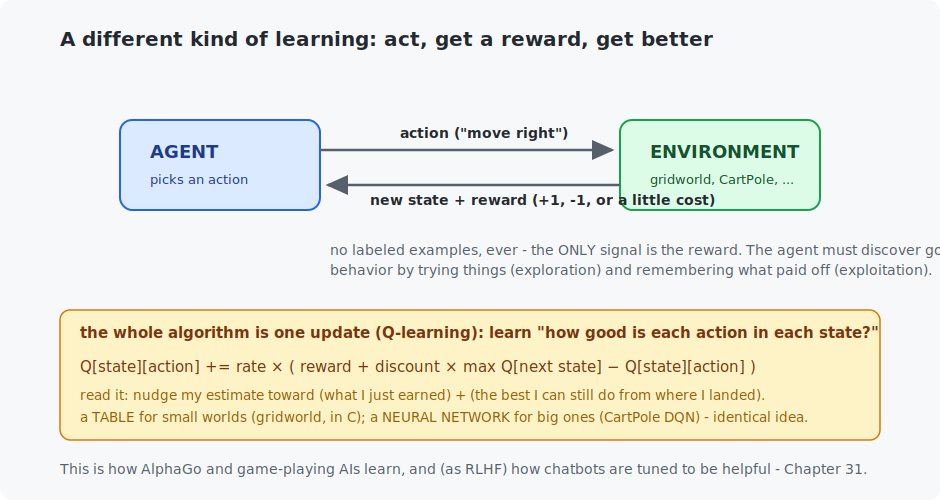

# Chapter 30 — Reinforcement learning

Every model in this course so far learned from *examples* — here is the input, here is the right answer. Reinforcement learning throws that away. An **agent** acts in a world, receives **rewards**, and must figure out good behavior with nobody ever showing it the right move. This is how AlphaGo beat the world champion, how robots learn to walk, and — as RLHF — how chatbots are tuned to be helpful. You will build the core algorithm from scratch (tabular Q-learning, in pure C), then scale it to a neural network (a DQN balancing a pole).

<!-- CONTENTS_START -->
## Contents

- [What you will learn](#what-you-will-learn)
- [Prerequisites](#prerequisites)
- [1. Learning by doing](#1-learning-by-doing)
- [2. Q-learning: the whole algorithm is one line](#2-q-learning-the-whole-algorithm-is-one-line)
- [3. Deep Q-networks: when the table won't fit](#3-deep-q-networks-when-the-table-wont-fit)
- [4. Where RL matters](#4-where-rl-matters)
- [Code walkthrough](#code-walkthrough)
- [Run it](#run-it)
- [What the C version covers](#what-the-c-version-covers)
- [Exercises](#exercises)
- [Next](#next)

<!-- CONTENTS_END -->

## What you will learn

- The RL setup: agent, environment, state, action, reward.
- Q-learning — the whole algorithm is one line — solving a gridworld.
- Exploration vs exploitation, and the discount factor.
- Deep Q-networks: replacing the table with a network for continuous problems.

## Prerequisites

- [Chapter 9](../09-first-neural-network/README.md) — MLPs (the DQN is one).
- [Chapter 4](../04-probability-basics/README.md) — expected value (rewards are expectations).

## 1. Learning by doing



The setup is a loop: the **agent** observes a **state**, picks an **action**, and the **environment** responds with a new state and a **reward** (a number: +1 for good, −1 for bad, often a small cost per step). No labeled data exists — the reward is the *only* teaching signal, and it is often sparse (you only find out you won at the very end of a game). The agent's problem: choose actions now to maximize *total future reward*, discovering a good strategy purely by trial and error.

Two ideas make this tractable. The **discount factor** (γ ≈ 0.95) makes near rewards worth more than distant ones — it keeps "total future reward" finite and expresses a sensible preference for sooner. And the **exploration/exploitation** trade-off: to learn, the agent must *explore* (try random actions to discover what works) but also *exploit* (use what it knows to gain reward). The standard recipe, ε-greedy, acts randomly a fraction ε of the time and greedily otherwise, with ε shrinking as the agent learns — curious at first, decisive later.

## 2. Q-learning: the whole algorithm is one line

**Q-learning** learns a function Q(state, action) = "the total future reward I can expect if I take this action here and play well afterward." Know Q and you know how to act: in each state, pick the action with the highest Q. For small worlds Q is just a **table**. The learning rule is the one equation of this chapter:

$$Q[s][a] \mathrel{+}= \text{rate} \times \Big( \underbrace{r + \gamma \max_{a'} Q[s'][a']}_{\text{a better estimate}} - \underbrace{Q[s][a]}_{\text{current estimate}} \Big)$$

Read it in words: *nudge my estimate toward (the reward I just got) plus (the best I can still do from where I landed).* That parenthesized difference — the **temporal-difference error** — is the surprise, and learning is repeatedly reducing it. Nothing else is needed; this line, looped over experience, is a complete RL algorithm.

The gridworld: reach the goal (+1), avoid the pit (−1), small cost per step. After training, the learned policy — the greedy action in each cell — is printed as a map:

```
   >   >   >  GOAL
   >   >   ^  PIT
   ^   ^   ^   <
```

Every arrow points along the shortest *safe* route to the goal — hugging away from the pit — **and the agent was never shown that route**. It discovered it by wandering and remembering what paid off. The C program does this in one file, no framework: RL, fully demystified.

## 3. Deep Q-networks: when the table won't fit

The table works because the gridworld has 12 states. **CartPole** — balance a pole upright by pushing a cart left or right — has a *continuous* state (four real numbers: positions and velocities), so there are infinitely many states and no table can hold them. The fix is the through-line of this whole course: **replace the table with a neural network.** A **DQN** (deep Q-network) is an MLP that takes the state and outputs a Q-value per action; it is trained by regression toward the same `reward + γ max Q(next)` target — Chapter 5's gradient descent, now chasing a Q-value.

Two tricks keep it stable (both in the code): a **replay buffer** (learn from a random shuffle of past experiences, not just the latest, so training data is less correlated) and a **target network** (a slowly-updated copy used for the bootstrap target, so the agent isn't chasing a value that jumps every step). Training:

```
   episode   0: last-20 average balance time   13.0 steps  (500 = perfect, ~22 = random)
   episode  40: last-20 average balance time   31.6 steps
   episode  60: last-20 average balance time  195.6 steps
   episode 100: last-20 average balance time  245.9 steps
```

From flailing (13 steps) to holding the pole up for 200+ steps in about a hundred episodes — the *same* Q-learning idea, now handling a continuous world it could never tabulate. (Honest note: after its peak the average wobbles back down — DQN is famously unstable, prone to suddenly "forgetting" a good policy. Modern variants like Double-DQN and PPO exist largely to tame this; watching it happen is part of the lesson.)

## 4. Where RL matters

RL is the smallest slice of this course but powers some of its most famous results. **Games:** AlphaGo/AlphaZero learned superhuman Go, chess, and shogi from self-play rewards alone. **Robotics & control:** locomotion, manipulation, chip layout, datacenter cooling. And the one every reader has touched: **RLHF** (reinforcement learning from human feedback) is how a raw next-token predictor (your Chapter 24 model) becomes a helpful assistant — humans rank responses, a reward model learns their preference, and RL tunes the LLM to score well. Your mini-LLM plus this chapter's ideas are, in miniature, the recipe behind ChatGPT's helpfulness. Chapter 31 says a bit more.

## Code walkthrough

The example is `python/q_learning_and_dqn.py`. It shows the same idea twice — a table for the small world, a network for the big one:

| Piece | What it does | What to notice |
|-------|--------------|----------------|
| `gridworld_step(state, action)` | The environment: move, return `(next_state, reward, done)`. | The `-0.02` step cost makes the agent *hurry*; goal is +1, pit is −1. |
| `train_q_learning(episodes, ...)` | Fills a Q-table with the one-line update `Q[s][a] += rate·(reward + γ·max Q[s'] − Q[s][a])`. | Uses **ε-greedy** exploration (act randomly sometimes), with ε shrinking over time — curious early, decisive late. |
| `print_learned_policy(q_table)` | Prints the greedy action per cell as arrows. | Every arrow points along the shortest safe route — learned, never shown. |
| `class QNetwork` | A tiny MLP: 4-number state → 2 action-values. | The table became a network — so the *same* Q-learning idea handles CartPole's continuous state. |
| `train_dqn(episodes, device)` | Deep Q-learning with a **replay buffer** and a **target network**. | Those two tricks keep it stable; even so, watch the balance time peak (~245 steps) then wobble — DQN is famously unstable, and seeing it is part of the lesson. Needs `gymnasium`. |

The C file `c/q_learning_gridworld.c` is the complete tabular algorithm — environment, ε-greedy, the one-line update, the policy printout — in pure C with no dependencies. RL's core, small enough to hold in your head.

## Run it

```bash
.venv/bin/python chapters/30-reinforcement-learning/python/q_learning_and_dqn.py --quick   # ~2 min
.venv/bin/python chapters/30-reinforcement-learning/python/q_learning_and_dqn.py           # ~8 min
# (the CartPole DQN needs gymnasium: uv pip install gymnasium — the gridworld runs without it)

make -C chapters/30-reinforcement-learning/c && ./chapters/30-reinforcement-learning/c/build/q_learning_gridworld
```

## What the C version covers

Complete tabular Q-learning — the environment, ε-greedy exploration, the one-line update, and the learned-policy printout — in pure C with no dependencies. It is the whole of reinforcement learning's core, small enough to hold in your head: a table, a reward, and one update repeated until arrows point home.

## Exercises

1. In the C gridworld, set the step cost to 0 (no hurry). Does the learned policy still find the shortest path, or just *a* safe path? What does the step cost actually teach?
2. Set the discount γ to 0.5 (very impatient) and to 0.99 (very patient) in the Python gridworld. How does the policy change near the pit? Relate to Section 1.
3. Freeze exploration at ε = 0 from the start (pure greedy). Why does the agent often fail to find the goal at all? This is the exploration problem in one experiment.
4. In the DQN, remove the replay buffer (train only on the latest step). Watch training destabilize, and explain why correlated data hurts.
5. Challenge: give the gridworld a second pit, or a wall the agent must go around, and confirm Q-learning still solves it. Then make the reward sparse (only +1 at the goal, 0 elsewhere) — does it still learn, and how much slower?

## Next

[Chapter 31 — Deployment](../31-deployment/README.md)

<!-- NAV_START -->
---

[← Chapter 29: Text-to-image and video](../29-text-to-image-and-video/README.md) · [↑ Course index](../../README.md) · [Chapter 31: Deployment →](../31-deployment/README.md)

<!-- NAV_END -->
