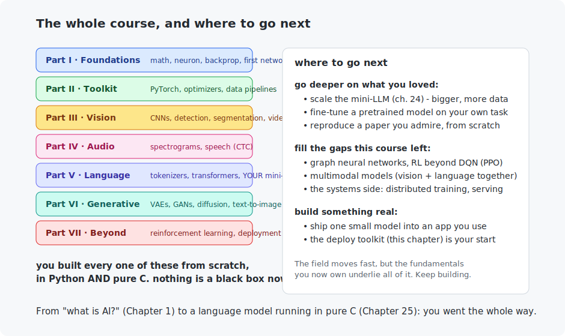

# Chapter 31 — Deployment

The final chapter, and a full-circle one. Every model you have built has, so far, lived in a training script. **Deployment** is the last mile: getting a trained model to run where it is actually needed — a server, a phone, a microcontroller, a game — fast enough, small enough, and without dragging PyTorch along. You will measure the real trade-offs (size, speed, accuracy), shrink a model with quantization, export it to run without Python, and embed one in a pure-C program. Then we close the whole course.

<!-- CONTENTS_START -->
## Contents

- [What you will learn](#what-you-will-learn)
- [Prerequisites](#prerequisites)
- [1. Training is not deploying](#1-training-is-not-deploying)
- [2. The deployment decision table](#2-the-deployment-decision-table)
- [3. Export: leaving Python behind](#3-export-leaving-python-behind)
- [4. Full circle: a model in a C program](#4-full-circle-a-model-in-a-c-program)
- [5. Where you are, and where to go](#5-where-you-are-and-where-to-go)
- [Code walkthrough](#code-walkthrough)
- [Run it](#run-it)
- [What the C version covers](#what-the-c-version-covers)
- [Exercises](#exercises)
- [The end](#the-end)

<!-- CONTENTS_END -->

## What you will learn

- Why deployment is a distinct problem from training.
- Export formats: TorchScript and ONNX.
- Quantization as a deployment tool: the size/speed/accuracy trade.
- Where to go next — a map for the rest of your journey.

## Prerequisites

- The rest of the course. This chapter ties it together.

## 1. Training is not deploying

A model that scores 99% in a notebook is worth nothing until it *runs* for someone. The two settings pull in opposite directions. **Training** wants flexibility, autograd, big batches, a GPU, and does not care about size or a millisecond here or there. **Deployment** wants the opposite: a frozen model, minimal dependencies, low latency, small footprint, and it often runs on a **CPU** or a tiny device — no GPU in sight. You already saw the sharpest version of this in Chapter 25, where a PyTorch-trained LLM became one pure-C file. This chapter generalizes the move.

## 2. The deployment decision table

The `deployment_toolkit.py` example trains the Chapter 9 classifier, then produces the numbers a deployment decision actually turns on:

```
   variant        size      latency    accuracy
   float32      400.0 KB    0.006 ms   95.31%
   int8         102.8 KB    0.006 ms   95.34%
   -> int8 is 3.9x smaller for a 0.03 point accuracy change.
```

**Quantization** (Chapter 25's int8, applied here to a real classifier) cuts the model to a quarter of its size for a *hundredth of a percentage point* of accuracy — a trade almost anyone would take. On a phone or a browser, 4× smaller means faster download, less memory, longer battery. This table *is* deployment engineering: you are choosing a point on a surface of size vs speed vs accuracy for *your* constraints. A cloud server chases the last 0.1% of accuracy; a smartwatch chases bytes and milliwatts; the same trained model serves both at different points on the curve.

## 3. Export: leaving Python behind

A `state_dict` needs your model *code* to load — useless on a device with no Python. Real deployment uses a self-contained format:

- **TorchScript** freezes the model — architecture and weights together — into one file that PyTorch's C++ runtime (or a mobile app) loads with no Python at all. The example saves one and reloads it *without the model class present*, at identical accuracy.
- **ONNX** (Open Neural Network Exchange) is the cross-framework standard: export once, run on dozens of runtimes (ONNX Runtime, TensorRT, CoreML, browsers via WebAssembly). One export, many targets.
- **Pure code** — the most extreme, and the one this course championed: bake the weights into a program, as Chapter 25 did for an LLM and the C example does here for a classifier. Nothing to install, runs anywhere C runs.

## 4. Full circle: a model in a C program

The C example ends the course where it began — the Chapter 1 fruit classifier — now deployed: real weights baked into a constant array, a forward pass in five lines, classifying inputs with no framework, no Python, no dependencies. It correctly calls the tricky 160-gram-but-smooth fruit an apple (Chapter 1's whole point, come back around). This is the deployed *core* of any model — and it is tiny. Chapter 25 already proved a whole LLM reduces to this shape; here it fits in a program that would run on a microcontroller.

That smallness is the quiet thesis of the entire course. A trained neural network — of any kind, for images or text or sound or games — is, at the end, **a file of numbers and a few loops.** You have now written those loops, by hand, for every major architecture in the field.

## 5. Where you are, and where to go



Look at what you built, all from scratch, in Python *and* pure C: the math and a neural network from nothing (Part I); the professional toolkit (II); computer vision — classification, detection, segmentation, video (III); audio and speech (IV); tokenizers, transformers, and **your own mini-LLM** (V); VAEs, GANs, diffusion, and text-to-image (VI); reinforcement learning and deployment (VII). Every headline capability of modern AI, demystified by building it.

Where to go from here (the figure lays it out): **go deeper** on whatever gripped you — scale the mini-LLM, fine-tune a pretrained model, reproduce a paper. **Fill the gaps** this course left by choice — graph networks, modern RL (PPO), multimodal models, the systems side of distributed training and serving. And above all, **build something real** — ship one small model into an app you actually use; this chapter's toolkit is where that starts.

The field will keep moving fast. But the fundamentals you now own — the weighted sum, the gradient, backprop, attention, denoising, the reward — underlie *all* of it, including whatever comes next. You did not learn to use AI tools; you learned to build them, down to the last loop. Keep building.

## Code walkthrough

The example is `python/deployment_toolkit.py`. Each function fills one cell of the deploy-or-not decision table. No prior programming assumed.

### Step 1 — the specimen, on CPU

The thing being deployed is `DigitClassifier`, Chapter 10's ordinary 784→128→10 network. The whole script runs on **CPU on purpose**: deployment is almost always a CPU story (phones, servers, embedded chips), and the questions that matter there are size, speed, and accuracy — not GPU throughput.

### Step 2 — shrink it: int8 quantization

```python
scale = module.weight.abs().max() / 127.0
quantized = torch.round(module.weight / scale).clamp(-127, 127)
module.weight.copy_(quantized * scale)   # store the dequantized values
```

`quantize_linears_to_int8` is Chapter 25's trick applied to a live PyTorch model: for each Linear layer, find the largest weight, set one `scale` so it maps to 127, and round every weight to the nearest int8. Storing `quantized * scale` puts the (slightly rounded) values back so the model still runs normally, while remembering the scale lets us report the ~4× smaller size. Biases stay float32 — they are tiny and sensitive. This is transparent and portable, unlike a backend-specific framework quantizer.

### Step 3 — measure what actually matters

```python
start = time.perf_counter()
...
return 1000.0 * (time.perf_counter() - start) / repeats
```

`measure_latency` reports the average **milliseconds per inference** (after a warm-up run so the first-call costs do not skew it) — latency is what a user actually feels. Alongside it, `file_size_kilobytes` reports size on disk and the script re-checks accuracy. Those three numbers — size, latency, accuracy — are the real deployment trade-off, and `main` prints them in a table so the decision is evidence, not vibes.

### Step 4 — ship it: a Python-free file

```python
scripted = torch.jit.script(model)
...
reloaded = torch.jit.load(str(scripted_path))
```

`torch.jit.script` compiles the model into **TorchScript** — a self-contained file that `torch.jit.load` reloads and runs **with no model code present**. That is what actually ships to production: a frozen artifact that does not need your Python classes, only the runtime. (ONNX is the cross-framework alternative, mentioned for when the serving stack is not PyTorch.)

The C file `c/embedded_classifier.c` bakes trained weights straight into a program — the Chapter 1 fruit classifier, come full circle — a five-line forward pass with no dependencies. The deployed *core* of every model in this course has exactly this shape: a file of numbers and a little arithmetic.

### Quick reference

| Function | What it does | What to notice |
|----------|--------------|----------------|
| `class DigitClassifier` | Chapter 10's 784→128→10 network — the specimen. | Runs on CPU on purpose; deployment is a CPU story. |
| `quantize_linears_to_int8(fresh, trained)` | Rounds each Linear's weights to int8 + a scale. | Biases stay float32; ~4× smaller, transparent and portable. |
| `measure_latency(model, batch)` | Avg ms per inference, with warm-up. | Latency is what a user feels. |
| `file_size_kilobytes(path)` | Size on disk. | int8 comes out ~4× smaller — the headline trade. |
| `main()` | float32 → int8 → **TorchScript** → the trade-off table. | `torch.jit.script` saves a Python-free file — what ships. |

## Run it

```bash
.venv/bin/python chapters/31-deployment/python/deployment_toolkit.py

make -C chapters/31-deployment/c && ./chapters/31-deployment/c/build/embedded_classifier
```

## What the C version covers

A trained model embedded directly in a C application — weights as constants, a five-line forward pass, real classification, zero dependencies. It is deliberately the Chapter 1 problem, closing the loop: the course opened by asking "rules or learning?" and ends by *deploying* the learned answer in a program that fits anywhere. The deployed core of every model in this course has this exact shape.

## Exercises

1. Run the toolkit and read the table. For a smartwatch app with 200 KB of budget, which variant do you ship, and what did it cost you? For a fraud-detection server where 0.1% accuracy is worth millions?
2. Export the model to ONNX (`torch.onnx.export`) and load it with `onnxruntime` (`uv pip install onnxruntime`). Confirm identical predictions. You just crossed a framework boundary.
3. Quantize the Chapter 14 CIFAR ResNet with the toolkit's method and measure the size drop and accuracy change on a bigger model. Does the trade hold up?
4. The embedded C classifier is a linear model. Extend it to the Chapter 9 two-layer MLP: export the trained weights (as in Chapter 9's C example) and load them instead of hard-coding. You now have a real deployed neural network in C.
5. Final challenge: pick *any* model you built in this course, deploy it end to end — export the weights, write (or reuse) a pure-C forward pass, and run it on real input with no Python. You have done every piece of this already; now assemble it into something you can hand to someone.

## The end

That is the course. From [Chapter 1](../01-what-is-ai/README.md)'s "what is AI?" to a language model running in pure C, you went the whole way — and built every step yourself. [Back to the index](../../README.md).

<!-- NAV_START -->
---

[← Chapter 30: Reinforcement learning](../30-reinforcement-learning/README.md) · [↑ Course index](../../README.md)

<!-- NAV_END -->
